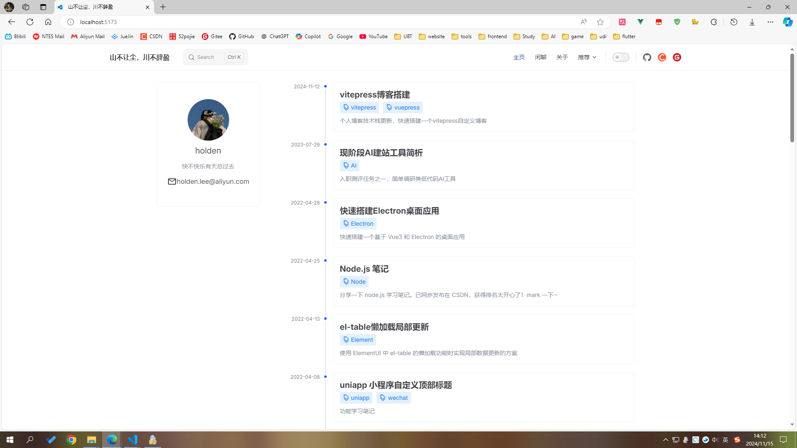
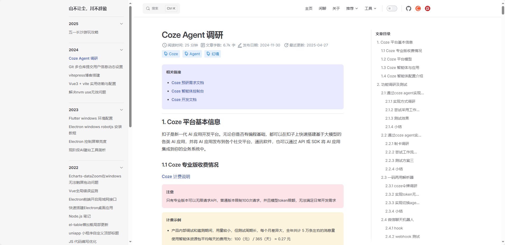
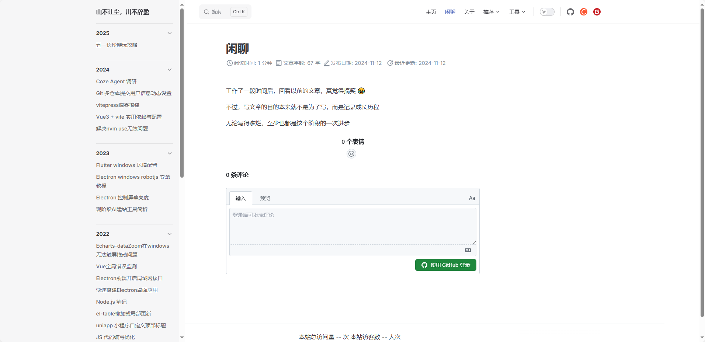
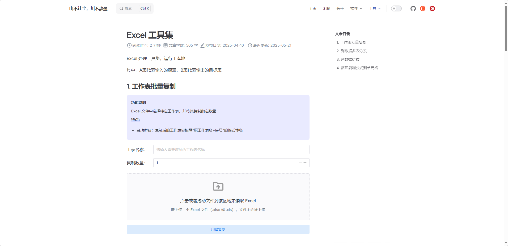
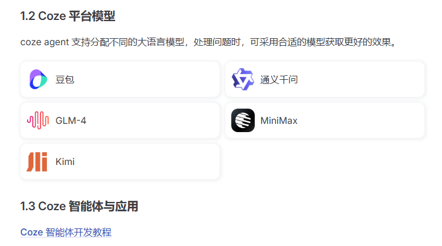

# 简约风个人博客

基于 VitePress 搭建的简约风个人博客，专注于技术分享和知识沉淀。

## 💻 在线预览

- 预览地址：[https://dddhl.cn](https://dddhl.cn)
- 搭建过程：[博客搭建过程](https://dddhl.cn/2024/blog-change.html)

<table>
  <tr>
    <td>
      
    </td>
    <td>
      
    </td>
  <tr />
  <tr>
    <td>
      
    </td>
    <td>
      
    </td>
  <tr />
</table>

## ✨ 特点

- 📝 自定义首页 - 个性化的博客展示界面
- 📱 手机网页适配 - 随时随地访问博客
- 🌞 支持夜间模式 - 适合不同时间段的阅读
- 🚀 网站加载页 - 优雅的过渡加载体验
- 🔍 全文搜索 - 快速定位文章内容
- 🖼️ 全文图片放大 - 更好的图片浏览体验
- 📊 网站访问量统计 - 实时了解网站访问情况
- 💬 GitHub评论系统 - 支持互动交流
- 📋 自动配置侧边栏 - 智能生成文章目录
- 🔄 自动打包部署GitHub Pages - 便捷的部署流程
- 📈 文章数据统计 - 自动统计字数/阅读时间/最近更新时间

## 📦 项目结构

```tree
.
├─ docs                           # 文档目录
│  ├─ .vitepress                  # VitePress 配置目录
│  │  ├─ config.mts               # 主配置文件
│  │  ├─ components               # 自定义组件
│  │  ├─ theme                    # 主题相关配置
│  │  ├─ plugins                  # 博客插件
│  │  └─ cache                    # 缓存文件
│  ├─ 2021-2025                   # 博客文章目录（按年份归档）
│  ├─ pages                       # 自定义页面
│  ├─ img                         # 博客图片
│  ├─ public                      # 静态资源目录
│  └─ index.md                    # 首页配置文件
├─ .github                        # GitHub 配置
│  └─ workflows                   # GitHub Actions 工作流
├─ package.json                   # 项目依赖配置
├─ pnpm-lock.yaml                 # pnpm 依赖锁定文件
└─ README.md                      # 项目说明文档
```

## 😃 使用方法

```bash
pnpm docs:dev
```

```bash
pnpm docs:build
```

## 🔎 自封装组件

### 1. Card

`docs/.vitepress/components/Card.vue`

- 示例

```vue
<script setup>
import Card from '../.vitepress/components/Card.vue'
const cozeModuleData = [
  { text: '豆包', url: '/2024/coze/coze1.png', link: 'https://www.volcengine.com/product/doubao' },
  { text: '通义千问', url: '/2024/coze/coze2.png', link: 'https://dundunlu.com/web/tongyi/' },
  { text: 'GLM-4', url: '/2024/coze/coze3.png', link: 'https://chatglm.cn/' },
  { text: 'MiniMax', url: '/2024/coze/coze4.png', link: 'https://www.minimaxi.com/' },
  { text: 'Kimi', url: '/2024/coze/coze5.png', link: 'https://www.minimaxi.com/' },
]
</script>

<Card :data="cozeModuleData" />
```

- 效果图



- API

| 参数   | 说明         | 类型                                             | 默认值   |
| ------ | ------------ | ------------------------------------------------ | -------- |
| data   | 数据列表     | `{ url: string; text: string; link?: string }[]` | 无       |
| target | 点击弹出类型 | `_blank` \| `_self` \| `_parent` \| `_top`       | `_blank` |

## 2. 图片组

`docs/.vitepress/components/PhotoGroup.vue`

- 示例

```vue
<script setup>
import PhotoGroup from '../.vitepress/components/PhotoGroup.vue'
<script />

<PhotoGroup :images="['/2025/changsha_travel/changsha_travel1.jpg']" />
```

- 效果图

根据图片数量自动调整列数，点击可放大图片。

<table>
  <tr>
    <td>
      
    </td>
    <td>
      
    </td>
  <tr />
  <tr>
    <td>
      
    </td>
    <td>
      
    </td>
  <tr />
</table>

- API

| 参数   | 说明     | 类型       | 默认值 |
| ------ | -------- | ---------- | ------ |
| images | 图片列表 | `string[]` | `[]`   |
