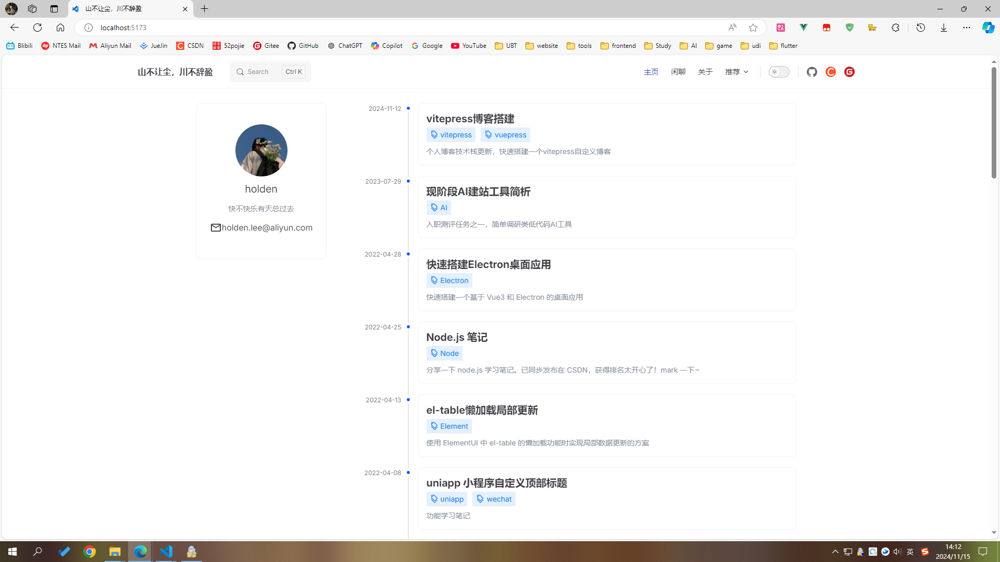

# VitePress Blog

基于 VitePress 搭建的简约风个人博客，专注于技术分享和知识沉淀。

## 在线预览

- 预览地址：[https://dddhl.cn](https://dddhl.cn)
- 搭建教程：[博客搭建过程](https://dddhl.cn/2024/blog-change.html)



## ✨ 特点

- 📝 自定义首页 - 个性化的博客展示界面
- 🚀 网站加载页 - 优雅的过渡加载体验
- 🔍 全文搜索 - 快速定位文章内容
- 🖼️ 全文图片放大 - 更好的图片浏览体验
- 📊 网站访问量统计 - 实时了解网站访问情况
- 💬 GitHub评论系统 - 支持互动交流
- 📋 自动配置侧边栏 - 智能生成文章目录
- 🔄 自动打包部署GitHub Pages - 便捷的部署流程
- 📈 文章数据统计 - 自动统计字数/阅读时间/最近更新时间

## 📦 项目结构

```tree
.
├─ docs                           # 文档目录
│  ├─ .vitepress                  # VitePress 配置目录
│  │  ├─ config.ts                # 主配置文件
│  │  ├─ theme                    # 主题相关配置
│  │  │  ├─ components            # 自定义组件
│  │  │  └─ styles                # 自定义样式
│  │  └─ cache                    # 缓存文件
│  ├─ 2021-2025                   # 博客文章目录（按年份归档）
│  │  ├─ 2024                     # 2024年文章
│  │  └─ ...                      # 其他年份文章
│  ├─ pages                       # 自定义页面
│  │  ├─ about                    # 关于页面
│  │  └─ tags                     # 标签页面
│  ├─ public                      # 静态资源目录
│  │  ├─ images                   # 图片资源
│  │  └─ fonts                    # 字体资源
│  └─ index.md                    # 首页配置文件
├─ .github                        # GitHub 配置
│  └─ workflows                   # GitHub Actions 工作流
├─ package.json                   # 项目依赖配置
├─ pnpm-lock.yaml                 # pnpm 依赖锁定文件
└─ README.md                      # 项目说明文档
```

## 使用方法

```bash
pnpm docs:dev
```

```bash
pnpm docs:build
```
