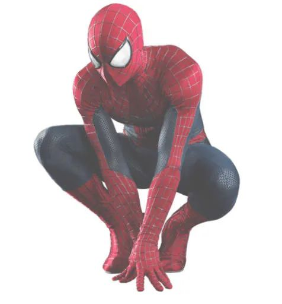

# CSS 图片处理技巧

## 1. Object-fit : cover

这个属性可以让图片填充整个区域，同时保持高宽比例。这个技巧在处理个人资料图片时尤其有用。

## 2. Transform: scaleX(-1) / scaleY(-1)

使用`transform: scaleX(-1)`可以水平翻转图像，`scaleY(-1)`则用于垂直方向。

## 3. Object-fit : contain

用于包含所需尺寸的整个图片并保持高宽比例。此属性常用于制作横幅。

## 4. Filter: drop-shadow

此属性用于为透明背景的图片添加阴影。

例如：`filter: drop-shadow(30px 10px 4px #3a3a3a);`

- `30px`表示目标的相对位置向右，负值则向左移动阴影。
- `10px`表示目标的相对位置向上，负值则向底部移动阴影。
- `4px`代表目标的模糊因子。
- `#3a3a3a`代表目标的颜色。

## 5. Filter: opacity

此属性根据百分比增加图像的透明度。

