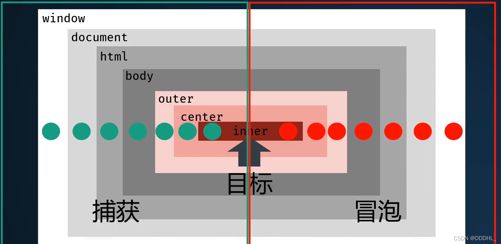
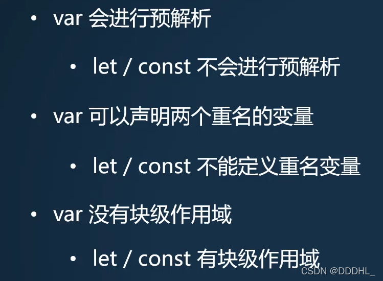
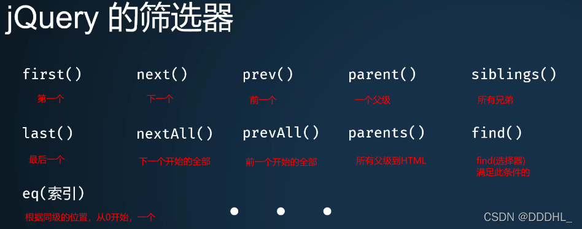
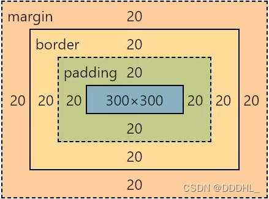

# JavaScript 笔记

## 1. 数值转换

```javascript
Boolean() // 布尔型 非0即真
Number() // 转换为数字   只有纯数字字符串才能转，不然就是NaN
parseInt() // 转换为int   取整3.14->3 为字符串时100a->100 开头不是数字则NaN
// 转换为十进制 parseInt(nmuber,进制)
parseFloat() // 转换为float  取浮点数
Math.ceil() // 向上取整 3.1->4
JSON.parse(str) // 把字符串解析成对象格式
JSON.stringify(json) // 把对象格式转成字符串
判断数字
isNaN()
```

## 2. 作用域

查找变量从最近父级查找，逐层向上

let 作用域为最近{}内

## 3. 存储数据

对象数据类型，键值对集合，json

## 4. 数组

### 4.1 设置数组长度

```javascript
// 例子：数组length-1 =>作用：可以用来删除最后的元素
arr.length = 长度
```

### 4.2 从后面加数据

```javascript
// 返回数组长度
push（value）
```

### 4.3 在前面加数据

```javascript
// 返回长度
unshift（value）
```

### 4.4 删除最后一个

```javascript
// 返回被删除的元素
pop（）
```

### 4.5 删除第一个

```javascript
// 返回被删除的元素
shift（）
```

### 4.6 数组反转

```javascript
// 返回反转后的数组
reverse（）
```

### 4.7 删除若干数据

```javascript
// 删除若干数据，并选择是否插入。默认值(0，0，没有) 返回新数组（被删除的数据）
splice（开始索引，多少个，value）
```

### 4.8 数组排序

```javascript
// 什么都不传就两个两个换。返回排序好的数组
sort()        //例如：1，2，3，4  => 2,1,4,3
// 从小到大排序
sort（function（a,b）{return a - b}）
// 从大到小排序
sort（function（a,b）{return b - a}）
```

### 4.9 拼接成字符串

```javascript
// join（连接符）。将数组用连接符连接成字符串，返回字符串
join('-') // 例如：1，2，3  =>  1-2-3
```

### 4.10 拼接数组

```javascript
// concat（其他数组）将其他数组与数组拼接。返回拼接好的数组
arr1.concat(arr2)
```

### 4.11 截取数组

```javascript
// 默认（0，数组长度），返回截取的新数组，包前不包后
slice（开始索引，结束索引）
```

### 4.12 查找 value 在数组的索引

```javascript
// 有该数据则返回第一次出现的索引。没有则返回-1
indexOf（value）
```

### 4.13 遍历数组

```javascript
// item 是数组每一个元素，index 是索引，arr是数组。参数可以不写,没有返回值
forEach（function（item，index，arr）{}）
```

### 4.14 映射数组

```javascript
// 返回新的数组
map（function（item，index，arr）{return item*10}）  // 将数组每一个元素*10
```

### 4.15 过滤数组

```javascript
// 返回过滤好的新数组
filter（function（item，index，arr）{return item>150}） // 将数组小于150的元素删除
```

### 4.16 判断是否每一项都满足条件

```javascript
// 返回布尔值
every（function（item，index，arr）{return item>150}）  // 判断是否大于150
```

### 4.17 判断是否有某一项都满足条件

```javascript
// 返回布尔值
some（function（item，index，arr）{return item>150}）   // 判断是否有满足大于150的元素
```

## 5. 字符串

### 5.1 获取对应索引位置的字符

```javascript
// 返回字符
charAt（索引）
```

### 5.2 将字符串的所有字母转换成小写

```javascript
// 返回转好的字符串
toLowerCase（）
```

### 5.3 将字符串的所有字母转换成大写

```javascript
// 返回转好的字符串
toUpperCase（）
```

### 5.4 将字符串第一个满足的内容更换

```javascript
// 返回字符串。注意：第一个
replace（换下内容，换上内容）
```

### 5.5 去除首尾空格

```javascript
// 返回字符串
trim（）
```

### 5.6 按照分隔符切割组成一个数组

```javascript
// 返回数组
split（分隔符）
// 多个分隔符（x，y是分隔符）
split（/x|y/）
// 若分隔符是. 要加[]
split（/[.]|y/）
```

### 5.7 截取字符串

有三个方法：

substr(开始索引，个数)

substring(开始索引，结束索引)

slice(开始索引，结束索引)

```javascript
// 示例
var arr = '01234567'
var res1 = substr(1, 6) // 结果为123456，1是开始索引，6是6个字符
var res2 = substring(1, 6) // 结果12345，1是开始索引，6是结束索引。包前不包后
var res3 = slice(1, 6) // 结果12345，1是开始索引，6是结束索引。包前不包后
```

## 6. 数字常用方法

### 6.1 获取 0~1 之间的随机小数。

```javascript
// 返回小数。包前不包后，即可以获取到0，不可以获取到1
Math.random（）
```

### 6.2 对数字进行四舍五入取整

```javascript
// 返回整数
Math.round（value）
```

### 6.3 对数字进行向上取整

```javascript
// 返回整数
Math.ceil（value）
```

### 6.4 对数字进行向下取整

```javascript
// 返回整数。相对于去小数
Math.floor（value）
```

### 6.5 对数字进行取幂运算

```javascript
// 返回结果
Math.pow（底数，指数）
// 例如2的5次方
Math.pow(2,5)
```

### 6.6 对数字进行二次方根运算

```javascript
// 返回结果
Math.sqrt（value）
// 例如根号4
Math.sqrt(4)
```

### 6.7 对数字进行绝对值运算

```javascript
// 返回结果
Math.abs（）
```

### 6.8 获取若干数字中的最大值

```javascript
// 返回最大值。
Math.max（value1，value2，...）
```

### 6.9 获取若干数字中的最小值

```javascript
// 返回最小值。
Math.min（value1，value2，...）
```

### 6.10 得到一个近似 Π(派：3.14159....)的值

```javascript
// 返回值
Math.PI
```

### 6.11 示例：

```javascript
// 获取0~x之间的随机整数，
var a = Math.random() * (x + 1)
var result = Math.floor(a)
// 获取x~y之间的随机整数
var b = Math.random() * (y - x + 1)
var result1 = Math.floor(b) + x
```

## 7. 时间常用方法

```javascript
var time = new Date（）
time.getFullYear()  // 获取年
time.getMonth()		// 获取月份
time.getDate()		// 获取日期
time.getHours() 	// 获取小时
time.getMinutes() 	// 获取分钟
time.getSeconds()	// 获取秒
time.getDay()		// 获取星期   0~6 周日到周六
time.getTime()		// 获取时间戳	1970/1/1 00:00:00 距离今天的毫秒

// 获取时间差函数
function getDiff(time1,time2){
    // 获取时间戳
    var ms1 = time1.getTime()
    var ms1 = time1.getTime()
    // 两个时间戳相减的秒数,向上取整忽略毫秒
    var sub = Math.celi((ms2-ms1)/1000)
    //换算,向下取整
    var day = Math.floor(sub / (60 * 60 * 24))
    var hours = Math.floor(sub % (60 * 60 *24) / (60 * 60))
    var minutes = Math.floor(sub % (60*60) / 60)
    var seconds = sub % 60

    return {day:day,hours:hours,minutes:minutes,seconds:seconds}
}
```

## 8. BOM 操作

操作浏览器

### 8.1 获取浏览器窗口尺寸

```javascript
// 获取浏览器可视窗口的宽度   包括滚动条
window.innerWidth
// 获取浏览器可视窗口的高度
window.innerHeight
```

### 8.2 浏览器的弹出层

```javascript
// 提示框
window.alert('value')
// 询问框 有返回值，确定true，取消false
window.confirm('value')
// 输入框 有返回值，确定输入的东西，取消null
window.prompt('value')
```

### 8.3 开启和关闭标签页

```javascript
// 开启
window.open('地址/url')
// 关闭当前
window.close()
```

### 8.4 浏览器常见事件

```javascript
// 资源加载完毕
window.onload = function () {}
//可视尺寸改变
window.onresize = function () {}
// 滚动条位置改变
window.onscroll = function () {}
```

### 8.5 浏览器的历史记录操作

```javascript
// 回退页面
window.history.back()
// 前进页面
window.history.forward()
```

### 8.6 浏览器卷去的尺寸

有滚动条时，页面隐藏的部分尺寸

```javascript
// 卷去的高度
document.documentElement.scrollTop //页面有<!DOCTYPE html>
document.body.scrollTop //页面没有<!DOCTYPE html>
//卷去的宽度
document.documentElement.scrollLeft
document.body.scrollLeft
// 卷去的高度/宽度 兼容写法
var height = document.documentElement.scrollTop || document.body.scrollTop
```

### 8.7 浏览器滚动到

```javascript
// left 浏览器卷去的宽度， top 浏览器卷去的高度 ，瞬间移动
window.scrollTo(left, top)
//平滑滚动
window.scrollTo({
  left: xx,
  top: yy,
  behavior: 'smooth', //平滑滚动
})
```

## 9. 定时器

有返回值，返回第几个定时器，不区分定时器类型

### 9.1 间隔定时器（按照指定周期毫秒，去执行指定代码）

```javascript
setInterval(function () {
  // 要执行的代码
}, 1000)
```

### 9.2 延时定时器（在固定的时间毫秒后执行一次代码）

```javascript
setTimeout(function () {
  // 要执行的代码
}, 1000)
```

### 9.3 关闭定时器，不区分定时器类型

```javascript
// 语法一
clearInterval(要关闭的定时器返回值)
// 语法二
clearTimeout(要关闭的定时器返回值)
```

## 10. DOM

操作文档流相关内容的属性和方法

### 10.1 获取元素

```javascript
// 根据id获取元素。有-对应元素，没有-null
document.getElementById('id名称')
// 根据类名获取元素。获取文档流中所有类名对应的元素，返回伪数组
document.getElementsByClassName('类名')
// 根据元素标签名获取。获取文档流中所有标签名对应的元素，返回伪数组
document.getElementsByTagName('标签名')
// 根据选择器获取一个，获取文档流中满足条件的第一个元素
document.querySelector('选择器') //选择器  .nav
// 根据选择器选择一组，获取文档流中所有满足条件的元素，返回伪数组
document.querySelectorAll('选择器')
```

### 10.2 操作元素内容

```javascript
// 文本内容
// 获取
元素.innerText
//设置   覆盖/替换
元素.innerText = '新内容'
// 超文本内容
//获取
元素.innerHTML
//设置   覆盖/替换
元素.innerHTML = '新内容'
```

### 10.3 操作元素属性

```javascript
// 原生属性（标签自带的属性）
	//获取
	元素.属性
	//设置
	元素.属性 = '新内容'
// 自定义属性（自己设定的一些属性）
	//获取
	元素.getAttribute('属性名')
	//设置
	元素.setAttribute('属性名'，'属性值')
	//删除
	元素.removeAttribute('属性名')

// 注意：以上方法一般不用做操作元素 类名 和 样式
```

### 10.4 操作元素类名

```javascript
//获取
元素.className
//设置
元素.className = '新类名'
```

### 10.5 操作元素行内样式

```javascript
// 获取
元素.style.样式名
// 设置
元素.style.样式名 = '样式值' //有中划线-的样式，写成驼峰，如backgroundColor
```

### 10.6 获取元素非行内样式

```javascript
// 获取 可以获取非行内样式，也可以获取行内样式，只能获取不能设置
window.getComputedStyle(元素).样式名
```

### 10.7 节点操作

```javascript
// 创建节点，创建一个指定的标签元素，返回节点
document.createElement('标签名称')
// 插入节点向后插入，把子节点放在父节点的内部，并且放在最后的位置
父节点.appendChild(子节点)
// 插入节点向前插入，把子节点放在父节点的内部,放在指定位置
父节点.insertBefore(要插入的子节点，哪个子节点前面)
// 删除节点，删除指定的节点
父节点.removeChild(子节点)
// 删除节点
节点.remove()
// 替换节点
父节点.replaceChild(换上节点，换下节点)
// 克隆节点 true/false
节点.cloneNode(是否克隆后代节点)
// 1.获取元素尺寸,元素 内容 + padding + border 区域的尺寸
元素.offsetHeight
元素.offsetWidth
// 2.获取元素尺寸，元素 内容 + padding 区域的尺寸
元素.clientHeight
元素.clientWidth
```

## 11. 事件类型

### 11.1 图错误点：contextmenu 是右键单击

事件对象，有函数提供，在函数里面用形参接收即可


补充：

offsetX 和 offsetY 相对于促发事件元素，鼠标的坐标信息

clientX 和 clientY 相对于可视窗口，鼠标的坐标信息

pageX 和 pageY 相对于整个页面文档流，鼠标的坐标信息

### 11.2 **浏览器相应事件的机制**



先从外层传递到里层（事件捕获阶段），最后传出来（事件冒泡阶段）

### 11.3 **阻止事件传播**

```javascript
事件对象.stopPropagation()
```

### 11.4 **事件委托**

使用事件对象的 target 可以知道点击的是哪个元素

```javascript
ul.onclick = function (e) {
  if (e.target.tagName === 'LI') {
    console.log('你点击的是LI')
  }
}
```

## 12. 面向对象

创建工厂

构造函数 首字母大写 与 new 连用 (内置构造函数 Object)

不要随便 return。return 基本数据类型无效；return 复杂数据类型比如数组，构造函数无效。

```javascript
function Person() {
  this.name = 'jack'
}
var obj = new Person() // 小括号不写也行，不推荐不写
```

如果构造函数里面有函数，每个对象都会新建一个函数

解决方案：使用原型 prototype 属性，是一个对象。

属性写在构造函数体内，方法写在构造函数的原型上，如果属性不变，也写在原型上

```javascript
// 所有实例化对象都会加上这个方法
function Person() {}
Person.prototype.sayHi = function () {} //sayHi 方法名
Person.prototype.a = 110
```

## 13. 原型链

用 "**proto**"串联起来的对象链状结构

对象访问机制：先去自己身上找，没有就去 proto 上找，逐级查找 最高级 Object 的 proto，没有就返回 undefined


## 14. ES6

### 14.1 新增变量命名

ES6 以前用 var ES6 新增 let/const

var 函数作用域



### 14.2 箭头函数

ES6 对函数表达式的简写（声明式函数不能使用）就是把 function 变成=>

```javascript
var fn1 = function () {}
var fn1 = () => {}
// 1.只有一个形参时,可以不写()
var fn1 = function (a) {}
var fn1 = (a) => {}
// 2.只有一句话时，可以不写{} 会把这句话的结果当做返回值
var fn1 = function (a, b) {
  return a + b
}
var fn1 = (a, b) => a + b
// 3.箭头函数没有arguments
// 4.箭头函数内部没有this，用的是外部作用域的this
```

### 14.3 解构赋值

```javascript
// 解构数组，使用[]
let arr[a,b] = ['1','2']
console.log(a)   // 1
console.log(b)	 // 2
// 解构对象，使用{}
let obj = {name:lhd, id:10}
let{name,id} = obj
console.log(name) //lhd
console.log(id) //10
// 解构对象起别名
let{name:a} = obj  //a=lhd
```

### 14.4 模板字符串

可以换行，直接在字符串内解析变量

```java
var str = `ab`
var str = `a
b`
// 解析变量
var age = 18
var str = `我今年${age}岁`  // 输出我今年18岁
```

### 14.5 展开运算符

展开数组 = 去除[]

```javascript
var arr = [1, 2, 3]
console.log(arr) //输出数组
console.log(...arr) //输出1,2,3
// 作用1：合并数组
var arr = [1, 2, 3]
var arr1 = [4, 5, 6]
var arr2 = [...arr, ...arr1] // 输出数组[1,2,3,4,5,6]
// 作用2：给函数传递参数
var arr1 = [10, 20, 5, 6]
var max = Math.max(...arr1) //输出最大值，max()不能直接放数组
```

展开对象 = 去除{}

```javascript
// 作用1：用来复制对象。注意：有相同成员，...obj要放在前面，不然会被obj的覆盖
var obj = {name:lhd}
var obj1 = {
    id：10，
    ...obj
}
```

### 14.6 类语法

ES6 的语法写构造函数，解决之前写构造函数需要分开写的缺点

```javascript
// 之前的写法
function Person(name,age){
    this.name = name
    this.age = age
}
Person.prototype.sayHi = function(){ console.log('hello world')}
// 静态属性与方法
Person.a = 100
Person.go = function(){ console.log('go') }
// 实例化对象
var p1 = new Person('lhd','19')
console.log(p1)					  	// 输出对象
p1.sayHi()							// 输出hello world
console.log(p1.a)					// 输出100
Person.go()							// 输出go
var p2 = Person('lhd','19')         // 注意：不报错，但不能实例化对象

// ES6 写法
class Person{
    // 这里按照 ES5 的构造函数体书写
    constructor(name,age){
        this.name = name
    	this.age = age
    }
    // 直接写原型的函数
    sayHi(){ console.log('hello world')}
    // 静态属性 + static
    static a = 100
	// 静态方法
	static go() = function(){ console.log('go') }
}
// 实例化对象
var p1 = new Person('lhd','19')
console.log(p1)
p1.sayHi()
var p2 = Person('lhd','19')        // 注意：报错，一定要用new
console.log(Person.a)
Person.go()
```

## 15. 立即执行函数

立即执行函数前面的语句必须有分号

```javascript
;(function () {
  // xx
})()
```

## 16. 请求接口

后端给予接口文档，按照接口文档写

### 16.1 Ajax

```javascript
var xhr = new XMLHttpRequest()
xhr.open('GET', 'XXX', true) //请求方式、请求地址、是否异步
xhr.onload = function () {
  //返回的是字符串
  console.log(xhr.responseText)
  //想拿json，要解析
  var res = JSON.parse(xhr.responseText)
}
xhr.send()
```

### 16.2 GET 和 POST 的区别

GET 直接在 open 函数地址内拼接

```javascript
xhr.open('GET', 'xxx?name=lhd&id=10', true) //请求方式、请求地址、是否异步
```

POST 在 send 函数内写参数，并且要特殊说明

```javascript
// 语法：xhr.setRequestHeader('content-type',你传递的参数格式) 后端给参数格式
xhr.setRequestHeader('content-type', 'application/x-www-form-urlencoded')
xhr.send('name=' + lhd + '&id=' + age)
```

### 16.3 阻止 form 表单的默认提交行为

```javascript
loginForm.onsubmit = function (e) {
  e.preventDefault()
}
```

## 17. jQuery

一个大型的简单的第三方类库，对 DOM 操作进行封装，引入后暴露两个全局变量 $ 和 jquery

### 17.1 选择器

（返回元素集合）

```javascript
$('选择器')
```

### 17.2 筛选器

```javascript
$('选择器').筛选器名称()
```



### 17.3 操作文本内容

$('div') = 选中 div

（1）html() 等价于原生 JS 的 innerHTML

```javascript
// 获取
$('div').html()
// 设置
$('div').html('你要设置的内容')
// 可以识别并解析 html 结构字符串
$('div').html('<h2>hello world<h2>')
```

（2）text() 等价于原生 JS 的 innerText

```javascript
// 获取
$('div').text()
// 设置  不可以解析
$('div').text('hello world')
```

（3）val() 等价于原生 JS 中 value

```javascript
// 获取
$('input').val()
// 设置
$('input').val('你要设置的内容')
```

### 17.4 操作元素类名

（1）addClass() 新增类名

```javascript
$('div').addClass('要添加的类名')
```

（2）removeClass() 删除类名

```javascript
$('div').removeClass('要删除的类名')
```

（3）toggleClass() 切换类名

本身有这个类名，那就是删除，如果本身没有这个类名，那就是添加

```javascript
// 假设div中有a b c d 三个类名
var btn = document.querySelector('button')
btn.onclick = function () {
  $('div').toggleClass('box')
}
// 点击一次，添加box到class中，点击第二次，删除box
```

### 17.5 操作元素样式

（1）css()

```javascript
// 获取，可以获取行内和非行内样式。
// 元素集合.css(你要获取的样式名称)
$('div').css('width') //获取div的宽

//设置，注意：样式单位是 px 时，可以省略 px
//元素集合.css(样式名，样式值)
$('div').css('width', '300px') //设置div宽为300px
$('div').css('width', 300)
```

（2）css 批量设置样式

```javascript
// 元素集合.css({ 所有要设置的样式 })
$('div').css({
  width: 260,
  height: 320,
  'background-color': 'purple',
})
```

### 17.6 操作元素属性

（1）arrt()

```javascript
// 一般用于操作元素的自定义属性。直接出现在元素的标签里

// 获取自定义属性hello
$('div').attr('hello')
// 设置自定义属性hello
$('div').attr('hello') = 100
```

（2）removeAttr()

```javascript
// 删除自定义属性hello
$('div').removeAttr('hello')
```

（3）prop()

```javascript
// 操作元素原生属性时，会直接出现在元素标签里
// 操作自定义属性时，不会直接出现在元素标签里，会响应在元素对象上
// 注意：prop()不能获取元素标签上原有的自定义属性，只能获取prop()自己设定的自定义属性

// 获取原生和自定义属性
$('div').prop('id')
$('div').prop('hello')
// 设置原生和自定义属性
$('div').prop('id') = 1
$('div').prop('hello') = 100
```

（4）removeProp()

```javascript
// 不能删除原有的自定义属性和原生属性，只能删除prop()设定的自定义属性
$('div').prop('hello') = 100
$('div').removeProp('hello')
```

### 17.7 获取元素尺寸



（1）width()、height()

```javascript
// 获取内容区域的尺寸
$('div').width() // 300
$('div').height() // 300
```

（2）innerWidth()、innerHeight()

```javascript
// 获取内容和 padding 区域尺寸
$('div').innerWidth() // 340
$('div').innerHeight() // 340
```

（3）outerWidth()、outerHeight()

```javascript
// 获取内容、padding 和 border 区域尺寸
$('div').outerWidth() // 380
$('div').outerHeight() // 380
```

（4）outerWidth(true)、outerHeight(true)

```javascript
// 获取内容、padding 、border 和 margin 尺寸
// 假设设定margin为20px
$('div').outerWidth(true) // 420
$('div').outerHeight(true) // 420
```

### 17.8 获取元素偏移量

（1）offset()

```javascript
// 获取元素相对于页面左上角的坐标位置
// 返回值是对象数据类型 {top:xx,left:xx}
$('div').offset()
```

（2）position()

```javascript
// 获取元素定位的位置
// 返回值是对象数据类型 {top:xx,left:xx}
// 注意：如果定位设置的是right，bottom，会自动转成top,left
$('div').position()
```

### 17.9 绑定事件

（1）on()

1-1 基础绑定事件

```javascript
// 语法：元素集合.on('事件类型','事件处理函数')
$('div').on('click', function () {
  console.log('点击div')
})
```

1-2 事件委托绑定事件

```javascript
// 语法：元素集合.on('事件类型',选择器,事件处理函数)
// 把事件绑定给 div 元素，当你在 div 内的 p 元素触发事件时，执行事件处理函数
// 相对于把 p 元素的事件委托给 div 元素来绑定
$('div').on('click', 'p', function () {
  console.log('点击p')
})
```

1-3 批量绑定事件

```javascript
// 语法：元素集合.on({事件类型1:处理函数, 事件类型2:处理函数})
// 注意：不能进行事件委托了
$('div').on({
    click: function(){ console.log('鼠标点击') }
    mouseover: function(){ console.log('鼠标移入') }
    mouseout: function(){ console.log('鼠标移出') }
})
```

（2）one()

one() 与 on() 绑定事件的方式一样，区别就是 one() 只能执行一次

2-1 基础绑定事件

```javascript
$('div').one('click', function () {
  console.log('只触发一次')
})
```

2-2 事件委托

```javascript
$('div').one('click', 'p', function () {
  console.log('只触发一次')
})
```

2-2 批量绑定事件

```javascript
$('div').one({
    click: function(){ console.log('鼠标点击，只触发一次') }
    mouseover: function(){ console.log('鼠标移入，只触发一次') }
    mouseout: function(){ console.log('鼠标移出，只触发一次') }
})
```

（3）hover()

jQuery 里面一个特殊的事件

```javascript
// 语法：元素集合.hover(移入时触发的函数,移出时触发的函数)
// 只传一个函数时，会在移入移出都触发这个函数
$('div').hover(
	function (){ console.log('鼠标移入') }
    function (){ console.log('鼠标移出') }
)
```

（4）常用事件函数

jQuery 把我们最常用的一些事件，单独做成了事件函数

我们通过调用这些事件函数，来达到绑定事件的效果

如 click()，mouseover()，mouseout()，change() ...

```javascript
$('div').click(function () {
  console.log('鼠标点击')
})
```

### 17.10 事件的解绑和触发

（1）off() 事件解绑

1-1 解绑全部事件处理函数

```javascript
// 准备事件处理函数
function A() {
  console.log('A事件处理函数')
}
function B() {
  console.log('B事件处理函数')
}
function C() {
  console.log('C事件处理函数')
}
// 给 div 元素绑定事件
$('div').click(A).click(B).click(C)

// 事件解绑 语法：元素集合.off(事件类型)
// 把 div 的 click 事件对应的所有事件处理函数全部移除
$('div').off('click')
```

1-2 解绑指定事件处理函数

```javascript
// 语法：元素集合.off(事件类型,要解绑的事件处理函数)
// 会把 div 的 click 事件对应的 B 事件处理函数移除
$('div').off('click', B)
```

（2）trigger() 事件触发

```javascript
// 语法：元素集合.trigger(事件类型)
// 触发 div 元素的 click 事件处理函数
$('div').trigger('click')
```

### 17.11 基本动画

（1）hide() 隐藏动画

（2）show() 显示动画

（3）toggle() 切换动画

​ => 本身如果是显示的，就切换成隐藏

​ => 本身如果是隐藏的，就切换成显示

三个函数都有三个参数，分布是运动时间、运动曲线、运动结束后的回调函数

```javascript
// 1.只写一个参数：运动时间，单位ms
$('div').hide(1000)
$('div').show(1000)
$('div').toggle(1000)
// 2.参数都写上
$('div').hide(1000, 'linear', function () {
  console.log('动画结束')
})
$('div').show(1000, 'linear', function () {
  console.log('动画结束')
})
$('div').toggle(1000, 'linear', function () {
  console.log('动画结束')
})
```

### 17.12 折叠动画

与上面动画的使用方法一致，只是隐藏和显示的效果不同

基本动画相对于把宽高都同时缩小到左上角，折叠动画则是只改变高度，由下向上缩小

（1）slideDown() 隐藏动画

（2）slideUp() 显示动画

（3）slideToggle() 切换动画

​ => 本身如果是显示的，就切换成隐藏

​ => 本身如果是隐藏的，就切换成显示

三个函数都有三个参数，分布是运动时间、运动曲线、运动结束后的回调函数

```javascript
// 1.只写一个参数：运动时间，单位ms
$('div').slideDown(1000)
$('div').slideUp(1000)
$('div').slideToggle(1000)
// 2.参数都写上
$('div').slideDown(1000, 'linear', function () {
  console.log('动画结束')
})
$('div').slideUp(1000, 'linear', function () {
  console.log('动画结束')
})
$('div').slideToggle(1000, 'linear', function () {
  console.log('动画结束')
})
```

### 17.13 渐隐渐显动画

与上面动画的使用方法一致，只是隐藏和显示的效果不同

相对于改变透明度，让元素慢慢消失

（1）fadeIn() 隐藏动画

（2）fadeOut() 显示动画

（3）fadeToggle() 切换动画

​ => 本身如果是显示的，就切换成隐藏

​ => 本身如果是隐藏的，就切换成显示

以上三个函数都有三个参数，分布是运动时间、运动曲线、运动结束后的回调函数

（4）fadeTo(运动时间，指定透明度，运动曲线，回调函数) 改变元素的透明度为指定值

```javascript
// 1.只写一个参数：运动时间，单位ms
$('div').fadeIn(1000)
$('div').fadeOut(1000)
$('div').fadeToggle(1000)
// 2.参数都写上
$('div').fadeIn(1000, 'linear', function () {
  console.log('动画结束')
})
$('div').fadeOut(1000, 'linear', function () {
  console.log('动画结束')
})
$('div').fadeToggle(1000, 'linear', function () {
  console.log('动画结束')
})
// 3.fadeTo() 改变透明度
$('div').fadeTo(1000, 0.68, 'linear', function () {
  console.log('运动到指定透明度')
})
```

### 17.14 综合动画函数

animate() 有四个参数

=>第一个：要运动的样式，以一个对象数据类型传递

=>第二个：运动时间

=>第三个：运动曲线

=>第四个：运动结束的回调函数

注意：关于 **颜色** 和 **transform** 相关的样式不能运动

```javascript
$('div').animate(
  {
    width: 500,
    height: 600,
  },
  1000,
  'linear',
  function () {
    console.log('运动结束')
  }
)
```

### 17.15 运动结束函数

不停点击按钮使动画变化时，会记录次数，即使你停下来也还在继续变化直到执行完所有次数

（1）stop()

=>当任何一个元素执行了 stop 方法后，会立即结束当前所有运动。

=>目前运动到那什么位置，就停留在什么位置。

=>一般对于结束动画的时候，都是在运动开始之前

```javascript
// 基本用法
$('div').stop()
// 假设有个按钮id为btn，点击切换动画
$('#btn').click(function () {
  // 加上stop()后，连续点击，只要不点击了，就只执行到本次的结束，不会继续执行所有次数
  $('div').stop().toggle(2000)
})
```

（2）finish()

会立即结束当前所有运动，直接去到动画的结束位置

```javascript
// 基本用法
$('div').finish()
// 利用完成动画函数书写动画函数
$('#btn').click(function () {
  // 每一次触发时，都会把之前的动画瞬间完成，只执行本次最新的动画
  $('div').finish().toggle(200)
})
```

### 17.16 ajax

语法：$.ajax({ 本次发送 ajax 的配置项 })

配置项：

（1）url：必填，表示请求地址

（2）method：选填，默认是 GET ，表示请求方式

（3）data：选填，默认是 ' ' ，表示携带给后端的参数

（4）dataType：选填，默认自动识别，表示后端返回给你的数据类型

（5）async：选填，默认是 true，表示是否异步

（6）success：选填，表示请求成功的回调函数

（7）error：选填，表示请求失败的回调函数

```javascript
// 演示 发送两个数据给后端
$.ajax({
  url: 'http://localhost:8888/test',
  method: 'POST',
  data: { name: 'lhd', id: '19' },
  dataType: 'JSON',
  async: 'true',
  success: function (res) {
    console.log(res) //输出后端给你的json
  },
})
```

```javascript
// 示例：获取表单里所有信息给后端
$('form').on('submit', function (e) {
  // 阻止默认行为
  e.preventDefault()
  const data = $('form').serialize() // 获取所有input信息
  $.post('http://localhost:8888/user', data, (res) => {
    console.log(res)
  })
})
```

```javascript
// 示例：用户退出登录
$.get('http://localhost:8888/logout', { id: id }, (res) => {
  // 退出登录后 直接刷新页面
  window.location.reload()
})
```

## 18. webStorage

存储大小 5M，不同浏览器不同，如果 getItem 找不到，则值为 NULL

### 18.1 存储 localStorage

存储：localStorage.setItem("key", "value");

取出：localStorage.getItem("key");

删除：localStorage.removeItem("key");

清空：localStorage.clear()

```javascript
// 示例：用户登录成功后保存后端返回的token，在主页请求拿到用户信息
// 登陆页存储token、id
localStorage.setItem('token',res.token)
// 主页拿到token、id
const token = localStorage.getItem('token')
const id = localStorage.getItem('id')
// 发送请求拿到用户信息
$.ajax({
    url:'http://localhost:8888/test'
    method:'GET',
    data:{id:id}
    headers:{
		authorization:token    // 请求头
	},
    success(res){
    	console.log(res)
	}
})
```

### 18.2 存储 sessionStorage

存储：sessionStorage.setItem("key", "value");

取出：sessionStorage.getItem("key");

删除：sessionStorage.removeItem("key");

清空：sessionStorage.clear()

区别：

localStorage 关闭浏览器还在，除非自己删除或清空浏览器缓存

sessionStorage 关闭浏览器就清空了

## 19.const 常量改变

const 定义的 "基本数据类型" 的变量确实不能修改。

const 定义的 "引用数据类型" 是可以的!

## 总结

看视频写笔记养成好习惯 ~
