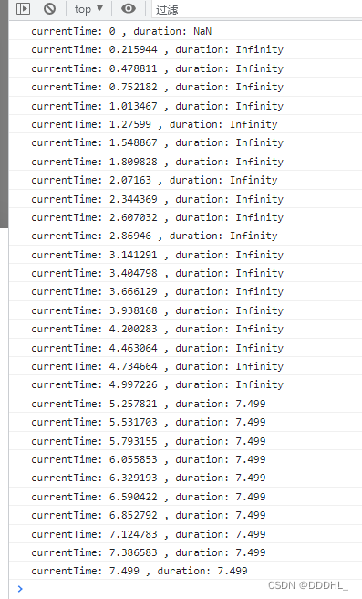

# JS音频的总时长 NaN || Infinity 问题

## 1. 需求分析

后端的接口中包含音频链接，前端需要自定义一个播放器播放音频。

## 2. 发现问题

### 2.1 使用浏览器内置播放器`<audio>`无法显示时长

`Chrome && Edge`：播放到一定时间后才能移动进度条与显示时长

|              Chrome默认状态              |                  播放时                  |               播放快结束时               |
| :--------------------------------------: | :--------------------------------------: | :--------------------------------------: |
|  |  |  |

`Firefox`：直接可以看到进度条与时长，样子也好看，问题解决（bushi）

|             Firefox默认状态              |                  播放时                  |               播放快结束时               |
| :--------------------------------------: | :--------------------------------------: | :--------------------------------------: |
|  |  |  |

>

### 2.2 获取总时长为 NaN || Infinity

```js
audio.ontimeupdate = () => {
  console.log(`currentTime: ${audio.currentTime} , duration: ${audio.duration}`)
}
```

根据输出可以看到只有在快接近播放完毕时才能获取到时间。

由此可以想到一个办法，预加载！直接先播放一遍获取时长！



>

## 3. 疑惑点

问：使用预加载方案，如果单纯的将音频播放一遍在获取总时长不太妙，时间太久了捏。

答：结合生活实际，想想你看片时想`快速结束`时会怎么做？

问：噢，快进！

>

## 4. 解决方案

示例代码，可根据自己的需要更改方案，主要看`countAudioTime`函数即可。

这种方案能很快的获取出音频的时间，然后就可以愉快的自定义播放器啦~ 有问题欢迎指出~

```js
const audio = new Audio()
audio.src = 'https://www.千度.com/audio/JiNiTaiMei.mp3'

// 计算音频的时长
const countAudioTime = async () => {
  while (isNaN(audio.duration) || audio.duration === Infinity) {
    // 延迟一会 不然网页都卡死
    await new Promise((resolve) => setTimeout(resolve, 200))
    // 设置随机播放时间，模拟调进度条
    audio.currentTime = 10000000 * Math.random()
  }
  console.log('音频的总时长:', audio.duration)
}
countAudioTime()
```
