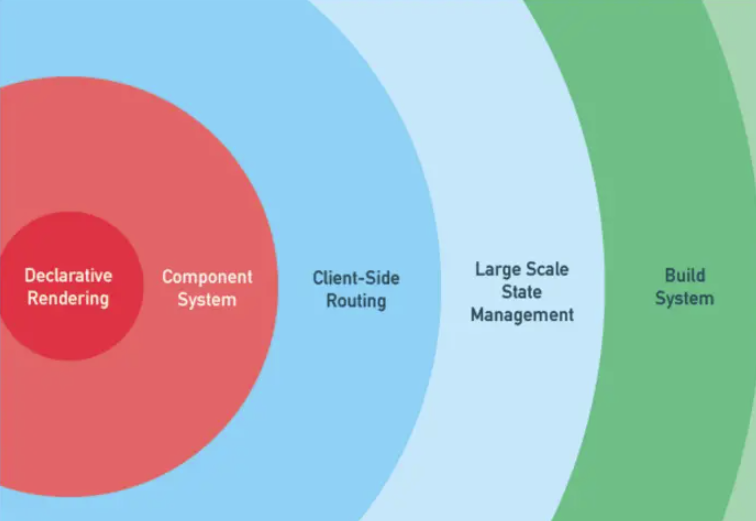
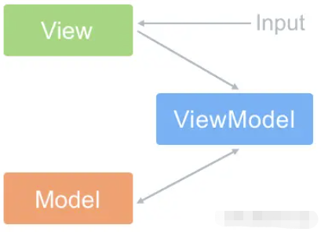

# Vue 面试知识点

## 1. Vue 的优点？Vue 的缺点？

**优点：**

- 渐进式
- 组件化开发
- 虚拟 dom
- 响应式数据
- 单页面路由
- 数据与视图分开

**缺点：**

- 单页面不利于 seo
- 不兼容 IE
- 首屏加载时间长

## 2. 为什么说 Vue 是一个渐进式框架？

Vue 的全家桶，你可以选择不用，或者只选几样去用，比如不用 vuex



## 3. Vue 跟 React 的异同点？

**相同点：**

- 都是单向数据流
- 都使用了虚拟 DOM 的技术
- 都支持 SSR
- 组件化开发

**不同点：**

- 前者 template，后者 JSX
- 数据改变，前者响应式，后者手动 setState
- React 单向绑定，Vue 双向绑定
- React 状态管理工具 Redux. Mobx，Vue 状态管理工具 Vuex

## 4. MVVM 是什么？和 MVC 有何区别呢？

**MVC**

- Model：负责从数据库中取数据
- View：负责展示数据
- Controller：用户交互的地方，例如点击事件
- 思想：Controller 将 Model 的数据展示在 View 上


**MVVM**

- VM：就是 View-Model，数据双向绑定
- Model：取数据的地方
- View：展示数据的地方
- 思想：View 和 Model 实现数据同步，不需要手动更新

> 注意：Vue 不严格符合 MVVM，因为 MVVM 规定 Model 和 View 不能直接通信，而 Vue 可以使用`ref`进行通信



## 5. Vue 和 JQuery 的区别在哪？为什么放弃 JQuery 用 Vue？

- JQuery 直接操作 DOM，而 Vue 不直接操作 DOM，而是只需操作数据
- Vue 的虚拟 DOM 技术，能适配多端
- Vue 集成了一些库，大大提高开发效率，例如 Route. Vuex 等等

## 6. 为什么 data 是个函数并且返回一个对象呢？

防止组件被多个页面使用时，造成的变量互相污染

## 7. 使用过哪些 Vue 的修饰符呢？

- `.lazy`：输入框失焦时才会更新 v-model 的值
- `.trim`：讲 v-model 绑定的值首位空格给去掉
- `.number`：将 v-medol 绑定的值转数字
- `.stop`：阻止事件冒泡
- `.capture`：事件的捕获
- `.self`：点击事件绑定本身才触发
- `.once`：事件只触发一次
- `.prevent`：阻止默认事件
- `.native`：绑定事件在自定义组件上时，确保能执行
- `.left. .middle. .right`：鼠标左中右键的触发
- `passive`：相当于给移动端滚动事件加一个`.lazy`
- `camel`：确保变量名会被识别成驼峰命名
- `.sync`：简化子修改父值的步骤

## 8. 路由的几种模式？

- hash：哈希模式，根据 hash 值的更改进行组件切换，而不刷新页面
- history：历史模式，依赖于 HTML5 的 pushState 和 replaceState
- abstract：适用于 Node

## 9. 路由的钩子函数？

**全局钩子**

- beforeEach：跳转路由前

- - to：将要跳转进入的路由对象
  - from：将要离开的路由对象
  - next：执行跳转的方法

- afterEach：路由跳转后

- - to：将要跳转进入的路由对象

**路由独享钩子**

```
routes: [
  {
    path: '/xxx',
    component: xxx,
    beforeEnter: (to, from, next) => {

    }
  }
]
```

**组件内路由钩子**

- beforeRouteEnter(to, from, next)：跳转路由渲染组件时触发
- beforeRouteUpdate(to, from, next)：跳转路由且组件被复用时触发
- beforeRouteLeave(to, from, next)：跳转路由且离开组件时触发

## 10. 使用过哪些 Vue 的内部指令呢？

- `v-text`：元素的 textContent
- `v-html`：元素的 innerHTML
- `v-show`：通过样式 display 改变显隐
- `v-if`：通过操作 DOM 改变显隐
- `v-else`：配合 v-if
- `v-else-id`：配合 v-else
- `v-for`：循环渲染
- `v-on`：绑定事件，缩写@
- `v-bind`：绑定变量，缩写:
- `v-model`：双向绑定
- `v-slot`：插槽
- `v-once`：只渲染一次
- `v-pre`：跳过元素编译
- `v-cloak`：隐藏双括号，有值再显示

## 11. 组件之间的传值方式有哪些？

- 父传子，子组件通过`props`接收
- 子传父，子组件使用`$emit`对父组件进行传值
- 父子之间通过`$parent`和`$chidren`获取实例进而通信
- 通过`vuex`进行状态管理
- 通过`eventBus`进行跨组件值传递
- `provide`和`inject`，官方不建议使用
- `$ref`获取实例，进而传值
- 路由传值
- localStorage. sessionStorage

## 12. 如何设置动态 class，动态 style？

- 动态 class 对象：`<div :class="{ 'is-active': true, 'red': isRed }"></div>`
- 动态 class 数组：`<div :class="['is-active', isRed ? 'red' : '' ]"></div>`
- 动态 style 对象：`<div :style="{ color: textColor, fontSize: '18px' }"></div>`
- 动态 style 数组：`

## 13. v-if 和 v-show 有何区别？

- `v-if`：通过操作 DOM 来控制显隐，适用于偶尔显隐的情况
- `v-show`：通过改变样式 display 属性控制显隐，适用于频繁显隐的情况

## 14. computed 和 watch 有何区别？

- `computed`：依赖多个变量计算出一个变量，且具有缓存机制，依赖值不变的情况下，会复用计算值。`computed`中不能进行异步操作
- `watch`：通常监听一个变量的变化，而去做一些事，可异步操作
- 简单记就是：一般情况下`computed`的多对一，`watch`一对多

## 15. Vue 的生命周期，讲一讲？

- `beforeCreate`：实例 Vue，未初始化和响应式数据
- `created`：已初始化和响应式数据，可访问数据
- `beforeMount`：render 调用，虚拟 DOM 生成，未转真实 DOM
- `mounted`：真实 DOM 挂载完成
- `beforeUpdate`：数据更新，新虚拟 DOM 生成
- `updated`：新旧虚拟 DOM 进行对比，打补丁，然后进行真实 DOM 更新
- `beforeDestroy`：实例销毁前，仍可访问数据
- `destroy`：实例销毁，子实例销毁，指令解绑，解绑本实例的事件
- `activated`：keep-alive 所缓存组件激活时调用
- `deactivated`：keep-alive 所缓存组件停用时调用
- `errorCaptured`：子孙组件的错误捕获，此函数可返回 false 阻止继续向上传播

## 16. 为什么 v-if 和 v-for 不建议用在同一标签？

`v-for`优先级高于`v-if`，每项都通过`v-for`渲染出来后再去通过`v-if`判断显隐，做了很多无用功

## 17. vuex 的有哪些属性？用处是什么？

- `state`：定义初始状态
- `getter`：从 store 从取数据
- `mutation`：更改 store 中状态，只能同步操作
- `action`：用于提交 mutation，而不直接更改状态，可异步操作
- `module`：store 的模块拆分


## 18. 不需要响应式的数据应该怎么处理？

- 定义在 data 的 return 之外
- 使用 Object.freeze 进行数据冻结

## 19. watch 有哪些属性，分别有什么用？

- immediate：初次加载时立即执行
- deep：是否进行深度监听
- handler：监听的回调函数

## 20. 父子组件生命周期顺序？

父 beforeCreate -> 父 created -> 父 beforeMount -> 子 beforeCreate -> 子 created -> 子 beforeMount -> 子 mounted -> 父 mounted

## 21. 对象新属性无法更新视图，删除属性无法更新视图，为什么？怎么办？

- 原因：Object.defineProperty 没有对对象的新属性进行劫持

- 解决：

- - 新增属性：`Vue.set(target, key, value)`
  - 删除属性：`Vue.delete(target, key)`

## 22. 直接 arr[index] = xxx 无法更新视图怎么办？为什么？怎么办？

- 原因：Vue 出于性能考虑没有对数组下标进行劫持，而是通过改写数组原型方法

- 解决：

- - `splice：arr.splice(index, 1, value)`
  - `Vue.set(target, index, value)`

## 23. 插槽的使用以及原理？

> 具体：https://juejin.cn/post/6949848530781470733

**普通插槽** 普通插槽`slot`会被当做子元素进行解析，最终会被解析成一个`_t`函数，他接收的第一个参数为插槽的名称，默认是`default`，也就是`_t('default')`，执行此函数进行最终元素的渲染，如果是具名插槽，则传对应的插槽名 **作用域插槽** 插槽会被封装成一个函数放置在`scopeSlotes`对象中，解析时`_t`第二个参数接收子组件的数据，并进行渲染

## 24. 为什么不建议用 index 做 key，为什么不建议用随机数做 key？

举个例子：

```
<div v-for="(item, index) in list" :key="index">{{item.name}}</div>

list: [
    { name: '小明', id: '123' },
    { name: '小红', id: '124' },
    { name: '小花', id: '125' }
]

渲染为
<div key="0">小明</div>
<div key="1">小红</div>
<div key="2">小花</div>

现在我执行 list.unshift({ name: '小林', id: '122' })

渲染为
<div key="0">小林</div>
<div key="1">小明</div>
<div key="2">小红</div>
<div key="3">小花</div>


新旧对比

<div key="0">小明</div>  <div key="0">小林</div>
<div key="1">小红</div>  <div key="1">小明</div>
<div key="2">小花</div>  <div key="2">小红</div>
                         <div key="3">小花</div>

可以看出，如果用index做key的话，其实是更新了原有的三项，并新增了小花，虽然达到了渲染目的，但是损耗性能

现在我们使用id来做key，渲染为

<div key="123">小明</div>
<div key="124">小红</div>
<div key="125">小花</div>

现在我执行 list.unshift({ name: '小林', id: '122' })，渲染为

<div key="122">小林</div>
<div key="123">小明</div>
<div key="124">小红</div>
<div key="125">小花</div>

新旧对比

                           <div key="122">小林</div>
<div key="123">小明</div>  <div key="123">小明</div>
<div key="124">小红</div>  <div key="124">小红</div>
<div key="125">小花</div>  <div key="125">小花</div>

可以看出，原有的三项都不变，只是新增了小林这个人，这才是最理想的结果
```

用`index`和用`随机数`都是同理，`随机数`每次都在变，做不到专一性，很`渣男`，也很消耗性能，所以，拒绝`渣男`，选择`老实人`

## 25. 自定义指令的钩子函数？

这里只说 Vue2 的

- `bind`：指令绑定到指定元素时调用，只调用一次
- `inserted`：指定元素插入父节点时调用
- `update`：所在组件的 VNode 更新时调用
- `componnetUpdated`：所在组件以及其子组件 VNode 全部更新后调用
- `unbind`：只调用一次，指令与元素解绑时调用

## 26. 说说 nextTick 的用处？

修改数据时不能马上得到最新的 DOM 信息，所以需要使用 nextTick，在 nectTick 回调中可以获取最新 DOM 信息

## 27. 为什么 nextTick 优先是微任务？

优先是`Promise.then`方法，是个微任务，这样可以避免多一次队列，进而少一次 UI 渲染，节省性能

## 28. Vue 的 SSR 是什么？有什么好处？

SSR 全称`Server Side Render`

- 有利于 SEO：由于是在服务端，将数据填充进 HTML 之后再推送到浏览器，所以有利于 SEO 的爬取
- 首屏渲染快

## 29. Vue 响应式是怎么实现的？

- 1. 劫持：通过`Object.defineProperty`对对象进行递归劫持属性的`get. set`
- 2. 观察者模式：使用`watcher`进行观察数据使用的地方
- 3. 发布订阅模式：使用`dep`收集`watcher`，数据更改时，通过`notify`方法通知`dep`里的`watcher`去进行相应的更新
- 4. 数组：数组没有使用劫持的模式，而是通过重写数组原型上的方法，来实现数组的响应式

## 30. 为什么只对对象劫持，而要对数组进行方法重写？

数组的元素大概率是成百上千的，所以对数组下标进行劫持的话会非常消耗性能。Vue 通过对数组原型上方法的重写，实现数组的响应式

## 31. Vue 的模板编译原理？

> 具体：https://juejin.cn/post/6969563640416436232

## 32. Vue 的 computed 和 watch 的原理？

> 具体：https://juejin.cn/post/6974293549135167495

## 33. Vue.set 方法的原理？

Vue.set(target, key, value)

- 第一步：判断 target 是数组的话，则调用 target.splice(key, 1, value)

- 第二步：判断 target 是对象的话，再判断传入的 key 是否已存在 target 中

- - 是：直接 target[key] = value
  - 否：调用 defineReactive(target, key, val)进行响应式处理

```
export default function set(target, key, val) {
    if (Array.isArray(target)) {
        target.length = Math.max(target.length, key)
        target.splice(key, 1, val)
        return val
    }

    const ob = target.__ob__

    if (key in target && !(key in target.prototype) || !ob) {
        target[key] = val
        return val
    }

    defineReactive(target, key, val)
    return val
}
```

## 34. Vue.delete 方法的原理？

Vue.delete(target, key)

- 第一步：判断 target 是否为数组，是的话调用 target.splice(key, 1)
- 第二步：判断 target 是对象的话，调用 delete 关键字删除属性，并调用**ob**.dep.notify 进行更新通知

```
export default function del (target, key) {
    if (Array.isArray(target)) {
        target.splice(key, 1)
        return
    }

    const ob = target.__ob__

    if (!(key in target)) return

    delete target[key]

    if (!ob) return

    ob.dep.notify()
}
```

## 35. nextTick 的原理？

维护一个数组，每次调用时讲回调函数压入这个数组，然后优先选择微任务，在微任务回调中去执行数组中的所有回调，同时维护一个布尔值，确保每一次队列进行一次执行数组所有回调

```
let callbacks = []; //回调函数
let pending = false;
function flushCallbacks() {
  pending = false; //把标志还原为false
  // 依次执行回调
  for (let i = 0; i < callbacks.length; i++) {
    callbacks[i]();
  }
}
let timerFunc; //先采用微任务并按照优先级优雅降级的方式实现异步刷新
if (typeof Promise !== "undefined") {
  // 如果支持promise
  const p = Promise.resolve();
  timerFunc = () => {
    p.then(flushCallbacks);
  };
} else if (typeof MutationObserver !== "undefined") {
  // MutationObserver 主要是监听dom变化 也是一个异步方法
  let counter = 1;
  const observer = new MutationObserver(flushCallbacks);
  const textNode = document.createTextNode(String(counter));
  observer.observe(textNode, {
    characterData: true,
  });
  timerFunc = () => {
    counter = (counter + 1) % 2;
    textNode.data = String(counter);
  };
} else if (typeof setImmediate !== "undefined") {
  // 如果前面都不支持 判断setImmediate
  timerFunc = () => {
    setImmediate(flushCallbacks);
  };
} else {
  // 最后降级采用setTimeout
  timerFunc = () => {
    setTimeout(flushCallbacks, 0);
  };
}

export function nextTick(cb) {
  callbacks.push(cb);
  if (!pending) {
    pending = true;
    timerFunc();
  }
}
```

## 36. 说说 虚拟 dom 和 diff 算法 吧？

**虚拟 dom**

虚拟 dom 是一个对象，一个描述真实 DOM 的对象，每次数据更新时，新旧虚拟 DOM 都会互相进行同层对比，而 diff 算法优化就是在此时做优化的。

**diff 算法**

- 第一步：调用`patch`方法，传入新旧虚拟 DOM，开始同层对比

- 第二步：调用`isSameNode`方法，对比新旧节点是否同类型节点

- 第三步：如果不同，新节点直接代替旧节点

- 第四步：如果相同，调用`patchNode`进行对比节点

- - 如果旧节点和新节点都是文本节点，则新文本代替旧文本
  - 如果旧节点有子节点，新节点没，则删除旧节点的子节点
  - 如果旧节点没有子节点，新节点有，则把子节点新增上去
  - 如果都有子节点，则调用`updateChildren`方法进行新旧子节点的对比
  - 子节点对比为首尾对比法

## 37. 如果子组件改变 props 里的数据会发生什么？

- 基础类型：如果父传给子的是基础类型，修改则会报错
- 引用类型：如果父传给子的是引用类型，修改属性则会同时修改父组件数据

## 38. props 怎么自定义验证

```
props: {
    num: {
      default: 1,
      validator: function (value) {
          // 返回值为false则验证不通过，报错
          return [
            1, 2, 3, 4, 5
          ].indexOf(value) !== -1
    }
    }
  }
}
```

## 39. watch 的 immediate 属性有什么用？

Vue 实例初始化的时候立即调用 watch 的监听回调函数

## 40. watch 监听一个对象时，如何排除某些属性的监听

```
mounted() {
    Object.keys(this.params)
      .filter((_) => !["c", "d"].includes(_)) // 排除对c，d属性的监听
      .forEach((_) => {
        this.$watch((vm) => vm.params[_], handler, {
          deep: true,
        });
      });
  },
data() {
    return {
      params: {
        a: 1,
        b: 2,
        c: 3,
        d: 4
      },
    };
  },
watch: {
    params: {
      deep: true,
      handler() {
        this.getList;
      },
    },
  }
```

## 41. 审查元素时发现 data-v-xxxxx，这是啥？

样式模块化 scoped 的效果，在本组件的标签都会带上 data-v-xxx 的属性，然后通过属性选择器实现样式模块化的效果

## 42. vue 的 hook 的使用？

- 同一组件中使用

> 这是我们常用的使用定时器的方式

```
export default{
  data(){
    timer:null
  },
  mounted(){
      this.timer = setInterval(()=>{
      //具体执行内容
      console.log('1');
    },1000);
  }
  beforeDestory(){
    clearInterval(this.timer);
    this.timer = null;
  }
}
```

> 上面做法不好的地方在于：得全局多定义一个 timer 变量，可以使用 hook 这么做：

```
export default{
  methods:{
    fn(){
      let timer = setInterval(()=>{
        //具体执行代码
        console.log('1');
      },1000);
      this.$once('hook:beforeDestroy',()=>{
        clearInterval(timer);
        timer = null;
      })
    }
  }
}
```

- 7.2 父子组件使用

> 如果子组件需要在 mounted 时触发父组件的某一个函数，平时都会这么写：

```
//父组件
<rl-child @childMounted="childMountedHandle"
/>
method () {
  childMountedHandle() {
  // do something...
  }
},

// 子组件
mounted () {
  this.$emit('childMounted')
},
```

> 使用 hook 的话可以更方便：

```
//父组件
<rl-child @hook:mounted="childMountedHandle"
/>
method () {
  childMountedHandle() {
  // do something...
  }
},
```

## 43. provide 和 inject 是响应式的吗？

引用数据类型响应式，基础数据类型不响应式

## 44. Vue 的 el 属性和$mount 优先级？

同时存在时，`el > $mount`


## 45. 动态指令和参数使用过吗？

```
<aButton @[someEvent]="handleSomeEvent()" :[someProps]="1000" />
```

## 46. 相同的路由组件如何重新渲染？

更改如有组件上的 key 即可

## 47. 自定义 v-model

```
export default: {
  model: {
    event: 'change',
    prop: 'checked'
  }
}
```

## 48. 如何将获取 data 中某一个数据的初始状态？

使用`this.$options.data().xxx`获取初始值

## 49. 计算变量时，methods 和 computed 哪个好？

computed 比较好，computed 有缓存机制，可以节省性能。而 method 则每次更新都会重新计算，不考虑缓存

## 50. router.push. router.replace. router.go 的区别？

- `router.push`：跳转，并向 history 栈中加一个记录，可以后退到上一个页面
- `router.replace`：跳转，不会向 history 栈中加一个记录，不可以后退到上一个页面
- `router.go`：传正数向前跳转，传负数向后跳转
