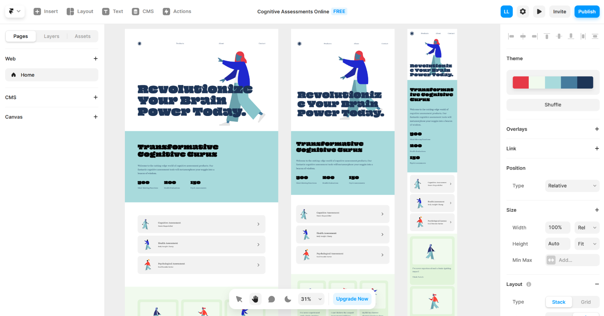

# 现阶段AI建站工具简析

## 前言

现AI建站的技术种类繁多，大体分为三类，文本描述类、图像生成类、问答||模板类。

## 1. 文本描述类

### （1）Boardmix AI

支持中文、可利用文字命令AI修改页面

https://boardmix.cn/

### （2）Dora AI

可编辑、可生成3D动画、可拖拽布局、支持响应式布局

https://www.dora.run/

### （3）Pineapple

根据一段话生成网站

https://www.pineapplebuilder.com/

### （4）framer

根据一段话生成网站，支持响应式布局，可多人在线编辑多端页面布局

https://www.framer.com/

### （5）elementor AI

选择模板后，使用文本描述修改网站，支持响应式布局

https://elementor.com/

### （6）Mixo

根据文本生成网站

https://www.mixo.io/

## 2. 图像生成类

### （1）Quest AI（beta版本出现error）

可根据设计稿、手稿生成网页、支持响应式布局、支持文本描述生成代码

https://www.quest.ai/

### （2）Imgcook（阿里）

根据设计稿生成页面

https://www.imgcook.com/

### （3）Deco（京东）

根据设计稿生成页面

https://deco-preview.jd.com/

### （4）Fronty（近期服务器迁移暂时无法使用）

AI智能将图像转换为HTML/CSS代码

https://fronty.com/

### （5）sketch2code（微软，目前无法访问）

手绘设计草图自动转换为 HTML 代码

https://sketch2code.azurewebsites.net/

### （6）站塔（AI智能生成页面出现未知错误）

选择模板或者上传设计图AI生成网站

https://zt.sz24hours.com/

### （7）MiniGPT-4（本地部署配置需求高）

开源，现已关闭在线试用，只能自己部署。语言能力与图像能力结合类GPT，支持图片解析。

https://github.com/Vision-CAIR/MiniGPT-4

### （8）Bard

多模态AI，支持图片解析（科学上网加英文）。草图绘制网页能力有限，样式粗糙。

https://bard.google.com/

### （9）ChatGPT4

未开放图片上传功能

## 3. 问答||模板类

### （1）webflow

著名低代码平台，支持多人协同，选择模板拖拽布局

https://webflow.com/

### （2）Hocoos

回答8个问题，一键生成网站，可自由编辑

https://hocoos.com/

### （3）Durable AI

选择主题，一键生成网站，可自由编辑

https://durable.co/

### （4）carrd

选择模板，一键生成网站，支持响应式

https://carrd.co/build

## 4. 尝试建站

### （1）Bard（谷歌）

- 上传草图，直接让AI建站

  结果：`AI回答需要更多细节`

  

- 再上传一张网站图片，让AI做出这种类型的网站

  结果：`因图片含有人物照片，无法解析`

  

- 再次上传草图，添加草图中网站的具体描述

  :::tip 中文
  结合这个草图来制作一个网页。 顶部是导航栏，中间使用了文字标识。 然后是三个功能介绍，最下面是联系我们。
  :::

  :::tip 英文
  Combine this sketch to make a web page. The top is the navigation bar, and a text logo is used in the middle. Then there are three function introductions, and the bottom is contact us.
  :::

  

- 将AI生成的代码拼接，用VScode查看

  

- 让AI将其变成中文网站。

  

- 让AI将网站加入高级设计

  中文：对网站进行一些高级设计，因为它现在看起来只是文本

  英文：Do some advanced design for the site as it looks like it's just text now

  结果：`AI仅回复建议，未更改`

  

- 让AI根据它给出的建议去改善网站并上线服务器

  演示地址1：http://106.13.229.31:2000/careana/

  

### （2）framer（AI文字描述建站）

- 第一步：描述建站内容，以附件4为例

  ::: tip 中文
  一个介绍认知测评产品网站。网站的顶部是导航栏。网站中心是文字logo。然后有3张图片介绍功能，分别是认知测评、健康测评、心理测评。底部是联系我们。
  :::

  ::: tip 英文
  A website that introduces cognitive assessment products. The top of the website is the navigation bar. The center of the website is a text logo. Then there are three pictures to introduce the functions, namely cognitive assessment, health assessment, and psychological assessment. The bottom is to contact us.
  :::

- 第二步：查看AI一键生成的网站预览

  

- 第三步：简单使用拖拽与更改文字进行布局调整，最后上线网站

  演示地址2：https://careana.framer.ai/

  

### （3）webflow（模板低代码建站）

- 第一步：选择合适模板

- 第二步：预览初始化模板网站

  

- 第三步：适当调整与发布网站

  演示地址3：https://careana.webflow.io/

  

## 5. 小结

:::tip 结果
体验了多个不同类型的AI建站工具后，个人感觉现阶段图像建站并没有特别完善，实际效果不佳，即便利用文字不断进行修改，效果也比较差。想要无代码快速建站，现阶段使用低代码平台、AI文本建站工具更优。
:::

:::tip 推荐
低代码已经发展多年，生态很完整，演示的这两个低代码工具均支持响应式布局，布局工具完整，有多种组件可供使用，同时支持多人协同建站，支持一键发布网站。
:::

优点：`无代码，适配多端，一键部署，多人协同。`

缺点：`生成的网站与实际想要效果仍然有差距，即便同一段话也会生成不同的风格。与后端的交互麻烦，仅仅适合一些商务介绍网站。无基础人员使用低代码需要一定学习时间。`

 

演示地址1：[bard草图建站地址](http://106.13.229.31:2000/careana/)

演示地址2：[webflow低代码建站地址](https://careana.webflow.io/)

演示地址2：[framer文本建站地址](http://106.13.229.31:2000/careana/)
