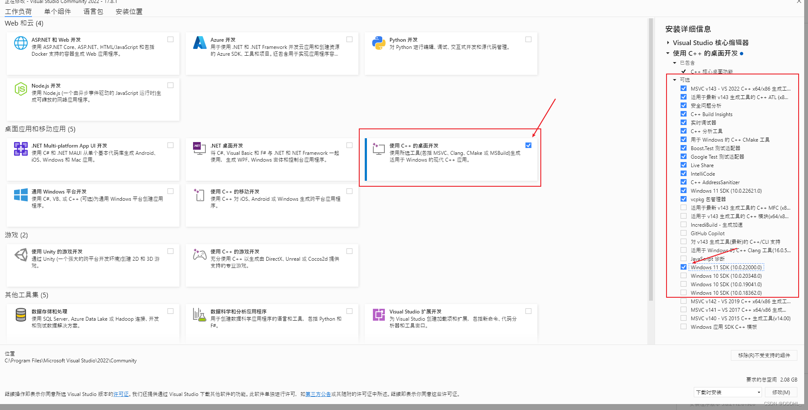

# electron windows robotjs 安装教程

## 前言

robotjs可以控制鼠标键盘，获取屏幕内容，配合electron可做很多自动化操作。windows下配置环境有很多坑，很多文章都太旧了。试了很多次发现了一个简单的环境安装办法。

```json
/* 演示版本 win11 */
"node":"20.10.0"
"electron": "^26.1.0"
"robotjs": "^0.6.0"
```

首先看一下官方给出的教程([github地址](https://github.com/octalmage/robotjs))

- Windows

  - windows-build-tools

  ```bash
  #  from an elevated PowerShell or CMD.exe
  npm install --global --production windows-build-tools
  ```

- Mac

  - Xcode Command Line Tools.

- Linux

  - Python (v2.7 recommended, v3.x.x is not supported).

  - make.

  - A C/C++ compiler like GCC.

  - libxtst-dev and libpng++-dev

    ```bash
    sudo apt-get install libxtst-dev libpng++-dev
    ```

很难受，`windows-build-tools` 我安装了半天都没安装上。

看了很多文章后，学到了个新办法，接下来开始教程。

## 1. 安装python

版本好像得3.6以上，我安装的是3.7.9 , 下载安装包，勾选 Add to path 即可。[python华为镜像链接 国内下载快](https://mirrors.huaweicloud.com/python/)

```bash
C:\Users\Administrator>python
Python 3.7.9 (tags/v3.7.9:13c94747c7, Aug 17 2020, 18:58:18) [MSC v.1900 64 bit (AMD64)] on win32
Type "help", "copyright", "credits" or "license" for more information.
>>>
```

## 2. 安装Visual Studio 2022

这一步只是安装c++编译环境（windows-build-tools是在安装这个VC++环境和python。实测可以通过手动安装python加vsc替代，满速且简单无差错，缺点是大了点，不过卸载也方便），robotjs经常需要构建兼容版本（electron-rebuild或者postinstall）。我下载的是社区版vs2022 [官方下载地址](https://visualstudio.microsoft.com/zh-hans/downloads/)。打开后勾选C++桌面开发，注意右侧还需手动勾选一项windows sdk。



## 3. 安装robotjs

注意配置镜像源，如果有下载node-headers错误，换源（淘宝源不行，我改用cnpm源就行了）。yarn推荐使用yrm，npm用nrm

```bash
# 有可能出现这个错误，换源即可解决，我用淘宝的不行，换了cnpm源就可以了
gyp http GET https://npm.taobao.org/dist/v26.5.0/node-v26.5.0-headers.tar.gz
gyp http 404 https://cdn.npmmirror.com/binaries/node/v26.5.0/node-v26.5.0-headers.tar.gz
gyp WARN install got an error, rolling back install
```

安装robotjs
::: code-group

```sh [yarn]
yarn add robotjs
```

```sh [npm]
npm i robotjs
```

:::

如果用的是electron-builder，可以添加这个命令，出现node版本不匹配的时候用这个命令构建一下即可

```js
"scripts": {
	...
    "postinstall": "electron-builder install-app-deps"
},
```

如果不是，可以安装 electron-rebuild， 用这个来构建

```sh [yarn]
yarn add electron-rebuild -D
yarn electron-rebuild
```
