# Flutter windows 环境配置

从零开始，演示flutter环境配置到启动项目，同时支持 vscode 和 android studio

## 1. Flutter SDK 环境配置

[Flutter Windows SDK 下载地址](https://flutter.cn/docs/get-started/install/windows)

### 1.1 将解压后的bin目录放入系统环境变量的Path中

Tips : `放在系统变量中时，需要管理员CMD才能使用命令，可以选择放在用户变量中`

```bash
解压目录\flutter\bin
解压目录\flutter\bin\cache\dart-sdk\bin
```

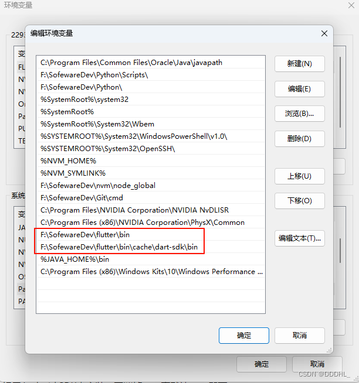

### 1.2 新建系统变量，配置源

```bash
PUB_HOSTED_URL=https://pub.flutter-io.cn
FLUTTER_STORAGE_BASE_URL=https://storage.flutter-io.cn

# 清华源（如果官方的临时源速度慢，可以用这个，速度快）
PUB_HOSTED_URL=https://mirrors.tuna.tsinghua.edu.cn/dart-pub
FLUTTER_STORAGE_BASE_URL=https://mirrors.tuna.tsinghua.edu.cn/flutter
```

| 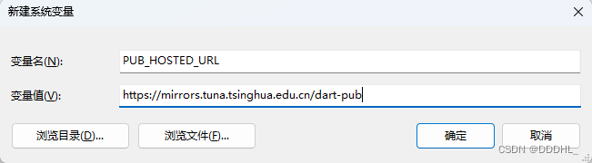 | 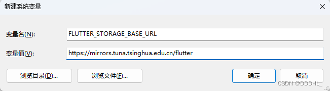 |
| ------------------------------------------------------ | ------------------------------------------------------ |

### 1.3 检测配置

```bash
# 测试是否配置完成 （管理员CMD）
flutter --version
dart --version

# 可以检测系统缺少什么 chrome可以用edge替代，visual studio 自行安装
flutter doctor
```

## 2 Android Studio

[Android Studio下载地址](https://developer.android.google.cn/studio?hl=zh-cn)

（1）打开软件后会提示Android SDK未安装，取消掉，一直默认next即可。

（2）正式进入软件界面后，在 Project 界面中点击 More Actions ，选择SDK Manager

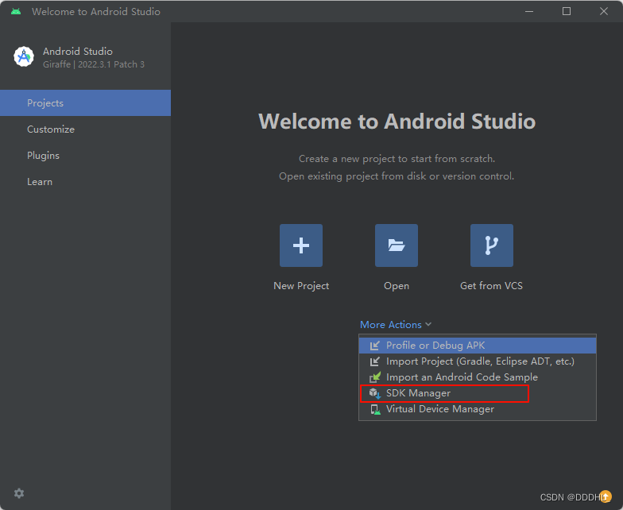

（3）在弹出的页面中，选择Android SDK Command-line Tools (latest) , 再点击ok即可安装。

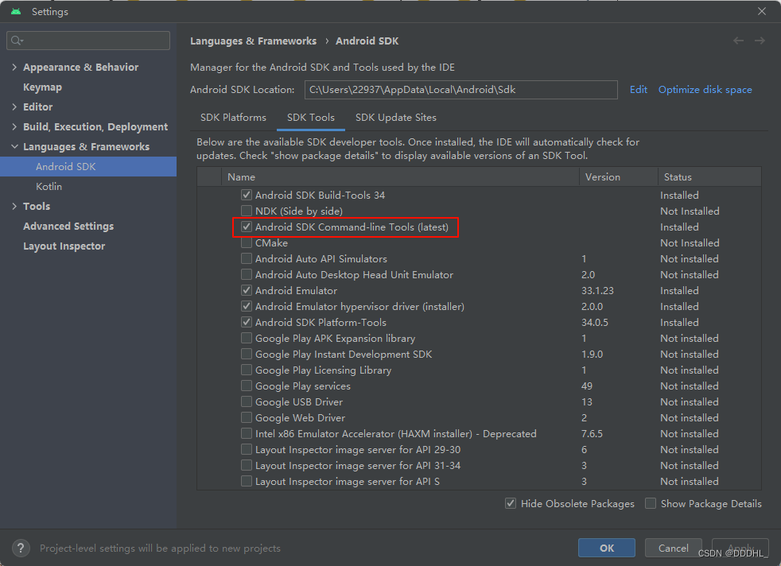

（4）android-licenses

```bash
# CMD输入命令 一直Y
flutter doctor --android-licenses
```

（5）最后可以在Android Studio 中的 More Actions中选择合适的安卓模拟器进行安装，默认会带一个模拟器。

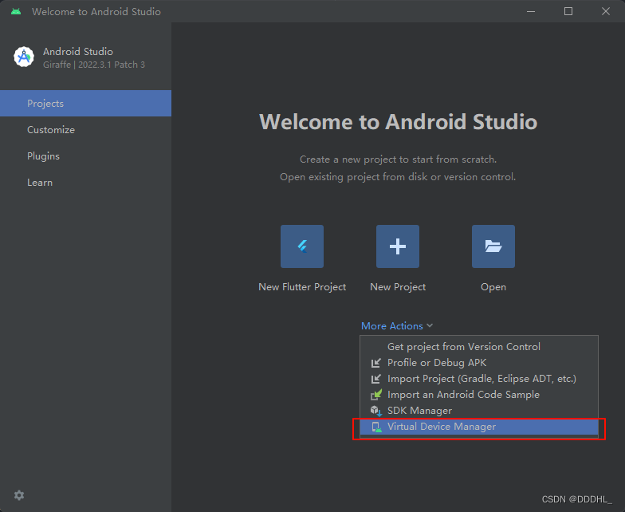

## 3. JDK

[JDK 下载地址](https://www.oracle.com/cn/java/technologies/downloads/#jdk21-windows)

正常安装，我安装的是21版本，一直next即可

```bash
# 新建环境变量
JAVA_HOME=安装目录
CLASSPATH=.;%JAVA_HOME%\lib\dt.jar;%JAVA_HOME%\lib\tools.jar;%JAVA_HOME%\lib;
```

| 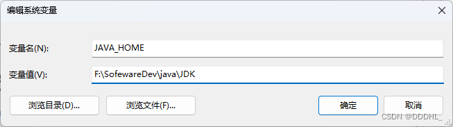 | 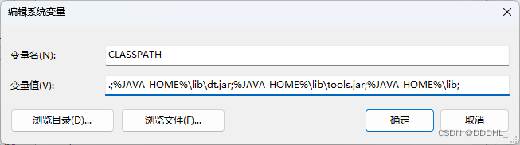 |
| ------------------------------------------------------ | ------------------------------------------------------ |

```bash
# 环境变量Path
%JAVA_HOME%\bin
```

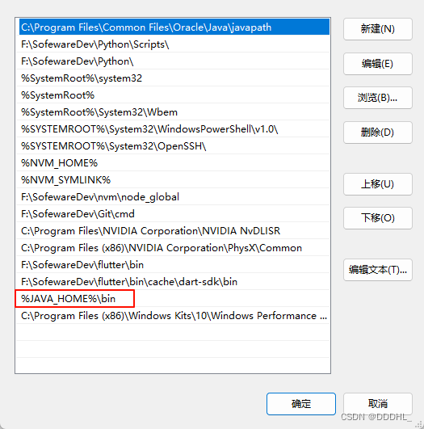

## 4. 拓展安装

需要安装 dart + flutter

（1）vscode - 插件市场上安装

| 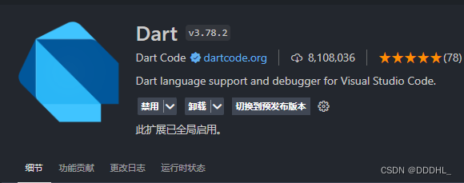 | 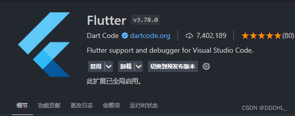 |
| ------------------------------------------------------- | ------------------------------------------------------- |

（2）Android Studio - Plugins中安装

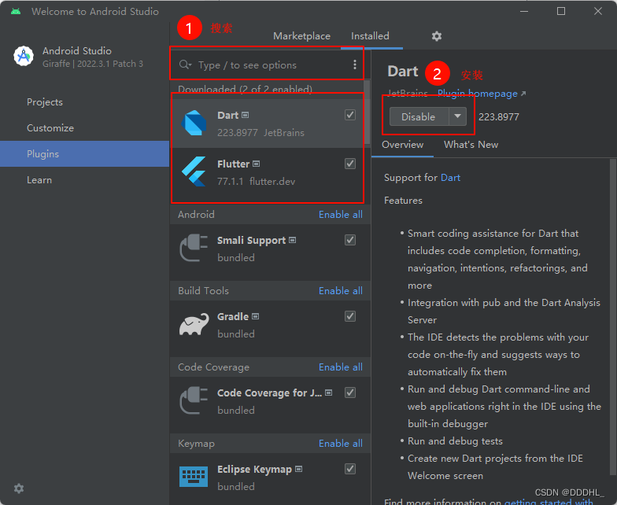

## 5. Visual Studio 2022

选择C++桌面开发后，右侧列表中检查是否勾选了Windows SDK，需要勾选，再点击安装即可。

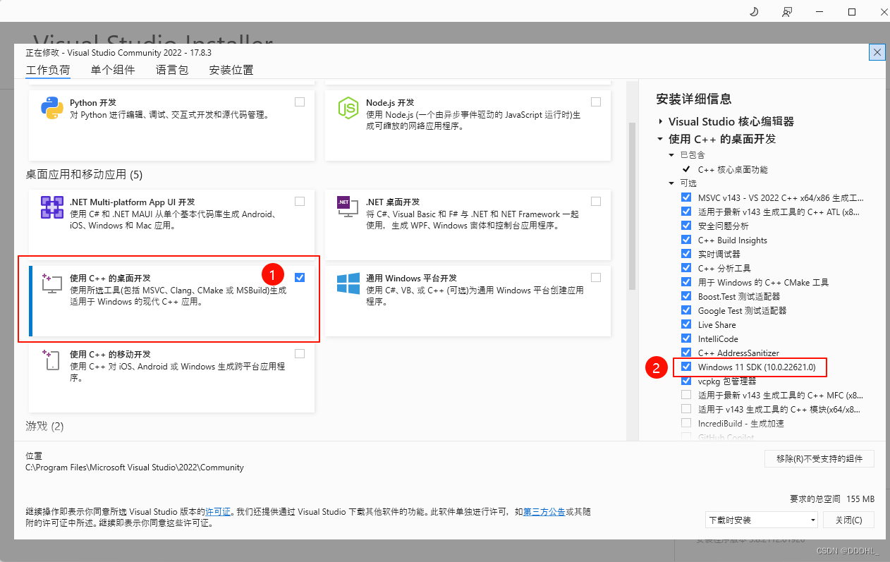

## 6. 项目创建和启动

### 6.1 vscode

（1）ctrl+shift+p 搜索 Flutter 选择 Flutter:New Project

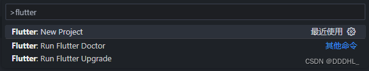

（2）选择Application，点击后需要选择项目目录，并输入名称

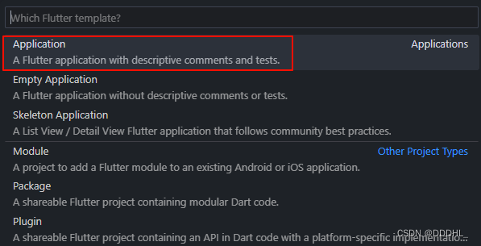

（3）创建项目完成

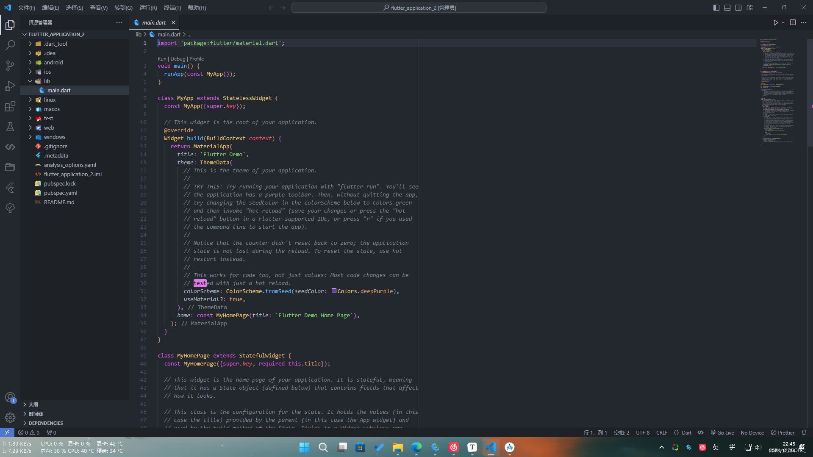

（4）右下角Select Device可选择启动设备

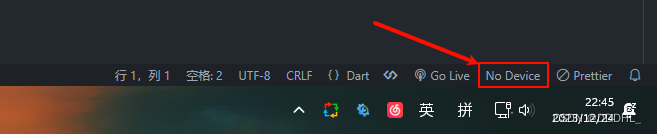

（3）选择启动的平台，下面是Android Studio默认的模拟器

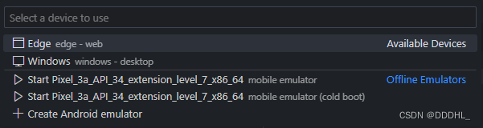

（4）启动项目

首次启动会下载相关包，需要github的网络，如果等了很久可以切换清华源

```bash
# 可能会卡在这里很久，需要注意是否能访问github
Flutter assets will be downloaded from https://mirrors.tuna.tsinghua.edu.cn/flutter. Make sure you trust this source!
Launching lib\main.dart on sdk gphone64 x86 64 in debug mode...
Flutter assets will be downloaded from https://mirrors.tuna.tsinghua.edu.cn/flutter. Make sure you trust this source!
Running Gradle task 'assembleDebug'...
```

启动方式有两种

① 控制台输入 flutter run

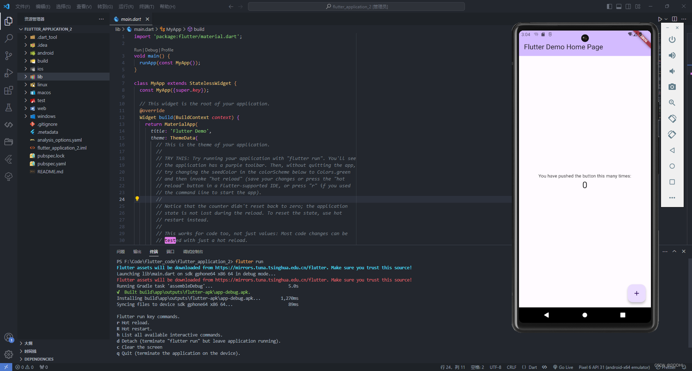

② 使用vscode的运行与调试，点击运行

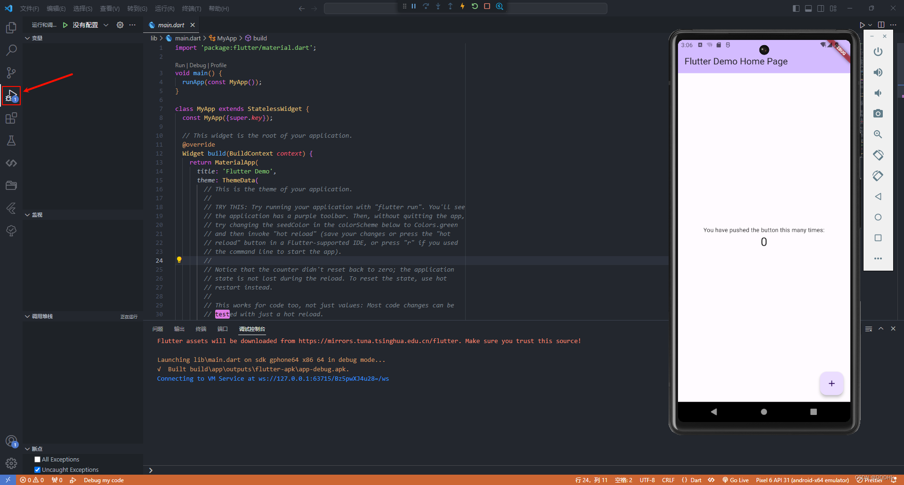

### 6.2 Android Studio

（1）安装完拓展后会显示新的选项，选择New Flutter Project

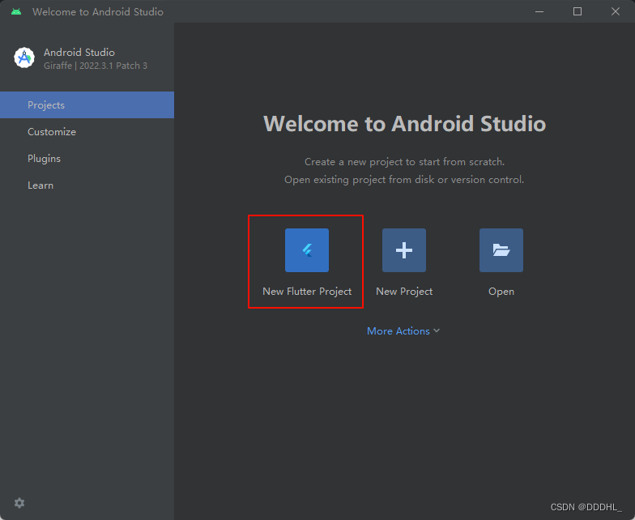

（2）选择flutter后，这边可以选择项目的初始化设置，不需要的可以取消，取消后不会生成对应目录。

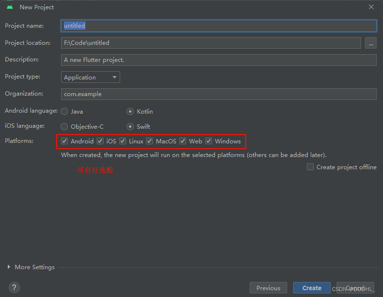

（3）先选择模拟器后再启动项目

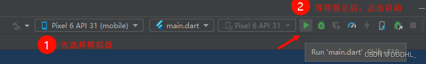

（4）启动后模拟器不会自动弹出，需要点击右下角的 "Running Devices"

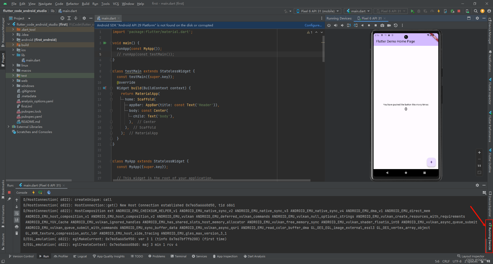
