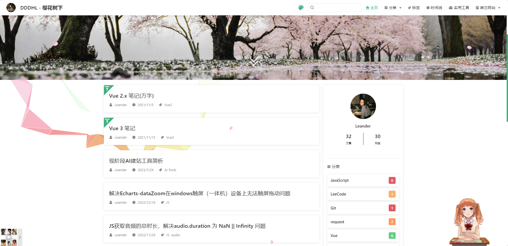
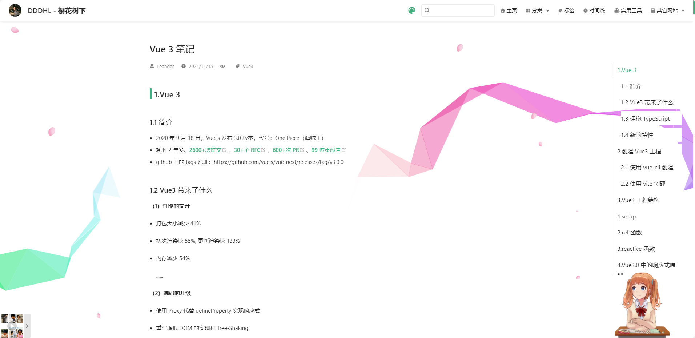
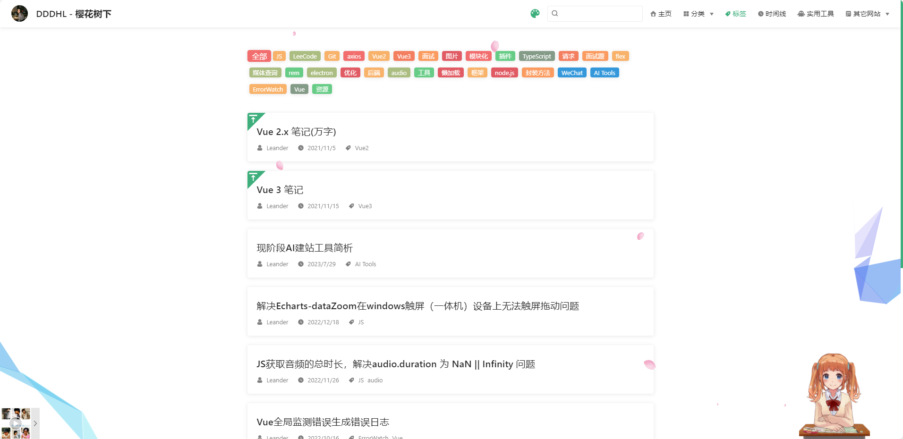

# vitepress自定义博客

## 前言

服务器过期快一年了，博客也快一年没更新了，最近重新搭建了一下博客，记录一下搭建过程。
以前的博客是使用vuepress搭建的，这次换成了vitepress，vitepress是vuepress的下一代，使用vite构建，性能更好，体验更好。缺点是vitepress的插件生态还没有vuepress那么丰富，很多功能需要自己实现，好在vitepress给出的配置也多，大部分功能都能实现。

<table>
  <tbody>
    <tr>
      <td>
        
      </td>
    </tr>
     <tr>
      <td>
        
      </td>
    </tr>
     <tr>
      <td>
        
      </td>
    </tr>
  </tbody>
</table>

## 博客简介

## 安装

[vitepress官方文档](https://vitepress.dev/zh/)

```sh
┌ Welcome to VitePress!
│
◇ Where should VitePress initialize the config?
│ ./docs
│
◇ Site title:
│ My Awesome Project
│
◇ Site description:
│ A VitePress Site
│
◆ Theme:
│ ● Default Theme (Out of the box, good-looking docs)
│ ○ Default Theme + Customization
│ ○ Custom Theme
└
```
