# vitepress博客搭建

## 前言

服务器过期快一年了，博客也快一年没更新了，最近重新搭建了一下博客，记录一下搭建过程。

以前的博客是使用vuepress搭建的，这次换成了vitepress，vitepress是vuepress的下一代，使用vite构建，性能更好，体验更好

缺点：`vitepress的插件生态还没有vuepress那么丰富，很多功能需要自己实现`

优点：`vitepress可配置项、api都比较多，大部分功能都能实现`

:::details 相关链接
[vuepress博客](https://holden526.github.io/vuepress-blog/)

[vuepress仓库地址](https://github.com/holden526/vuepress-blog)

[vitepress博客](https://dddhl.cn)

[vitepress仓库地址](https://github.com/holden526/blog)

[vitepress-blog-template](https://github.com/holden526/vitepress-blog-template)
:::

旧版本图片预览：

<table>
  <tbody>
    <tr>
      <td>
        
      </td>
    </tr>
     <tr>
      <td>
        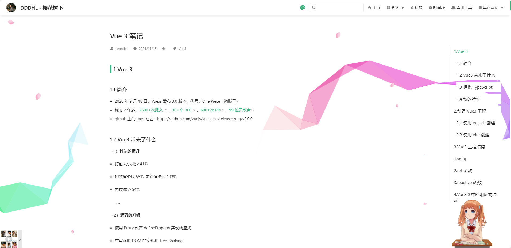
      </td>
    </tr>
     <tr>
      <td>
        
      </td>
    </tr>
  </tbody>
</table>

## 博客介绍

- 自定义首页
- 网站加载页
- 全文搜索
- 全文图片放大
- 网站访问量统计
- GitHub评论系统
- 自动配置侧边栏
- 自动打包部署GitHub Pages
- 自动统计文章字数/阅读时间/最近更新时间
- 未完待续......

## 1. 安装

[vitepress官方文档](https://vitepress.dev/zh/)

Node.js 18 及以上版本，推荐使用pnpm安装

::: code-group

```sh [npm]
# 初始化项目并安装 VitePress 依赖
mkdir blog
cd blog
npm init -y
npm install vitepress --save-dev

# 使用 VitePress CLI 初始化目录结构
npx vitepress init

```

```sh [yarn]
# 初始化项目并安装 VitePress 依赖
mkdir blog
cd blog
yarn init -y
yarn add -D vitepress

# 使用 VitePress CLI 初始化目录结构
yarn vitepress init

```

```sh [pnpm]
# 创建项目并安装 VitePress 依赖
mkdir blog
cd blog
pnpm init
pnpm add -D vitepress

# 使用 VitePress CLI 初始化目录结构
pnpm vitepress init

```

```sh [bun]
# 创建项目并安装 VitePress 依赖
mkdir blog
cd blog
bun init
bun add vitepress --dev

# 使用 VitePress CLI 初始化目录结构
bun vitepress init

```

:::

```sh
┌ Welcome to VitePress!
│
◇ Where should VitePress initialize the config?
│ ./docs
│
◇ Site title:
│ My Awesome Project
│
◇ Site description:
│ A VitePress Site
│
◇ Theme:
│ ● Default Theme (Out of the box, good-looking docs)
│ ○ Default Theme + Customization
│ ○ Custom Theme
│
◇ Use TypeScript for config and theme files?
│  Yes
│
◆ Add VitePress npm scripts to package.json?
│  Yes
└
```

## 2. 运行

::: code-group

```sh [npm]
npm run docs:dev
```

```sh [yarn]
yarn docs:dev
```

```sh [pnpm]
pnpm docs:dev
```

```sh [bun]
bun run docs:dev
```

:::

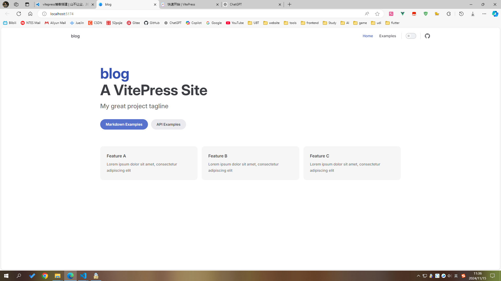

## 3. 结构

官方文档：[vitepress目录结构](https://vitepress.dev/zh/guide/getting-started#file-structure)

需要手动新建文件夹，我的目录结构如下：

```
.
├─ .github                # 配置GitHub Actions
├─ docs
│  ├─ .vitepress
│  │  ├─ components       # 自定义组件
│  │  ├─ plugins          # 自定义插件
│  │  ├─ theme            # 主题配置
│  │  ├─ utils            # 工具函数
│  │  └─ config.mts       # 配置文件
│  ├─ 2024
│  │  └─ xx.md            # 文章
│  ├─ img                 # 文章图片
│  ├─ pages               # 自定义页面
│  ├─ public              # 静态资源
│  └─ index.md            # 首页
└─ package.json
```

## 4. 导航栏

配置文件：`/docs/.vitepress/config.mts`

### 4.1 标题

官方文档：[vitepress站点标题和图标](https://vitepress.dev/zh/reference/default-theme-nav#site-title-and-logo)

```ts{2}
export default defineConfig({
  title:'山不让尘，川不辞盈',
  // ...
})
```

### 4.2 搜索

官方文档：[vitepress搜索](https://vitepress.dev/zh/reference/default-theme-search)

有多种方式可以实现，我采用的是 [vitepress-plugin-pagefind](https://www.npmjs.com/package/vitepress-plugin-pagefind) 插件

该插件支持i18n，具体配置请查看文档

:::code-group

```sh [npm]
npm i vitepress-plugin-pagefind pagefind
```

```sh [yarn]
yarn add vitepress-plugin-pagefind pagefind
```

```sh [pnpm]
pnpm add vitepress-plugin-pagefind pagefind
```

```sh [bun]
bun add vitepress-plugin-pagefind pagefind
```

:::

```ts{1,7-18}
import { pagefindPlugin } from 'vitepress-plugin-pagefind'

export default defineConfig({
  title:'山不让尘，川不辞盈',
  vite:{
    plugins:[
     pagefindPlugin({
        btnPlaceholder: '搜索',
        placeholder: '搜索文档',
        emptyText: '空空如也',
        heading: '共: {{searchResult}} 条结果',
        customSearchQuery(input) {
          return input
            .replace(/[\u4E00-\u9FA5]/g, ' $& ')
            .replace(/\s+/g, ' ')
            .trim()
        },
      }),
    ]
  }
  // ...
})
```

### 4.3 导航链接

官方文档：[vitepress导航链接](https://vitepress.dev/zh/reference/default-theme-nav#navigation-links)

配置中的link是md文件的地址，比如：`/pages/about` 对应 `docs/pages/about.md`

```ts{4-19}
export default defineConfig({
  title:'山不让尘，川不辞盈',
  themeConfig:{
   nav: [
      { text: '主页', link: '/' },
      { text: '闲聊', link: '/pages/comment' },
      { text: '关于', link: '/pages/about' },
      {
        text: '推荐',
        items: [
          {
            items: [
              { text: '实用网页', link: '/pages/webPage' },
              { text: '工具插件', link: '/pages/tools' },
            ],
          },
        ],
      },
    ],
  }
  // ...
})
```

### 4.4 社交链接

官方文档：[vitepress社交链接](https://vitepress.dev/zh/reference/default-theme-config#sociallinks)

```ts{3-15}
export default defineConfig({
  themeConfig: {
    socialLinks: [
      { icon: 'github', link: 'https://github.com/vuejs/vitepress' },
      { icon: 'twitter', link: '...' },
      // 可以通过将 SVG 作为字符串传递来添加自定义图标：
      {
        icon: {
          svg: '<svg role="img" viewBox="0 0 24 24" xmlns="http://www.w3.org/2000/svg"><title>Dribbble</title><path d="M12...6.38z"/></svg>',
        },
        link: '...',
        // 也可以为无障碍添加一个自定义标签 (可选但推荐):
        ariaLabel: 'cool link',
      },
    ],
  },
})
```

### 4.5 效果

配置完后效果图：

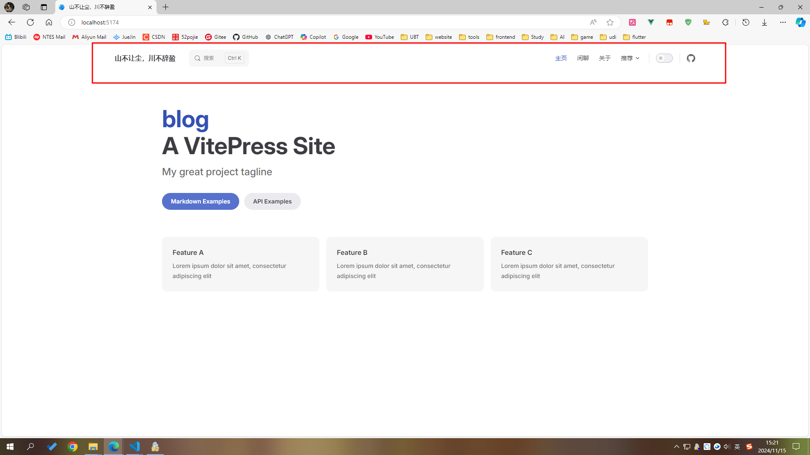

## 5. 布局框架

### 5.1 Naive UI

[Naive UI 文档](https://www.naiveui.com/zh-CN/os-theme/docs/vitepress)

#### （1）安装

图标库：[xicons material](https://xicons.org/#/)

时间库：[dayjs](https://day.js.org/zh-CN/)

::: code-group

```sh [npm]
npm install -D @css-render/vue3-ssr naive-ui @vicons/material dayjs
```

```sh [yarn]
yarn add -D @css-render/vue3-ssr naive-ui @vicons/material dayjs
```

```sh [pnpm]
pnpm add -D @css-render/vue3-ssr naive-ui @vicons/material dayjs
```

```sh [bun]
bun add -d @css-render/vue3-ssr naive-ui @vicons/material dayjs
```

:::

#### （2）配置

新建 `.vitepress/theme/index.ts` 文件

```ts
import { defineComponent, h, inject } from 'vue'
import DefaultTheme from 'vitepress/theme'
import { NConfigProvider } from 'naive-ui'
import { setup } from '@css-render/vue3-ssr'
import { useRoute } from 'vitepress'

const { Layout } = DefaultTheme

const CssRenderStyle = defineComponent({
  setup() {
    const collect = inject<() => string>('css-render-collect')
    return {
      style: collect ? collect() : '',
    }
  },
  render() {
    return h('css-render-style', {
      innerHTML: this.style,
    })
  },
})

const VitepressPath = defineComponent({
  setup() {
    const route = useRoute()
    return () => {
      return h('vitepress-path', null, [route.path])
    }
  },
})

const NaiveUIProvider = defineComponent({
  render() {
    return h(
      NConfigProvider,
      { abstract: true, inlineThemeDisabled: true },
      {
        default: () => [
          h(Layout, null, { default: this.$slots.default?.() }),
          import.meta.env.SSR ? [h(CssRenderStyle), h(VitepressPath)] : null,
        ],
      }
    )
  },
})

export default {
  extends: DefaultTheme,
  Layout: NaiveUIProvider,
  enhanceApp: ({ app }) => {
    if (import.meta.env.SSR) {
      const { collect } = setup(app)
      app.provide('css-render-collect', collect)
    }
  },
}
```

`.vitepress/config.mts` 文件

```ts{3,8-10,12-30}
import { defineConfig } from 'vitepress'

const fileAndStyles: Record<string, string> = {}

export default defineConfig({
  // ...
  vite: {
    ssr: {
      noExternal: ['naive-ui', 'date-fns', 'vueuc'],
    },
  },
  postRender(context) {
    const styleRegex = /<css-render-style>((.|\s)+)<\/css-render-style>/
    const vitepressPathRegex = /<vitepress-path>(.+)<\/vitepress-path>/
    const style = styleRegex.exec(context.content)?.[1]
    const vitepressPath = vitepressPathRegex.exec(context.content)?.[1]
    if (vitepressPath && style) {
      fileAndStyles[vitepressPath] = style
    }
    context.content = context.content.replace(styleRegex, '')
    context.content = context.content.replace(vitepressPathRegex, '')
  },
  transformHtml(code, id) {
    const html = id.split('/').pop()
    if (!html) return
    const style = fileAndStyles[`/${html}`]
    if (style) {
      return code.replace(/<\/head>/, `${style}</head>`)
    }
  },
  // ...
})
```

#### （3）解决ts报错

安装vite

::: code-group

```sh [npm]
npm install -D vite vue
```

```sh [yarn]
yarn add -D vite vue
```

```sh [pnpm]
pnpm add -D vite vue
```

```sh [bun]
bun add -D vite vue
```

:::

根目录下新建 `type.d.ts` 文件

```ts
/// <reference types="vite/client" />

interface ImportMetaEnv {}

interface ImportMeta {
  readonly env: ImportMetaEnv
}
```

#### （5）测试

在 `docs/index.md` 文件中测试

```js
<script setup>
import { NButton } from 'naive-ui'
</script>

<NButton>Hello World</NButton>
```

按钮正常出现则配置完成


### 5.2 Sass

此项为选配，按需安装

#### （1）安装

::: code-group

```sh [npm]
npm install -D sass
```

```sh [yarn]
yarn add -D sass
```

```sh [pnpm]
pnpm add -D sass
```

```sh [bun]
bun add -D sass
```

:::

#### （2）忽视告警

安装sass会出现此告警，目前没有发现什么问题

::: warning
Deprecation Warning: The legacy JS API is deprecated and will be removed in Dart Sass 2.0.0.

More info: https://sass-lang.com/d/legacy-js-api
:::

`.vitepress/config.mts`

```ts{5-13}
import { defineConfig } from 'vite'

export default defineConfig({
  // ...
  vite:{
    css: {
     preprocessorOptions: {
       scss: {
          api: 'modern-compiler', // or 'modern'
        },
      },
    },
  }
  // ...
})
```

## 6. 首页

默认首页是`docs/index.md`

### 6.1 自定义组件

由于想自己写首页样式，所以仅保留 `layout: home`

新建 `docs/.vitepress/components/ArticleList.vue` 文件

```vue
<script setup lang="ts"></script>

<template>
  <div class="artical-list"></div>
</template>

<style scoped lang="scss">
.artical-list {
  width: 100%;
  height: 100%;
  color: var(--black-color-1);
}
</style>
```

修改 `docs/index.md` 文件

```md
---
layout: home
---

<script setup>
import ArticleList from './.vitepress/components/ArticleList.vue'
</script>

<ArticleList />
```

此时首页会白屏，因为自定义组件没有内容

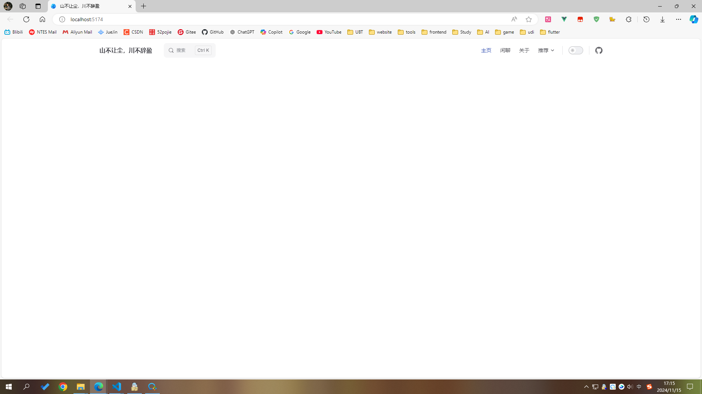

### 6.2 设置文章信息

首先得了解 [vitepress frontmatter](https://vitepress.dev/zh/guide/frontmatter) . 文章可以在顶部自定义信息，如标题、描述、作者、标签、时间等，自定义信息后，可使用各种api访问

- 在 docs文件夹下新建 2023、2024 、pages 文件夹，移入示例文章

  此项目的是以文件夹的名称按年份排序，个人习惯，可根据个人需求调整

  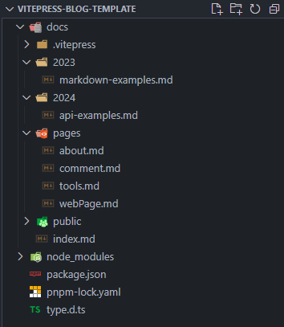

- frontmatter 可自定义key，我的配置如下（`每个文章都需要配置`）：

  ```md
  ---
  title: vitepress博客搭建
  date: 2024-11-12
  info: 个人博客技术栈更新，快速搭建一个vitepress自定义博客
  tags:
    - vitepress
    - vuepress
  ---
  ```

- 示例md

  `next/pre` 指的是文章底部的下一篇/上一篇

  `sidebar` 指的是左侧文章列表

  ::: code-group

  ```md [about.md]
  ---
  title: 关于我
  date: 2024-11-12
  prev: false
  next: false
  ---

  # 关于我

  这里是关于我页面
  ```

  ```md [webPage.md]
  ---
  title: 实用网页
  date: 2024-11-12
  prev: false
  next: false
  sidebar: false
  ---

  # 实用网页

  这里是实用网页页面
  ```

  :::

### 6.3 首页获取文章列表

官方文档：[vitepress createcontentloader](https://vitepress.dev/zh/guide/data-loading#createcontentloader)

VitePress 提供了一个 createContentLoader 辅助函数，可通过它获取到匹配的文章列表信息

- ESM模式 `package.json`

  ```json
  "type": "module"
  ```

- 新建 `.vitepress/utils/posts.data.ts` 文件

  ```ts
  import { createContentLoader } from 'vitepress'

  export default createContentLoader('../docs/*/*.md' /* options */)
  ```

- 在主页组件中引入并打印

  `.vitepress/components/ArticleList.vue` 此处用了类型忽略

  ```ts
  // @ts-ignore
  import { data as posts } from '../utils/posts.data'
  console.log(posts)
  ```

  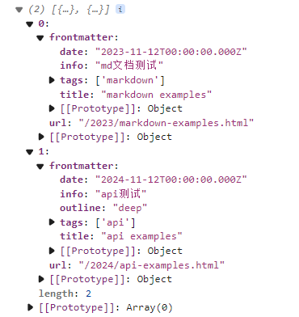

### 6.4 时间线展示文章

此处可以自行设计，我使用的是时间线展示。

- 首先，需要定义一些暗色和亮色的公共样式

  官方文档：[vitepress 自定义css](https://vitepress.dev/zh/guide/extending-default-theme#customizing-css)

  新建 `.vitepress/theme/styles/global.css` & `.vitepress/theme/styles/rewrite.css` 文件

  此处是区分重写样式和个人自定义的样式，可根据个人需求调整
  ::: code-group

  ```css [global.css]
  @import './rewrite.css';

  :root {
    --border-color-1: rgb(242, 243, 245);
    --black-color-1: rgb(60, 60, 67);
    --grey-color-1: rgb(134, 144, 156);
    --grey-color-2: rgb(229, 230, 235);
    --blue-color-1: rgb(22, 93, 255);
    --border-radius: 8px;
    img {
      display: block;
      margin: auto;
      cursor: pointer;
    }
    .vp-doc {
      h2:first-of-type {
        margin: 10px 0 16px;
        padding-top: 15px;
      }
    }
    .VPHome {
      margin-bottom: 23px;
    }
  }

  .dark {
    --border-color-1: rgba(255, 255, 255, 0.08);
    --black-color-1: rgba(255, 255, 255, 0.9);
    --grey-color-1: rgba(255, 255, 255, 0.5);
    --grey-color-2: rgb(72, 72, 73);
    --blue-color-1: rgb(60, 126, 255);
  }
  ```

  ```css [rewrite.css]
  .VPNavBar.home.top {
    border-bottom: 1px solid #f2f3f5;
  }

  .dark {
    .VPNavBar.home.top {
      border-bottom: 1px solid #000;
    }
  }

  :root {
    .vp-doc .custom-block {
      padding: 8px 16px;
    }

    .vp-doc .custom-block :first-child:first-child {
      margin: 8px 0;
    }

    .VPMenuGroup > .title {
      font-size: 0.7em;
    }

    /* 链接 */

    .vp-doc a {
      background: linear-gradient(var(--vp-c-brand-soft), var(--vp-c-brand-soft)) no-repeat center
        bottom / 100% 2px;
      text-decoration: none;
      transition: 0.2s;
    }

    .vp-doc a:hover {
      border-radius: 0.2em;
      background: linear-gradient(var(--vp-c-brand-soft), var(--vp-c-brand-soft)) no-repeat center
        bottom / 100% 100%;
    }

    .vp-doc strong {
      background: linear-gradient(var(--vp-c-brand-soft), var(--vp-c-brand-soft)) no-repeat center
        bottom / 100% 40%;
    }

    .vp-doc s {
      opacity: 0.6;
    }

    /* 文章目录hover */
    .VPDocOutlineItem.root > li > a,
    .VPDocOutlineItem.nested > li > a {
      padding-left: 5px;
      padding-right: 5px;
      border-radius: 5px;
    }
    .VPDocOutlineItem.root > li > a:first-child:hover,
    .VPDocOutlineItem.root > li > a:first-child.active,
    .VPDocOutlineItem.nested li > a:hover,
    .VPDocOutlineItem.nested li > a.active {
      background-color: var(--grayA3);
    }
  }
  ```

  :::

- 导入样式

  官方文档：[vitepress 自定义主题](https://vitepress.dev/zh/guide/custom-theme)

  新建 `.vitepress/theme/index.ts` 文件

  ```ts
  import './styles/global.css'
  // ...
  ```

- 主页设计

  不多解释，放置一个头像 `docs/public/assets/avatar.jpg` 即可。

  注意：此处深色区域，过滤了 `/pages/` 路径下的文章，因为该路径下的文件是作为独立页面展示的，参考博客中的`关于我/闲聊`。

  ```vue{9-19}
  <script setup lang="ts">
  import { NTimeline, NTimelineItem, NIcon, NBackTop, NTag } from 'naive-ui'
  import { useRouter } from 'vitepress'
  import dayjs from 'dayjs'
  import { EmailOutlined, DiscountOutlined } from '@vicons/material'
  // @ts-ignore
  import { data as posts } from '../utils/posts.data'
  const router = useRouter()
  const list = posts
    .filter((item) => !item.url.includes('/pages/'))
    .map((item) => ({
      ...item,
      unixDate: dayjs(item.frontmatter.date).unix(),
    }))
    .sort((a, b) => b.unixDate - a.unixDate)
    .map((item) => {
      const { unixDate, ...rest } = item
      return rest
    })
  const jump = (path: string) => {
    router.go(path)
  }
  </script>

  <template>
    <div class="artical-list">
      <section class="left-wrapper">
        
        <p class="name">holden</p>
        <p class="text">快不快乐有天总过去</p>
        <div class="email">
          <NIcon :size="23">
            <EmailOutlined />
          </NIcon>
          holden.lee@aliyun.com
        </div>
      </section>
      <section class="right-wrapper">
        <n-timeline size="large">
          <n-timeline-item v-for="item in list">
            <template #icon>
              <div class="icon">
                <p>{{ dayjs(item.frontmatter.date).format('YYYY-MM-DD') }}</p>
                <div class="dot"></div>
              </div>
            </template>
            <template #default>
              <div class="card" @click="jump(item.url)">
                <div class="title">{{ item.frontmatter.title }}</div>
                <div class="tags">
                  <n-tag :bordered="false" type="info" v-for="tagItem in item.frontmatter.tags">
                    {{ tagItem }}
                    <template #icon>
                      <n-icon :size="16" :component="DiscountOutlined" />
                    </template>
                  </n-tag>
                </div>
                <div class="info">{{ item.frontmatter.info ?? '无简介' }}</div>
                <div class="date">{{ dayjs(item.frontmatter.date).format('YYYY-MM-DD') }}</div>
              </div>
            </template>
          </n-timeline-item>
        </n-timeline>
      </section>
      <n-back-top :right="10" />
    </div>
  </template>

  <style scoped lang="scss">
  .artical-list {
    width: 100%;
    height: 100%;
    color: var(--black-color-1);
    display: flex;

    .left-wrapper {
      position: sticky;
      top: 92px;
      margin-top: 3vh;
      border: 1px solid var(--border-color-1);
      width: 250px;
      height: 300px;
      display: flex;
      flex-direction: column;
      align-items: center;
      border-radius: var(--border-radius);

      p {
        margin: 0;
      }

      .avatar {
        width: 100px;
        border-radius: 100%;
        user-select: none;
        cursor: auto;
        margin: 40px 0 0 0;
      }

      .name {
        font-size: 20px;
        margin: 10px 0;
      }

      .text {
        font-size: 14px;
        color: var(--grey-color-1);
        user-select: none;
      }

      .email {
        width: 100%;
        height: 25px;
        display: flex;
        align-items: center;
        justify-content: center;
        cursor: pointer;
        margin-top: 10px;
      }
    }

    .right-wrapper {
      margin-left: 150px;
      margin-top: 3vh;
      width: calc(100% - 250px - 150px);
      min-width: 300px;

      :deep(.n-timeline-item-timeline__line) {
        background-color: var(--grey-color-2);
      }

      .card {
        cursor: pointer;
      }

      .icon {
        width: 6px;
        height: 6px;
        position: relative;

        p {
          position: absolute;
          margin: 0;
          width: 130px;
          left: -140px;
          top: -2px;
          font-size: 12px;
          line-height: 12px;
          height: 12px;
          text-align: right;
        }

        .dot {
          width: 100%;
          height: 100%;
          border-radius: 100%;
          background-color: var(--blue-color-1);
        }
      }

      .card {
        width: 100%;
        min-height: 120px;
        color: var(--black-color-1);
        border: 1px solid var(--border-color-1);
        border-radius: var(--border-radius);
        padding: 15px;
        display: flex;
        flex-direction: column;
        justify-content: space-around;

        .title {
          font-size: 20px;
          font-weight: 700;
          cursor: pointer;
        }

        .tags {
          width: 100%;
          display: flex;
          flex-wrap: wrap;

          .n-tag {
            margin-right: 10px;
          }
        }

        .info,
        .date {
          font-size: 14px;
          color: var(--grey-color-1);
          margin-top: 5px;
          overflow: hidden;
          white-space: nowrap;
          text-overflow: ellipsis;
        }

        .date {
          display: none;
        }
      }
    }
  }

  @media (max-width: 730px) {
    .artical-list {
      flex-direction: column;

      .left-wrapper {
        min-width: 300px;
        width: 100%;
        position: static;
      }

      .right-wrapper {
        margin-left: 0;
        width: 100%;

        .icon {
          p {
            display: none;
          }
        }
      }

      .card {
        .date {
          display: block !important;
        }

        .info {
          display: none !important;
        }
      }
    }
  }
  </style>
  ```

- 效果图

  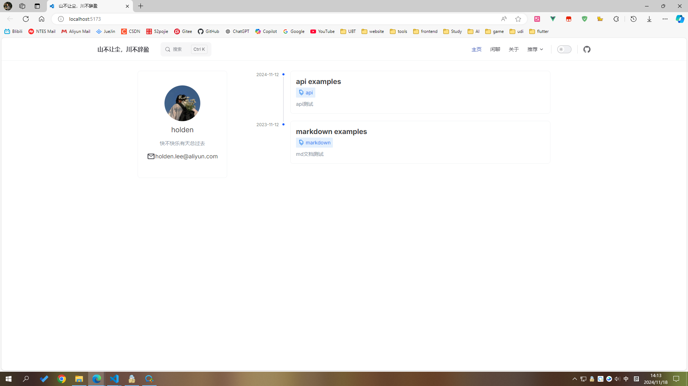

## 7. 文章侧边栏

官方文档：[vitepress 侧边栏](https://vitepress.dev/zh/reference/default-theme-sidebar)

正常情况下，需要手动配置侧边栏

```ts
export default {
  themeConfig: {
    sidebar: [
      {
        text: 'Guide',
        items: [
          { text: 'Introduction', link: '/introduction' },
          { text: 'Getting Started', link: '/getting-started' },
          ...
        ]
      }
    ]
  }
}
```

### 7.1 使用插件

插件可以自动生成侧边栏并且根据文章名称日期排序

[vitepress-sidebar](https://vitepress-sidebar.cdget.com/)

::: code-group

```sh [npm]
npm i -D vitepress-sidebar
```

```sh [yarn]
yarn add -D vitepress-sidebar
```

```sh [pnpm]
pnpm add -D vitepress-sidebar
```

```sh [bun]
bun add -D vitepress-sidebar
```

:::

`.vitepress/config.mts` 文件，具体配置请看官方文档

```ts
import { generateSidebar } from 'vitepress-sidebar'
// ...

const autoSidebar = () => {
  let result: any = generateSidebar({
    documentRootPath: '/docs',
    collapseDepth: 2,
    useTitleFromFrontmatter: true,
    sortMenusByFrontmatterDate: true,
    sortMenusOrderByDescending: true,
  })
  return result.map((year) => ({
    ...year,
    items: year.items.reverse(),
  }))
}

export default defineConfig({
  // ...
  themeConfig: {
    sidebar: autoSidebar(),
  },
  // ...
})
```

配置完成后的效果

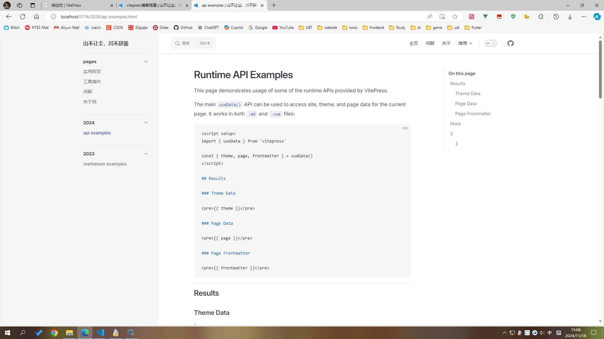

### 7.2 优化

侧边栏中，会显示docs文件夹下所有的md，包括了我们需要单独显示的pages目录

如果直接在autoSideBar函数中过滤pages目录下的文件，则无法跳转，因此得从页面下手，css隐藏。（如果不需要隐藏该目录的话，以下步骤忽视）

- 新建 `.vitepress/theme/MyLayout.vue` 文件

  ```vue
  <script setup lang="ts">
  import DefaultTheme from 'vitepress/theme'
  import { useRoute } from 'vitepress'
  import { watch, nextTick, onMounted } from 'vue'
  const { Layout } = DefaultTheme
  const route = useRoute()

  onMounted(() => {
    hideSpecificSidebarItem()
  })

  watch(
    () => route.path,
    (_, oldPath) => {
      if (oldPath === '/') {
        nextTick(() => {
          hideSpecificSidebarItem()
        })
      }
    }
  )

  // 隐藏pages
  function hideSpecificSidebarItem() {
    const sidebarItems = document.querySelectorAll(
      '#VPSidebarNav > .group'
    ) as NodeListOf<HTMLElement>
    sidebarItems.forEach((item, index) => {
      const textContent = item.querySelector('.text')?.textContent?.trim()
      if (textContent === 'pages') {
        item.style.display = 'none'
        sidebarItems[index + 1].style.borderTop = 'none'
      }
    })
  }
  </script>

  <template>
    <Layout></Layout>
  </template>

  <style scoped lang="scss"></style>
  ```

- 修改 `.vitepress/theme/index.ts` 文件

  ```ts{1,11}
  import MyLayout from './MyLayout.vue'
  // ...

  const NaiveUIProvider = defineComponent({
    render() {
      return h(
        NConfigProvider,
        { abstract: true, inlineThemeDisabled: true },
        {
          default: () => [
            h(MyLayout, null, { default: this.$slots.default?.() }),
            import.meta.env.SSR ? [h(CssRenderStyle), h(VitepressPath)] : null,
          ],
        }
      )
    },
  })

  // ...
  ```

- 效果

  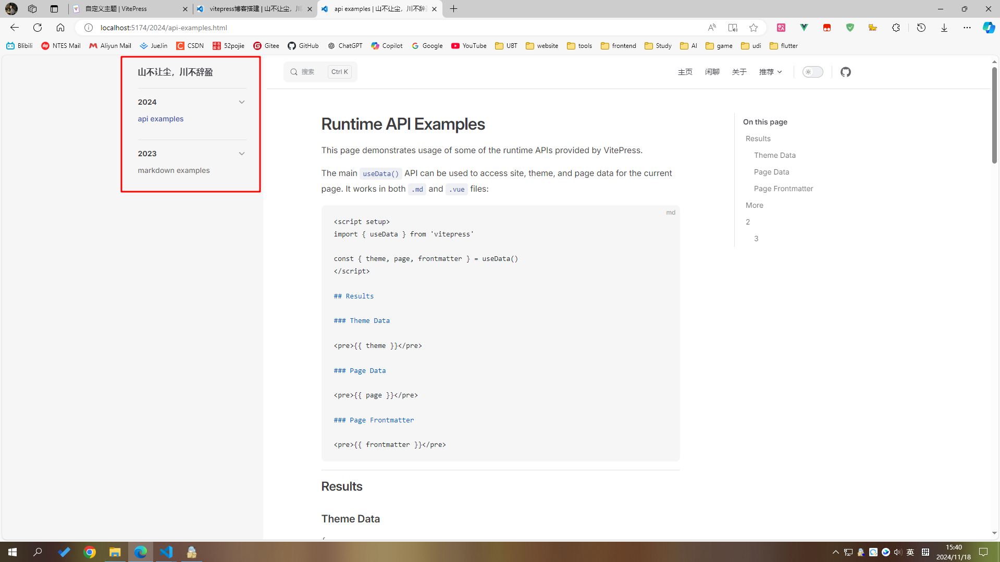

## 8. 文章信息统计

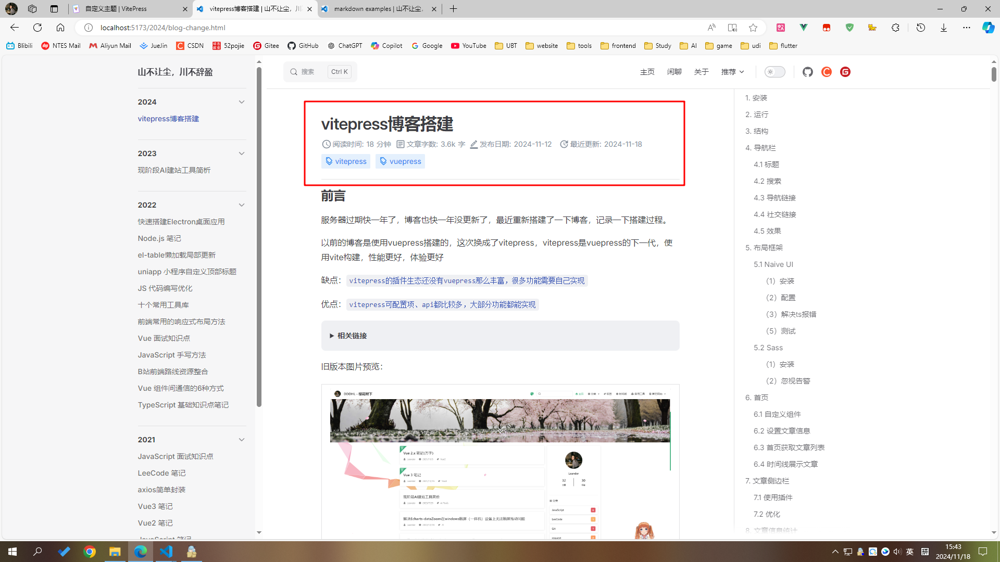

- 新建 `.vitepress/utils/getReadingTime.ts` 文件

  ```ts
  export function getWords(content: string): RegExpMatchArray | null {
    // 仅匹配英文单词，忽略标点和纯数字
    return content.match(/\b[a-zA-Z]+(?:['-]?[a-zA-Z]+)?\b/gu)
  }

  export function getChinese(content: string): RegExpMatchArray | null {
    // 匹配中文字符
    return content.match(/[\u4E00-\u9FD5]/gu)
  }

  export function getEnWordCount(content: string): number {
    // 英文单词数量
    return getWords(content)?.length || 0
  }

  export function getCnWordCount(content: string): number {
    // 中文字符数量
    return getChinese(content)?.length || 0
  }

  export function getWordNumber(content: string): number {
    // 总字数统计
    const enWordCount = getEnWordCount(content)
    const cnWordCount = getCnWordCount(content)
    return enWordCount + cnWordCount
  }

  export function getReadingTime(content: string, cnWordPerMinute = 350, enWordPerMinute = 160) {
    const trimmedContent = content.trim()
    const enWord = getEnWordCount(trimmedContent)
    const cnWord = getCnWordCount(trimmedContent)

    const totalWords = enWord + cnWord
    const words = totalWords >= 1000 ? `${Math.round(totalWords / 100) / 10}k` : totalWords

    const readingTime = cnWord / cnWordPerMinute + enWord / enWordPerMinute
    const readTime = Math.ceil(readingTime)

    return {
      readTime,
      words,
    }
  }
  ```

- 新建 `.vitepress/plugins/headerPlugin.ts` 文件

  ```ts
  import { Plugin } from 'vite'
  import { getReadingTime } from '../utils/getReadingTime'
  import fs from 'fs'

  export function HeaderPlugin(): Plugin {
    return {
      name: 'header-plugin',
      enforce: 'pre',
      async transform(code, id) {
        if (!id.match(/\.md\b/)) return null

        const cleanContent = cleanMarkdownContent(code)

        // 获取文件的最近更新时间
        const lastUpdated = getLastUpdatedTime(id)

        // 获取阅读时间和字数
        const { readTime, words } = getReadingTime(cleanContent)

        // 插入组件到文章中
        code = insertReadingTimeAndWords(
          `<ArticleHeader readTime="${readTime}" words="${words}" lastUpdated="${lastUpdated}" />`,
          code
        )
        return code
      },
    }
  }

  // 获取文件的最近更新时间
  function getLastUpdatedTime(filePath: string): string {
    const stats = fs.statSync(filePath)
    const lastModifiedTime = stats.mtime
    return lastModifiedTime.toLocaleString()
  }

  // 插入目标字符串到第一个一级标题后
  function insertReadingTimeAndWords(target: string, source: string) {
    const headerRegex = /(^#\s.+$)/m
    return source.replace(headerRegex, `$1\n\n${target}`)
  }

  // 去掉 Frontmatter
  function cleanMarkdownContent(content: string): string {
    return content.replace(/^---[\s\S]+?---\n+/g, '').trim()
  }
  ```

- `.vitepress/config.mts` 文件

  ```ts{1,6}
  import { HeaderPlugin } from './plugins/headerPlugin'
  // ...
  export default defineConfig({
    vite: [
      // ...
      HeaderPlugin(),
    ],
  })
  ```

- 新建 `.vitepress/components/ArticleHeader.vue` 组件

  ```vue
  <script setup lang="ts">
  import {
    AccessTimeFilled,
    ArticleOutlined,
    BorderColorOutlined,
    UpdateOutlined,
    DiscountOutlined,
  } from '@vicons/material'
  import { NIcon, NTag } from 'naive-ui'
  import { useData } from 'vitepress'
  import dayjs from 'dayjs'
  const { frontmatter } = useData()
  defineProps<{
    readTime: string
    words: string
    lastUpdated: string
  }>()
  </script>

  <template>
    <div class="header">
      <section class="info">
        <div class="read">
          <NIcon :size="20">
            <AccessTimeFilled />
          </NIcon>
          阅读时间:
          <p>{{ readTime }}</p>
          分钟
        </div>
        <div class="words">
          <NIcon :size="20">
            <ArticleOutlined />
          </NIcon>
          文章字数:
          <p>{{ words }}</p>
          字
        </div>
        <div class="write">
          <NIcon :size="18">
            <BorderColorOutlined />
          </NIcon>
          发布日期:
          <p>{{ dayjs(frontmatter.date).format('YYYY-MM-DD') }}</p>
        </div>
        <div class="update">
          <NIcon :size="20">
            <UpdateOutlined />
          </NIcon>
          最近更新:
          <p>{{ dayjs(lastUpdated).format('YYYY-MM-DD') }}</p>
        </div>
      </section>
      <section class="tags">
        <n-tag :bordered="false" type="info" v-for="item in frontmatter.tags">
          {{ item }}
          <template #icon>
            <n-icon :size="16" :component="DiscountOutlined" />
          </template>
        </n-tag>
      </section>
    </div>
  </template>

  <style scoped lang="scss">
  .header {
    width: 100%;

    .info {
      width: 100%;
      display: flex;
      margin-top: 5px;
      margin-bottom: 5px;
      flex-wrap: wrap;
      font-size: 14px;
      color: var(--grey-color-1);

      .read,
      .words,
      .write,
      .update {
        display: flex;
        align-items: center;
        justify-content: center;
        margin-right: 8px;

        p {
          margin: 0 5px;
        }

        i {
          margin-right: 2px;
        }
      }
    }

    .tags {
      width: 100%;
      display: flex;
      flex-wrap: wrap;

      .n-tag {
        margin-right: 10px;
        margin-bottom: 10px;
      }
    }
  }
  </style>
  ```

- 配置全局组件

  `.vitepress/theme/index.ts`

  ```ts{1,7}
  import ArticleHeader from '../components/ArticleHeader.vue'
  // ...
  export default {
    extends: DefaultTheme,
    Layout: NaiveUIProvider,
    enhanceApp: ({ app }) => {
      import ArticleHeader from '../components/ArticleHeader.vue'
      if (import.meta.env.SSR) {
        const { collect } = setup(app)
        app.provide('css-render-collect', collect)
      }
    },
  }
  ```

- 效果

  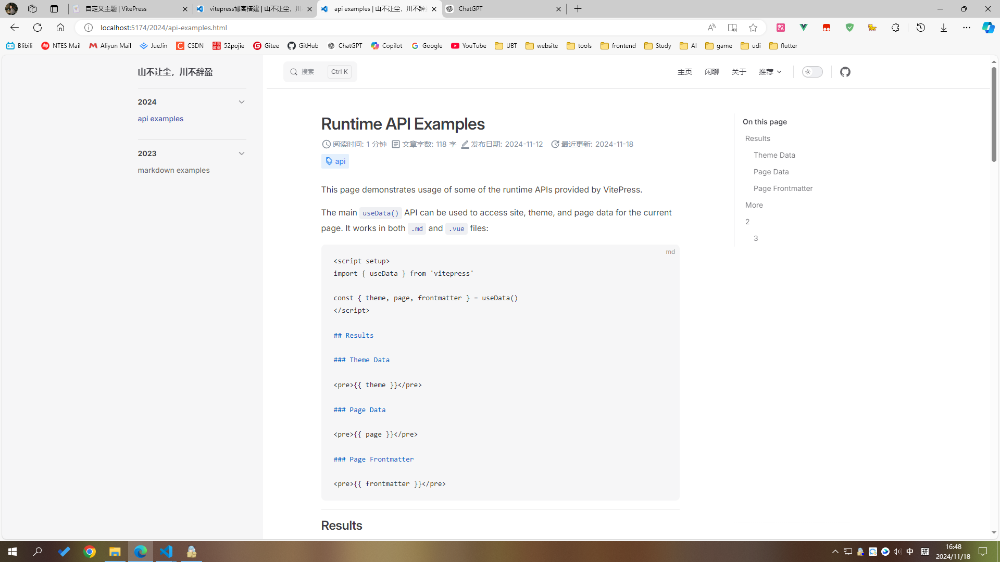

## 9. 评论插件

我使用的是：[@giscus/vue](https://giscus.app/zh-CN)，无跟踪，无广告，永久免费，github邮箱通知，支持暗色切换。

### 9.1 安装配置

- 新建一个 `公开` 仓库，打开仓库 Settings，勾选 Discussions，开启评论区

  私有仓库的话访客无法查看讨论

  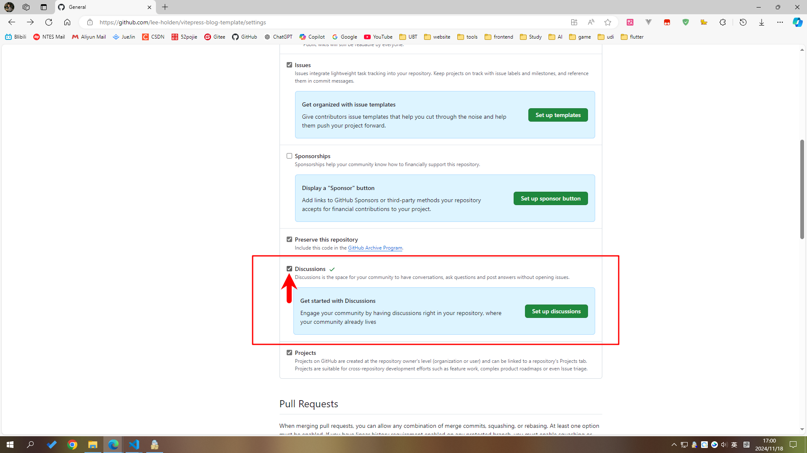

- GitHub 安装 giscus

  [点击此处安装](https://github.com/apps/giscus)

  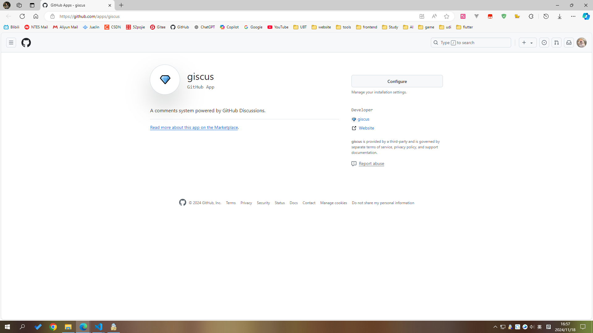

- giscus 配置

  安装完毕后，点击 Configure 配置 giscus，选中刚刚创建的仓库，点击保存

  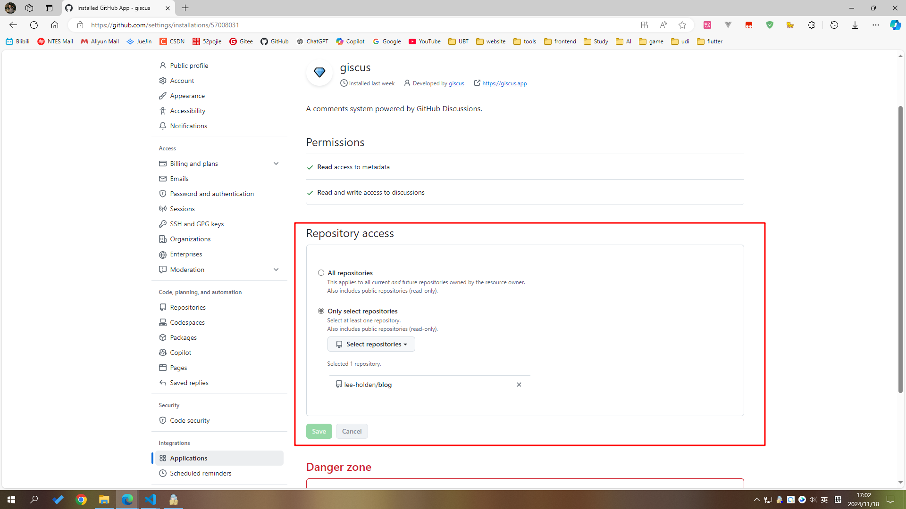

- 项目中安装

  ::: code-group

  ```sh [npm]
  npm i -D @giscus/vue
  ```

  ```sh [yarn]
  yarn add -D @giscus/vue
  ```

  ```sh [pnpm]
  pnpm add -D @giscus/vue
  ```

  ```sh [bun]
  bun add -D @giscus/vue
  ```

  :::

### 9.2 获取设置

- 去官方文档获取设置

  [点击这里去获取](https://giscus.app/zh-CN)

- 填写自己的仓库信息

  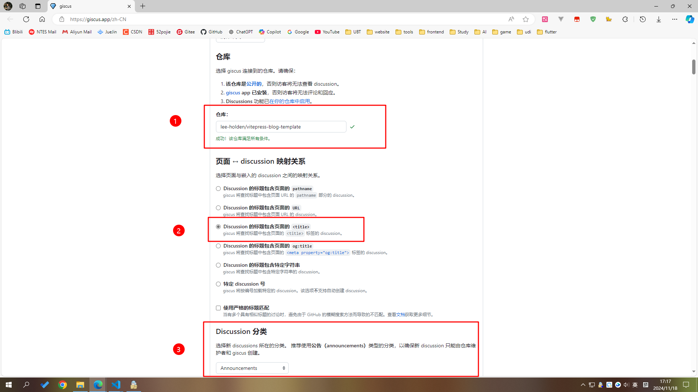

- 滚到到下边，获取设置

  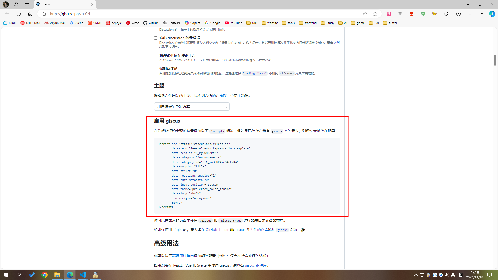

### 9.3 使用

利用默认布局组件 Layout 的 doc-after 插槽将 giscus 组件放入页面中

官方文档：[vitepress 布局插槽](https://vitepress.dev/zh/guide/extending-default-theme#layout-slots)

`.vitepress/theme/MyLayout.vue` 文件

```vue{2,7-24}
<script setup lang="ts">
import Giscus from '@giscus/vue'
import { useRoute,useData } from "vitepress";
const { page } = useData()
// ...
</script>
<template>
  <Layout>
     <template #doc-after>
        <div style="margin-top: 24px">
          <Giscus
            :key="page.filePath"
            repo="holden526/vitepress-blog-template"
            repo-id="R_kgDONRAkeA"
            category="Announcements"
            category-id="IC_kwDONRAkeM4CkXRA"
            mapping="title"
            strict="0"
            reactions-enabled="1"
            emit-metadata="0"
            input-position="top"
            lang="zh-CN"
            crossorigin="anonymous"
          />
        </div>
    </template>
  </Layout>
</template>

<style scoped lang="scss"></style>
```

- 效果

  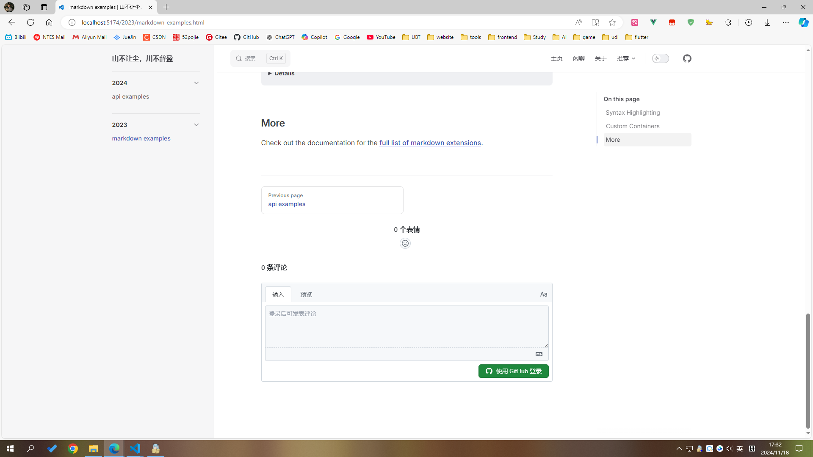

### 9.4 优化

尝试切换亮/暗样式会发现评论组件不会跟随切换，这需要与 giscus 通信实现。

giscus 可以通过 message 与 giscus iframe 通信，所以我们在切换样式时通知 giscus 同步切换即可，恰好vitepress提供了 isDark 数据，我们可以监听它进行切换

官方文档：[vitepress useData](https://vitepress.dev/zh/reference/runtime-api#usedata)

官方文档：[giscus-to-parent-message-events](https://github.com/giscus/giscus/blob/main/ADVANCED-USAGE.md#giscus-to-parent-message-events)

`.vitepress/theme/MyLayout.vue` 文件

```vue{2-3,5-14,34}
<script setup lang="ts">
const { page, isDark } = useData()
import { useRoute, useData, inBrowser } from 'vitepress'

watch(isDark, (dark) => {
  if (!inBrowser) return

  const iframe = document.querySelector('giscus-widget')?.shadowRoot?.querySelector('iframe')

  iframe?.contentWindow?.postMessage(
    { giscus: { setConfig: { theme: dark ? 'dark' : 'light' } } },
    'https://giscus.app'
  )
})

// ...
</script>

<template>
  <Layout>
    <template #doc-after>
      <div style="margin-top: 24px">
        <Giscus
          :key="page.filePath"
          repo="holden526/vitepress-blog-template"
          repo-id="R_kgDONRAkeA"
          category="Announcements"
          category-id="IC_kwDONRAkeM4CkXRA"
          mapping="title"
          strict="0"
          reactions-enabled="1"
          emit-metadata="0"
          input-position="top"
          :theme="isDark ? 'dark' : 'light'"
          lang="zh-CN"
          crossorigin="anonymous"
        />
      </div>
    </template>
  </Layout>
</template>

<style scoped lang="scss"></style>
```

- 效果

  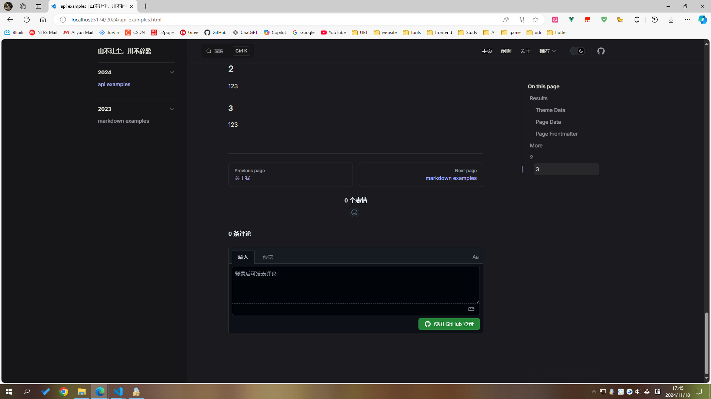

## 10. 项目配置

### 10.1 prettier

- 安装vscode拓展：Prettier - Code formatter

- 安装prettier库
  ::: code-group

  ```sh [npm]
  npm i -D prettier
  ```

  ```sh [yarn]
  yarn add -D prettier
  ```

  ```sh [pnpm]
  pnpm add -D prettier
  ```

  ```sh [bun]
  bun add -D prettier
  ```

  :::

- 项目根目录，新建 `.prettierrc` 文件

  ```json
  {
    "printWidth": 100,
    "tabWidth": 2,
    "useTabs": false,
    "semi": false,
    "singleQuote": true,
    "quoteProps": "as-needed",
    "jsxSingleQuote": false,
    "trailingComma": "es5",
    "bracketSpacing": true,
    "jsxBracketSameLine": false,
    "arrowParens": "always",
    "proseWrap": "preserve",
    "htmlWhitespaceSensitivity": "css",
    "endOfLine": "lf"
  }
  ```

- 项目根目录，新建 `.vscode/settings.json`

  ```json
  {
    "editor.defaultFormatter": "esbenp.prettier-vscode",
    "editor.formatOnSave": true,
    "[javascript]": {
      "editor.defaultFormatter": "esbenp.prettier-vscode"
    },
    "[typescript]": {
      "editor.defaultFormatter": "esbenp.prettier-vscode"
    },
    "[json]": {
      "editor.defaultFormatter": "esbenp.prettier-vscode"
    },
    "[html]": {
      "editor.defaultFormatter": "esbenp.prettier-vscode"
    },
    "[css]": {
      "editor.defaultFormatter": "esbenp.prettier-vscode"
    },
    "[scss]": {
      "editor.defaultFormatter": "esbenp.prettier-vscode"
    },
    "[vue]": {
      "editor.defaultFormatter": "esbenp.prettier-vscode"
    },
    "prettier.configPath": "./.prettierrc"
  }
  ```

- 项目根目录，新建 `.prettierignore` 文件

  ```json
  cache
  node_modules
  dist
  temp
  public
  !docs
  ```

- 格式化全部文件

  ::: code-group

  ```sh [npm]
  npx prettier --write .
  ```

  ```sh [yarn]
  yarn prettier --write .
  ```

  ```sh [pnpm]
  pnpm prettier --write .
  ```

  ```sh [bun]
  bun prettier --write .
  ```

  :::

### 10.2 git

- 项目根目录，新建 `.gitignore` 文件

  ```json
  node_modules
  .temp
  docs/.vitepress/cache
  dist
  cache
  .eslintcache
  components.d.ts
  .env.local
  .env.\*.local
  npm-debug.log*
  yarn-debug.log*
  yarn-error.log*
  pnpm-debug.log*
  meta.json
  ```

- 配置git仓库并且推送

  ```sh
  git init
  git add .
  git commit -m 'first commit'
  git remote add origin git@github.com:holden526/vitepress-blog-template.git
  git push -u origin master
  ```

## 11. 自动部署GitHub Pages

官方文档：[vitepress 部署](https://vitepress.dev/zh/guide/deploy#github-pages)

- 设置根目录

  官方文档：[vitepress 根目录设置](https://vitepress.dev/zh/guide/deploy#setting-a-public-base-path)

  如果你使用的是 Github 页面并部署到 user.github.io/repo/，请将 base 设置为 /repo/。

  `.vitepress/config.mts` 文件

  ```ts{3}
  // ...
  export default defineConfig({
    base: '/vitepress-blog-template/', // 替换成你的仓库名称
    // ...
  })
  ```

  `.vitepress/components/ArticleList.vue`

  ```vue{4}
  <script setup lang="ts">
  // ...
  const jump = (path: string) => {
    router.go('vitepress-blog-template' + path)
  }
  </script>

  // ...
  ```

- 开启GitHub Pages 功能

  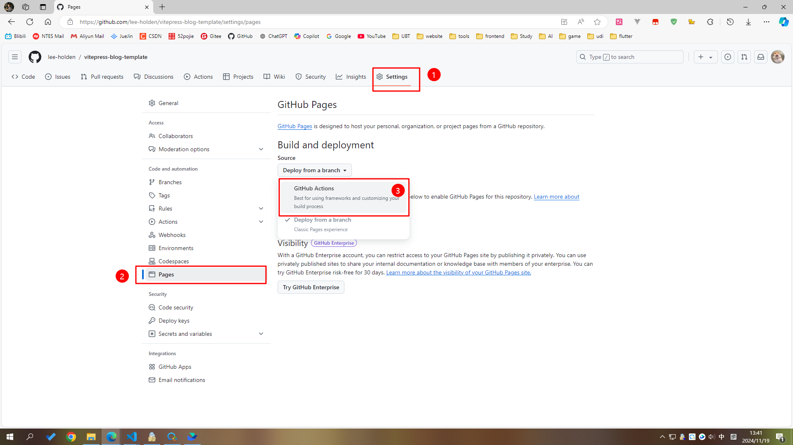

- 项目根目录，新建 `.github/workflows/deploy.yml`
  ::: code-group

  ```yml [官方示例]
  # 构建 VitePress 站点并将其部署到 GitHub Pages 的示例工作流程
  #
  name: Deploy VitePress site to Pages

  on:
    # 在针对 `main` 分支的推送上运行。如果你
    # 使用 `master` 分支作为默认分支，请将其更改为 `master`
    push:
      branches: [main]

    # 允许你从 Actions 选项卡手动运行此工作流程
    workflow_dispatch:

  # 设置 GITHUB_TOKEN 的权限，以允许部署到 GitHub Pages
  permissions:
    contents: read
    pages: write
    id-token: write

  # 只允许同时进行一次部署，跳过正在运行和最新队列之间的运行队列
  # 但是，不要取消正在进行的运行，因为我们希望允许这些生产部署完成
  concurrency:
    group: pages
    cancel-in-progress: false

  jobs:
    # 构建工作
    build:
      runs-on: ubuntu-latest
      steps:
        - name: Checkout
          uses: actions/checkout@v4
          with:
            fetch-depth: 0 # 如果未启用 lastUpdated，则不需要
        # - uses: pnpm/action-setup@v3 # 如果使用 pnpm，请取消此区域注释
        #   with:
        #     version: 9
        # - uses: oven-sh/setup-bun@v1 # 如果使用 Bun，请取消注释
        - name: Setup Node
          uses: actions/setup-node@v4
          with:
            node-version: 20
            cache: npm # 或 pnpm / yarn
        - name: Setup Pages
          uses: actions/configure-pages@v4
        - name: Install dependencies
          run: npm ci # 或 pnpm install / yarn install / bun install
        - name: Build with VitePress
          run: npm run docs:build # 或 pnpm docs:build / yarn docs:build / bun run docs:build
        - name: Upload artifact
          uses: actions/upload-pages-artifact@v3
          with:
            path: docs/.vitepress/dist

    # 部署工作
    deploy:
      environment:
        name: github-pages
        url: ${{ steps.deployment.outputs.page_url }}
      needs: build
      runs-on: ubuntu-latest
      name: Deploy
      steps:
        - name: Deploy to GitHub Pages
          id: deployment
          uses: actions/deploy-pages@v4
  ```

  ```yml [pnpm]
  name: Deploy VitePress site to Pages

  on:
    push:
      branches:
        - master
        - main
    workflow_dispatch:

  permissions:
    contents: read
    pages: write
    id-token: write

  concurrency:
    group: pages
    cancel-in-progress: false

  jobs:
    build:
      runs-on: ubuntu-latest
      steps:
        - name: Checkout
          uses: actions/checkout@v4
          with:
            fetch-depth: 1 # 如果启用了 vitepress lastUpdated，则改成 0
        - uses: pnpm/action-setup@v3
          with:
            version: 9
        - name: Setup Node
          uses: actions/setup-node@v4
          with:
            node-version: 20
            cache: pnpm
        - name: Setup Pages
          uses: actions/configure-pages@v4
        - name: Install dependencies
          run: pnpm install
        - name: Build with VitePress
          run: pnpm docs:build
        - name: Upload artifact
          uses: actions/upload-pages-artifact@v3
          with:
            path: docs/.vitepress/dist

    # 部署工作
    deploy:
      environment:
        name: github-pages
        url: ${{ steps.deployment.outputs.page_url }}
      needs: build
      runs-on: ubuntu-latest
      name: Deploy
      steps:
        - name: Deploy to GitHub Pages
          id: deployment
          uses: actions/deploy-pages@v4
  ```

  :::

- 推送代码到仓库，查看Action

  此处可以看到，Action已经成功运行，点进去可以看到build和部署进程，如果出现报错，可以查看报错信息

  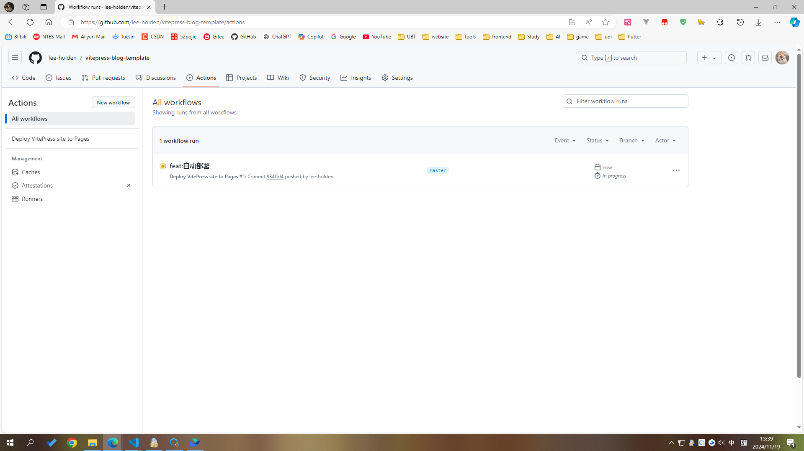

  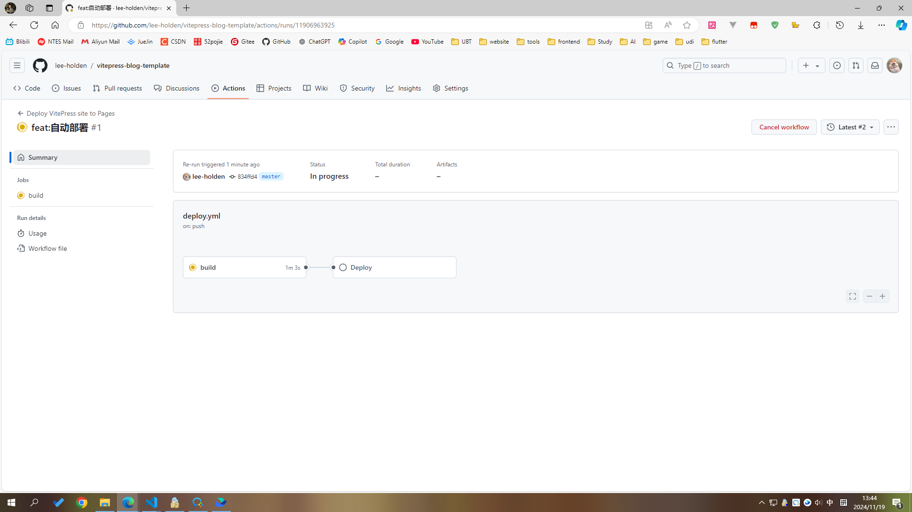

  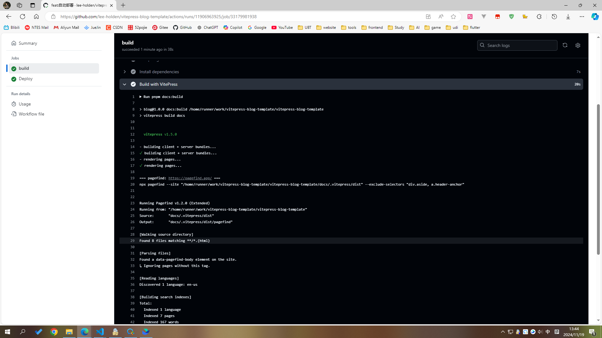

- 部署成功

  [vitepress-blog-template](https://holden526.github.io/vitepress-blog-template/)

## 12. 访问统计

用的是 [busuanzi](https://busuanzi.ibruce.info/)

- 安装
  ::: code-group

  ```sh [pnpm]
  pnpm add -D busuanzi.pure.js
  ```

  ```sh [npm]
  npm i -D busuanzi.pure.js
  ```

  ```sh [yarn]
  yarn add -D busuanzi.pure.js
  ```

  ```sh [bun]
  bun add -D busuanzi.pure.js
  ```

  :::

- `.vitepress/theme/index.ts` 文件

  ```ts{1-2,8,14-18}
  import { inBrowser } from 'vitepress'
  import busuanzi from 'busuanzi.pure.js'
  // ...

  export default {
    extends: DefaultTheme,
    Layout: NaiveUIProvider,
    enhanceApp: ({ app, router }) => {
      app.component('ArticleHeader', ArticleHeader)
      if (import.meta.env.SSR) {
        const { collect } = setup(app)
        app.provide('css-render-collect', collect)
      }
      if (inBrowser) {
        router.onAfterRouteChanged = () => {
          busuanzi.fetch()
        }
      }
    },
  }
  ```

- `.vitepress/theme/MyLayout.vue` 文件

  在网站底部插槽放入，官方文档：[vitepress 布局插槽](https://vitepress.dev/zh/guide/extending-default-theme#layout-slots)

  ```vue{3-12,15-33}
  <template>
    <Layout>
      <template #layout-bottom>
        <div class="bottom">
          <div>
            本站总访问量
            <span id="busuanzi_value_site_pv" class="font-bold">--</span> 次 本站访客数
            <span id="busuanzi_value_site_uv" class="font-bold">--</span> 人次
          </div>
          <p>前端狗都不如 © 2021-2024 holden</p>
        </div>
      </template>
    </Layout>
    <!-- ... -->
  </template>

  <style lang="scss" scoped>
  .bottom {
    margin-left: 5%;
    width: 90%;
    height: 100px;
    display: flex;
    flex-direction: column;
    align-items: center;
    justify-content: center;
    border-top: 1px solid var(--border-color-1);
    text-align: center;

    p {
      margin-top: 5px;
    }
  }
  </style>
  ```

- 效果

  可以自行调整底部样式

  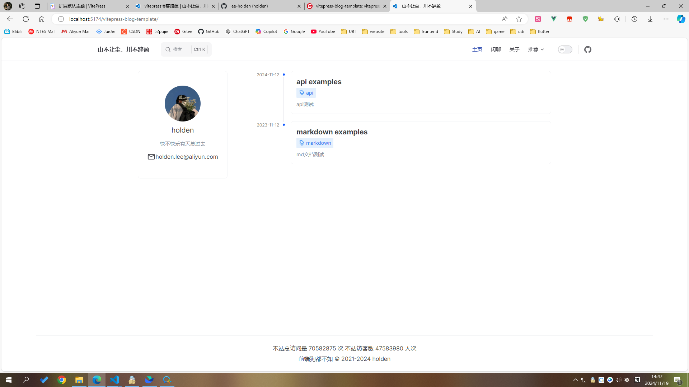

## 13. 网站加载

部署Github Pages后发现，白屏时间比较长，此时可以考虑使用加载页

- 新建 `.vitepress/components/Loading.vue` 文件

  ```vue
  <script setup lang="ts"></script>

  <template>
    <div class="loading">
      <div class="loader">
        <div v-for="_ in 5"></div>
      </div>
    </div>
  </template>

  <style scoped lang="scss">
  $color: #3451b2;

  .loading {
    width: 100vw;
    height: 100vh;
    display: flex;
    justify-content: center;
    align-items: center;
  }

  .loader {
    position: relative;
  }
  .loader > div:nth-child(2) {
    -webkit-animation: pacman-balls 1s -0.99s infinite linear;
    animation: pacman-balls 1s -0.99s infinite linear;
  }
  .loader > div:nth-child(3) {
    -webkit-animation: pacman-balls 1s -0.66s infinite linear;
    animation: pacman-balls 1s -0.66s infinite linear;
  }
  .loader > div:nth-child(4) {
    -webkit-animation: pacman-balls 1s -0.33s infinite linear;
    animation: pacman-balls 1s -0.33s infinite linear;
  }
  .loader > div:nth-child(5) {
    -webkit-animation: pacman-balls 1s 0s infinite linear;
    animation: pacman-balls 1s 0s infinite linear;
  }
  .loader > div:first-of-type {
    width: 0px;
    height: 0px;
    border-right: 25px solid transparent;
    border-top: 25px solid $color;
    border-left: 25px solid $color;
    border-bottom: 25px solid $color;
    border-radius: 25px;
    -webkit-animation: rotate_pacman_half_up 0.5s 0s infinite;
    animation: rotate_pacman_half_up 0.5s 0s infinite;
    position: relative;
    left: -30px;
  }
  .loader > div:nth-child(2) {
    width: 0px;
    height: 0px;
    border-right: 25px solid transparent;
    border-top: 25px solid $color;
    border-left: 25px solid $color;
    border-bottom: 25px solid $color;
    border-radius: 25px;
    -webkit-animation: rotate_pacman_half_down 0.5s 0s infinite;
    animation: rotate_pacman_half_down 0.5s 0s infinite;
    margin-top: -50px;
    position: relative;
    left: -30px;
  }
  .loader > div:nth-child(3),
  .loader > div:nth-child(4),
  .loader > div:nth-child(5),
  .loader > div:nth-child(6) {
    background-color: $color;
    width: 15px;
    height: 15px;
    border-radius: 100%;
    margin: 2px;
    width: 10px;
    height: 10px;
    position: absolute;
    -webkit-transform: translate(0, -6.25px);
    transform: translate(0, -6.25px);
    top: 25px;
    left: 70px;
  }
  @-webkit-keyframes cube-transition {
    25% {
      -webkit-transform: translateX(50px) scale(0.5) rotate(-90deg);
      transform: translateX(50px) scale(0.5) rotate(-90deg);
    }
    50% {
      -webkit-transform: translate(50px, 50px) rotate(-180deg);
      transform: translate(50px, 50px) rotate(-180deg);
    }
    75% {
      -webkit-transform: translateY(50px) scale(0.5) rotate(-270deg);
      transform: translateY(50px) scale(0.5) rotate(-270deg);
    }
    100% {
      -webkit-transform: rotate(-360deg);
      transform: rotate(-360deg);
    }
  }
  @keyframes cube-transition {
    25% {
      -webkit-transform: translateX(50px) scale(0.5) rotate(-90deg);
      transform: translateX(50px) scale(0.5) rotate(-90deg);
    }
    50% {
      -webkit-transform: translate(50px, 50px) rotate(-180deg);
      transform: translate(50px, 50px) rotate(-180deg);
    }
    75% {
      -webkit-transform: translateY(50px) scale(0.5) rotate(-270deg);
      transform: translateY(50px) scale(0.5) rotate(-270deg);
    }
    100% {
      -webkit-transform: rotate(-360deg);
      transform: rotate(-360deg);
    }
  }
  @-webkit-keyframes pacman-balls {
    75% {
      opacity: 0.7;
    }
    100% {
      -webkit-transform: translate(-100px, -6.25px);
      transform: translate(-100px, -6.25px);
    }
  }
  @keyframes pacman-balls {
    75% {
      opacity: 0.7;
    }
    100% {
      -webkit-transform: translate(-100px, -6.25px);
      transform: translate(-100px, -6.25px);
    }
  }
  @-webkit-keyframes rotate_pacman_half_down {
    0% {
      -webkit-transform: rotate(90deg);
      transform: rotate(90deg);
    }
    50% {
      -webkit-transform: rotate(0deg);
      transform: rotate(0deg);
    }
    100% {
      -webkit-transform: rotate(90deg);
      transform: rotate(90deg);
    }
  }
  @keyframes rotate_pacman_half_down {
    0% {
      -webkit-transform: rotate(90deg);
      transform: rotate(90deg);
    }
    50% {
      -webkit-transform: rotate(0deg);
      transform: rotate(0deg);
    }
    100% {
      -webkit-transform: rotate(90deg);
      transform: rotate(90deg);
    }
  }
  @-webkit-keyframes rotate_pacman_half_up {
    0% {
      -webkit-transform: rotate(270deg);
      transform: rotate(270deg);
    }
    50% {
      -webkit-transform: rotate(360deg);
      transform: rotate(360deg);
    }
    100% {
      -webkit-transform: rotate(270deg);
      transform: rotate(270deg);
    }
  }
  @keyframes rotate_pacman_half_up {
    0% {
      -webkit-transform: rotate(270deg);
      transform: rotate(270deg);
    }
    50% {
      -webkit-transform: rotate(360deg);
      transform: rotate(360deg);
    }
    100% {
      -webkit-transform: rotate(270deg);
      transform: rotate(270deg);
    }
  }
  </style>
  ```

- `.vitepress/theme/MyLayout.vue` 文件

  ```vue
  <script setup lang="ts">
  // ...
  import { watch, nextTick, onMounted, ref } from 'vue'
  import Loading from '../components/Loading.vue'
  const loading = ref(true)

  onMounted(() => {
    loading.value = false
  })

  // ...
  </script>

  <template>
    <Loading v-show="loading" />
    <Layout v-show="!loading">
      <!-- ... -->
    </Layout>
  </template>
  ```

- 效果

  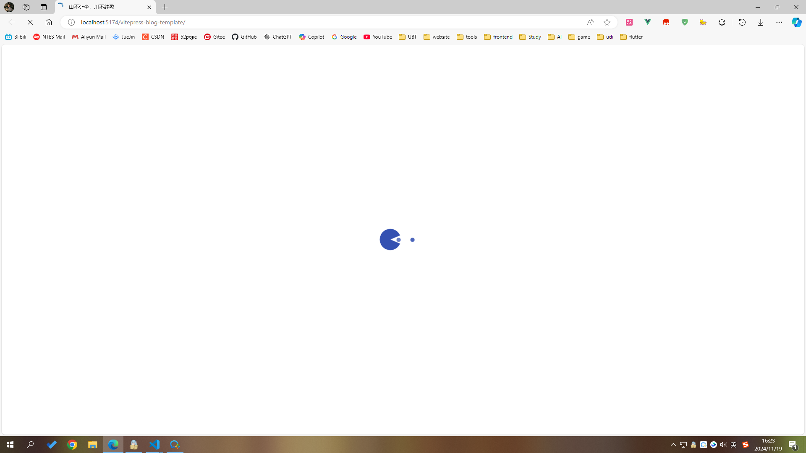

## 14. 图片放大

vitepress文章中，图片点击没有任何效果，可以使用 [vitepress-plugin-image-viewer](https://github.com/T-miracle/vitepress-plugin-image-viewer) 这个插件

- 安装
  ::: code-group

  ```sh [pnpm]
  # Tip: If you use pnpm to install, you need to install viewerjs additionally.
  pnpm add vitepress-plugin-image-viewer viewerjs
  ```

  ```sh [npm]
  npm i vitepress-plugin-image-viewer
  ```

  ```sh [yarn]
  yarn add vitepress-plugin-image-viewer
  ```

  :::

- `.vitepress/theme/index.ts` 文件

  ```ts{2-4,11,23-26}
  // ...
  import 'viewerjs/dist/viewer.min.css'
  import imageViewer from 'vitepress-plugin-image-viewer'
  import vImageViewer from 'vitepress-plugin-image-viewer/lib/vImageViewer.vue'

  // ...
  export default {
    extends: DefaultTheme,
    Layout: NaiveUIProvider,
    enhanceApp: ({ app, router }) => {
      app.component('ArticleHeader', ArticleHeader)
      app.component('vImageViewer', vImageViewer)
      if (import.meta.env.SSR) {
        const { collect } = setup(app)
        app.provide('css-render-collect', collect)
      }
      if (inBrowser) {
        router.onAfterRouteChanged = () => {
          busuanzi.fetch()
        }
      }
    },
    setup() {
      const route = useRoute()
      imageViewer(route)
    },
  }
  ```

- 效果
  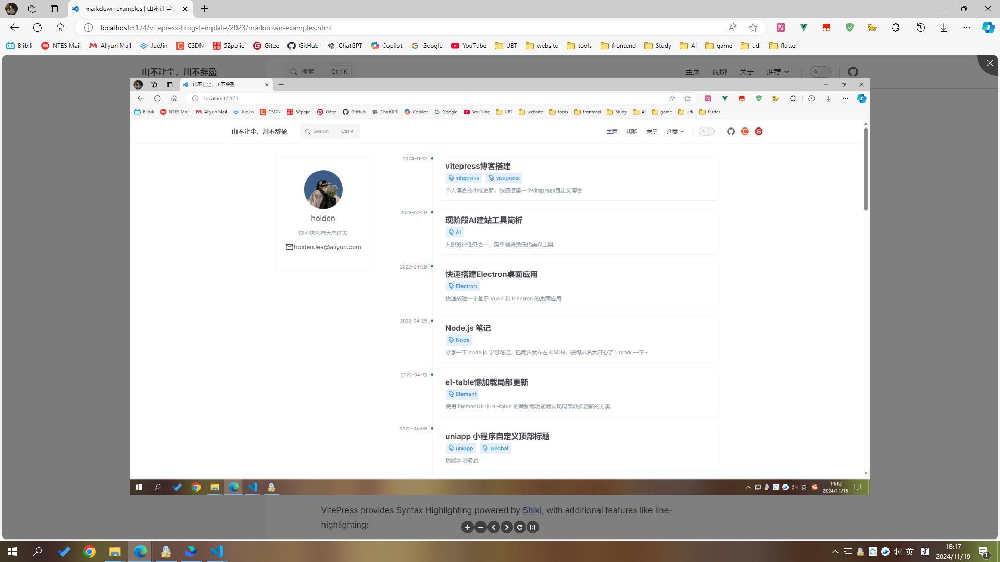

## 总结

从0创建vitepress博客，一步步来，收获满满。

有什么问题欢迎到评论区咨询，一起交流学习。
