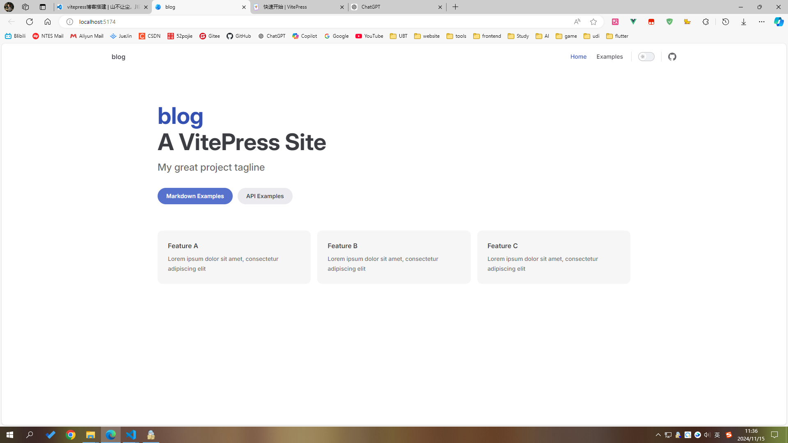
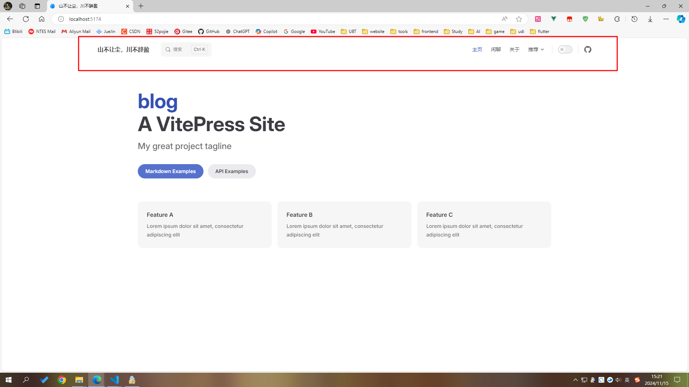
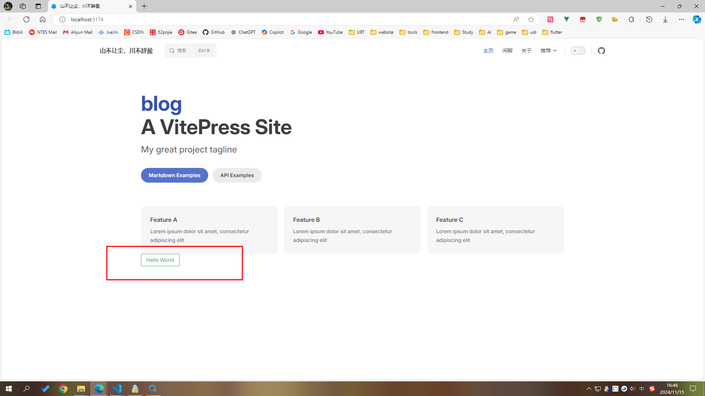
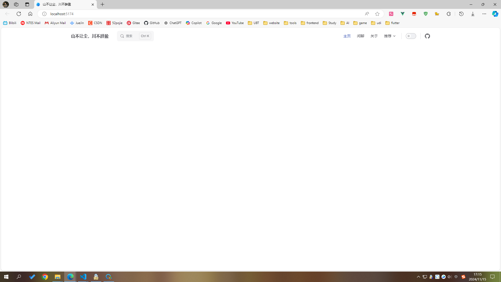

# vitepress博客搭建

## 前言

服务器过期快一年了，博客也快一年没更新了，最近重新搭建了一下博客，记录一下搭建过程。

以前的博客是使用vuepress搭建的，这次换成了vitepress，vitepress是vuepress的下一代，使用vite构建，性能更好，体验更好

缺点：`vitepress的插件生态还没有vuepress那么丰富，很多功能需要自己实现`

优点：`vitepress可配置项、api都比较多，大部分功能都能实现`

:::details 相关链接
[vuepress博客](https://lee-holden.github.io/vuepress-blog/)

[vuepress仓库地址](https://github.com/lee-holden/vuepress-blog)

[vitepress博客](https://dddhl.cn)

[vitepress仓库地址](https://github.com/lee-holden/blog)
:::

旧版本图片预览：

<table>
  <tbody>
    <tr>
      <td>
        
      </td>
    </tr>
     <tr>
      <td>
        
      </td>
    </tr>
     <tr>
      <td>
        
      </td>
    </tr>
  </tbody>
</table>

## 博客介绍

- 自定义首页
- 网站加载页
- 全文搜索
- 全文图片放大
- 网站访问量统计
- GitHub评论系统
- 自动配置侧边栏
- 自动打包部署GitHub Pages
- 自动统计文章字数/阅读时间/最近更新时间
- 未完待续......

## 1. 安装

[vitepress官方文档](https://vitepress.dev/zh/)

Node.js 18 及以上版本，推荐使用pnpm安装

::: code-group

```sh [npm]
# 初始化项目并安装 VitePress 依赖
mkdir blog
cd blog
npm init -y
npm install vitepress --save-dev

# 使用 VitePress CLI 初始化目录结构
npx vitepress init

```

```sh [yarn]
# 初始化项目并安装 VitePress 依赖
mkdir blog
cd blog
yarn init -y
yarn add -D vitepress

# 使用 VitePress CLI 初始化目录结构
yarn vitepress init

```

```sh [pnpm]
# 创建项目并安装 VitePress 依赖
mkdir blog
cd blog
pnpm init
pnpm add -D vitepress

# 使用 VitePress CLI 初始化目录结构
pnpm vitepress init

```

```sh [bun]
# 创建项目并安装 VitePress 依赖
mkdir blog
cd blog
bun init
bun add vitepress --dev

# 使用 VitePress CLI 初始化目录结构
bun vitepress init

```

:::

```sh
┌ Welcome to VitePress!
│
◇ Where should VitePress initialize the config?
│ ./docs
│
◇ Site title:
│ My Awesome Project
│
◇ Site description:
│ A VitePress Site
│
◇ Theme:
│ ● Default Theme (Out of the box, good-looking docs)
│ ○ Default Theme + Customization
│ ○ Custom Theme
│
◇ Use TypeScript for config and theme files?
│  Yes
│
◆ Add VitePress npm scripts to package.json?
│  Yes
└
```

## 2. 运行

::: code-group

```sh [npm]
npm run docs:dev
```

```sh [yarn]
yarn docs:dev
```

```sh [pnpm]
pnpm docs:dev
```

```sh [bun]
bun run docs:dev
```

:::



## 3. 结构

官方文档：[vitepress目录结构](https://vitepress.dev/zh/guide/getting-started#file-structure)

需要手动新建文件夹，我的目录结构如下：

```
.
├─ .github                # 配置GitHub Actions
├─ docs
│  ├─ .vitepress
│  │  ├─ components       # 自定义组件
│  │  ├─ plugins          # 自定义插件
│  │  ├─ theme            # 主题配置
│  │  ├─ utils            # 工具函数
│  │  └─ config.mts       # 配置文件
│  ├─ 2024
│  │  └─ xx.md            # 文章
│  ├─ img                 # 文章图片
│  ├─ pages               # 自定义页面
│  ├─ public              # 静态资源
│  └─ index.md            # 首页
└─ package.json
```

## 4. 导航栏

配置文件：`/docs/.vitepress/config.mts`

### 4.1 标题

官方文档：[vitepress站点标题和图标](https://vitepress.dev/zh/reference/default-theme-nav#site-title-and-logo)

```ts{2}
export default defineConfig({
  title:'山不让尘，川不辞盈',
  // ...
})
```

### 4.2 搜索

官方文档：[vitepress搜索](https://vitepress.dev/zh/reference/default-theme-search)

有多种方式可以实现，我采用的是 [vitepress-plugin-pagefind](https://www.npmjs.com/package/vitepress-plugin-pagefind) 插件

该插件支持i18n，具体配置请查看文档

:::code-group

```sh [npm]
npm i vitepress-plugin-pagefind pagefind
```

```sh [yarn]
yarn add vitepress-plugin-pagefind pagefind
```

```sh [pnpm]
pnpm add vitepress-plugin-pagefind pagefind
```

```sh [bun]
bun add vitepress-plugin-pagefind pagefind
```

:::

```ts{1,7-18}
import { pagefindPlugin } from 'vitepress-plugin-pagefind'

export default defineConfig({
  title:'山不让尘，川不辞盈',
  vite:{
    plugins:[
     pagefindPlugin({
        btnPlaceholder: '搜索',
        placeholder: '搜索文档',
        emptyText: '空空如也',
        heading: '共: {{searchResult}} 条结果',
        customSearchQuery(input) {
          return input
            .replace(/[\u4E00-\u9FA5]/g, ' $& ')
            .replace(/\s+/g, ' ')
            .trim()
        },
      }),
    ]
  }
  // ...
})
```

### 4.3 导航链接

官方文档：[vitepress导航链接](https://vitepress.dev/zh/reference/default-theme-nav#navigation-links)

配置中的link是md文件的地址，比如：`/pages/about` 对应 `docs/pages/about.md`

```ts{4-19}
export default defineConfig({
  title:'山不让尘，川不辞盈',
  themeConfig:{
   nav: [
      { text: '主页', link: '/' },
      { text: '闲聊', link: '/pages/comment' },
      { text: '关于', link: '/pages/about' },
      {
        text: '推荐',
        items: [
          {
            items: [
              { text: '实用网页', link: '/pages/webPage' },
              { text: '工具插件', link: '/pages/tools' },
            ],
          },
        ],
      },
    ],
  }
  // ...
})
```

### 4.4 社交链接

官方文档：[vitepress社交链接](https://vitepress.dev/zh/reference/default-theme-config#sociallinks)

```ts{3-15}
export default defineConfig({
  themeConfig: {
    socialLinks: [
      { icon: 'github', link: 'https://github.com/vuejs/vitepress' },
      { icon: 'twitter', link: '...' },
      // 可以通过将 SVG 作为字符串传递来添加自定义图标：
      {
        icon: {
          svg: '<svg role="img" viewBox="0 0 24 24" xmlns="http://www.w3.org/2000/svg"><title>Dribbble</title><path d="M12...6.38z"/></svg>',
        },
        link: '...',
        // 也可以为无障碍添加一个自定义标签 (可选但推荐):
        ariaLabel: 'cool link',
      },
    ],
  },
})
```

### 4.5 效果

配置完后效果图：



## 5. 布局框架

### 5.1 Naive UI

[Naive UI 文档](https://www.naiveui.com/zh-CN/os-theme/docs/vitepress)

#### （1）安装

::: code-group

```sh [npm]
npm install -D @css-render/vue3-ssr naive-ui
```

```sh [yarn]
yarn add -D @css-render/vue3-ssr naive-ui
```

```sh [pnpm]
pnpm add -D @css-render/vue3-ssr naive-ui
```

```sh [bun]
bun add -d @css-render/vue3-ssr naive-ui
```

:::

#### （2）配置

新建 `.vitepress/theme/index.ts` 文件

```ts
import { defineComponent, h, inject } from 'vue'
import DefaultTheme from 'vitepress/theme'
import { NConfigProvider } from 'naive-ui'
import { setup } from '@css-render/vue3-ssr'
import { useRoute } from 'vitepress'

const { Layout } = DefaultTheme

const CssRenderStyle = defineComponent({
  setup() {
    const collect = inject<() => string>('css-render-collect')
    return {
      style: collect ? collect() : '',
    }
  },
  render() {
    return h('css-render-style', {
      innerHTML: this.style,
    })
  },
})

const VitepressPath = defineComponent({
  setup() {
    const route = useRoute()
    return () => {
      return h('vitepress-path', null, [route.path])
    }
  },
})

const NaiveUIProvider = defineComponent({
  render() {
    return h(
      NConfigProvider,
      { abstract: true, inlineThemeDisabled: true },
      {
        default: () => [
          h(Layout, null, { default: this.$slots.default?.() }),
          import.meta.env.SSR ? [h(CssRenderStyle), h(VitepressPath)] : null,
        ],
      }
    )
  },
})

export default {
  extends: DefaultTheme,
  Layout: NaiveUIProvider,
  enhanceApp: ({ app }) => {
    if (import.meta.env.SSR) {
      const { collect } = setup(app)
      app.provide('css-render-collect', collect)
    }
  },
}
```

`.vitepress/config.mts` 文件

```ts{3,8-10,12-30}
import { defineConfig } from 'vitepress'

const fileAndStyles: Record<string, string> = {}

export default defineConfig({
  // ...
  vite: {
    ssr: {
      noExternal: ['naive-ui', 'date-fns', 'vueuc'],
    },
  },
  postRender(context) {
    const styleRegex = /<css-render-style>((.|\s)+)<\/css-render-style>/
    const vitepressPathRegex = /<vitepress-path>(.+)<\/vitepress-path>/
    const style = styleRegex.exec(context.content)?.[1]
    const vitepressPath = vitepressPathRegex.exec(context.content)?.[1]
    if (vitepressPath && style) {
      fileAndStyles[vitepressPath] = style
    }
    context.content = context.content.replace(styleRegex, '')
    context.content = context.content.replace(vitepressPathRegex, '')
  },
  transformHtml(code, id) {
    const html = id.split('/').pop()
    if (!html) return
    const style = fileAndStyles[`/${html}`]
    if (style) {
      return code.replace(/<\/head>/, `${style}</head>`)
    }
  },
  // ...
})
```

#### （3）解决ts报错

安装vite

::: code-group

```sh [npm]
npm install -D vite vue
```

```sh [yarn]
yarn add -D vite vue
```

```sh [pnpm]
pnpm add -D vite vue
```

```sh [bun]
bun add -D vite vue
```

:::

根目录下新建 `type.d.ts` 文件

```ts
/// <reference types="vite/client" />

interface ImportMetaEnv {}

interface ImportMeta {
  readonly env: ImportMetaEnv
}
```

#### （5）测试

在 `docs/index.md` 文件中测试

```js
<script setup>
import { NButton } from 'naive-ui'
</script>

<NButton>Hello World</NButton>
```

按钮正常出现则配置完成



### 5.2 Sass

此项为选配，按需安装

#### （1）安装

::: code-group

```sh [npm]
npm install -D sass
```

```sh [yarn]
yarn add -D sass
```

```sh [pnpm]
pnpm add -D sass
```

```sh [bun]
bun add -D sass
```

:::

#### （2）忽视告警

安装sass会出现此告警，目前没有发现什么问题

::: warning
Deprecation Warning: The legacy JS API is deprecated and will be removed in Dart Sass 2.0.0.

More info: https://sass-lang.com/d/legacy-js-api
:::

`.vitepress/config.mts`

```ts{5-13}
import { defineConfig } from 'vite'

export default defineConfig({
  // ...
  vite:{
    css: {
     preprocessorOptions: {
       scss: {
          api: 'modern-compiler', // or 'modern'
        },
      },
    },
  }
  // ...
})
```

## 6. 首页

默认首页是`docs/index.md`

### 6.1 自定义首页组件

#### （1）配置

由于想自己写首页样式，所以仅保留 `layout: home`

新建 `docs/.vitepress/components/ArticleList.vue` 文件

```vue
<script setup lang="ts"></script>

<template>
  <div class="artical-list"></div>
</template>

<style scoped lang="scss">
.artical-list {
  width: 100%;
  height: 100%;
  color: var(--black-color-1);
}
</style>
```

修改 `docs/index.md` 文件

```md
---
layout: home
---

<script setup>
import ArticleList from './.vitepress/components/ArticleList.vue'
</script>

<ArticleList />
```

#### （2）调整

此时首页会白屏，因为自定义组件没有内容



自定义组件时，顶部导航栏的下边框可以加入一个细线

`.vitepress/components/ArticleList.vue` 文件

```vue
<style>
.VPNavBar.home.top {
  border-bottom: 1px solid #f2f3f5;
}

.dark {
  .VPNavBar.home.top {
    border-bottom: 1px solid #000;
  }
}
</style>
```

#### （3）设置文章信息

首先得了解 [vitepress frontmatter](https://vitepress.dev/zh/guide/frontmatter)

指的是文章可以在顶部自定义信息，如标题、描述、作者、标签、时间等，自定义信息后，可使用各种api访问

frontmatter 可自定义key，我的配置如下（`每个文章都需要配置`）：

```md
---
title: vitepress博客搭建
date: 2024-11-12
info: 个人博客技术栈更新，快速搭建一个vitepress自定义博客
tags:
  - vitepress
  - vuepress
---
```

#### （4）首页获取文章列表

官方文档：[vitepress createcontentloader](https://vitepress.dev/zh/guide/data-loading#createcontentloader)

VitePress 提供了一个 createContentLoader 辅助函数，可通过它获取到匹配的文章列表信息

新建 `.vitepress/utils/posts.data.ts` 文件

```ts
import { createContentLoader } from 'vitepress'

export default createContentLoader('../docs/*/*.md' /* options */)
```

在主页组件中引入

`.vitepress/components/ArticleList.vue` 此处用了类型忽略

```ts
// @ts-ignore
import { data as posts } from '../utils/posts.data'
```

打印data
