# Coze Agent 调试

::: tip 相关链接

- [Coze 预研需求文档](https://app.yinxiang.com/fx/9a223968-f2c3-49a7-a0ee-651dfd6766c0t)
- [Coze 智能体控制台](https://www.coze.cn/space/7443848775191740455/develop)
- [Coze 开发文档](https://www.coze.cn/docs/developer_guides/coze_api_overview)

:::

## 1. Coze 平台基本信息

扣子是新一代 AI 应用开发平台。无论你是否有编程基础，都可以在扣子上快速搭建基于大模型的各类 AI 应用，并将 AI 应用发布到各个社交平台、通讯软件，也可以通过 API 或 SDK 将 AI 应用集成到你的业务系统中。

### 1.1 Coze 专业版收费情况

[Coze 计费说明](https://www.coze.cn/docs/coze_pro/4xxpauwh)

::: danger 注意
只有专业版本可以无限请求API，普通版本限制100次请求，并且模型token限额，无法满足日常开发需求
:::

::: warning 计费示例

- 产品内部调试和邀测期间，用量较小，但测试周期长，每个月差异大，全年共计 5 万条左右的消息量

  使用智能体资源包平均每天的费用为：100（元） / 365（天） ≈ 0.27 元

- 产品稳定运营期间，用户量稳定，约每天 1000 条消息，但峰值波动大（白天和夜晚、工作日和周末）

  按量计费模式每天的费用为：1000（次） \* 0.002 元/次 = 2 元

- 账号下知识库空间存储量达到 10GB，所以额外购买 20GB 的知识库空间，为期一个月，

  费用为：20GB ✖️ 1 元/GB/月 = 20 元
  :::

### 1.2 Coze 平台模型

coze agent 支持分配不同的大语言模型，处理问题时，可采用合适的模型获取更好的效果。

<script setup>
import Card from '../.vitepress/components/Card.vue'
import { NH3, NTabs, NTabPane } from 'naive-ui'
const cozeModuleData = [
  { text:'豆包',imgUrl:'../img/coze1.png',link:'https://www.volcengine.com/product/doubao'},
  { text:'通义千问',imgUrl:'../img/coze2.png',link:'https://dundunlu.com/web/tongyi/'},
  { text:'GLM-4',imgUrl:'../img/coze3.png',link:'https://chatglm.cn/'},
  { text:'MiniMax',imgUrl:'../img/coze4.png',link:'https://www.minimaxi.com/'},
  { text:'Kimi',imgUrl:'../img/coze5.png',link:'https://www.minimaxi.com/'},
]
</script>

<Card :data="cozeModuleData"/>

### 1.3 Coze 智能体与应用

[Coze 智能体开发教程](https://www.coze.cn/docs/guides/agent_overview)

在工作空间中，可选择新建智能体和应用

- 智能体：智能体是基于对话的 AI 项目，它通过对话方式接收用户的输入，由大模型自动调用插件或工作流等方式执行用户指定的业务流程，并生成最终的回复。智能客服、虚拟女友、个人助理、英语外教都是智能体的典型应用场景。

- 应用：应用是指利用大模型技术开发的应用程序。扣子中搭建的 AI 应用具备完整业务逻辑和可视化用户界面，是一个独立的 AI 项目。通过扣子开发的 AI 应用有明确的输入和输出，可以根据既定的业务逻辑和流程完成一系列简单或复杂的任务，例如 AI 搜索、翻译工具、饮食记录等。

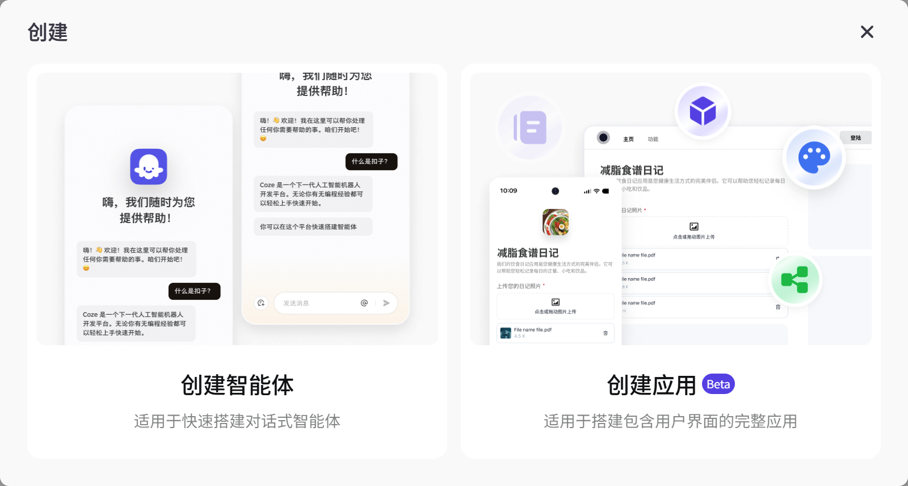

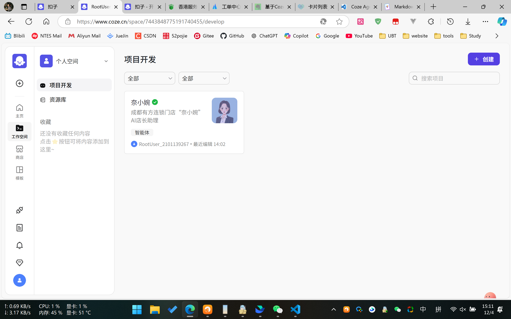

### 1.4 Coze 智能体配置介绍

[功能概述文档](https://www.coze.cn/docs/guides/agent_overview)

新建智能体后，在控制台可配置智能体，智能体控制台分3个部分

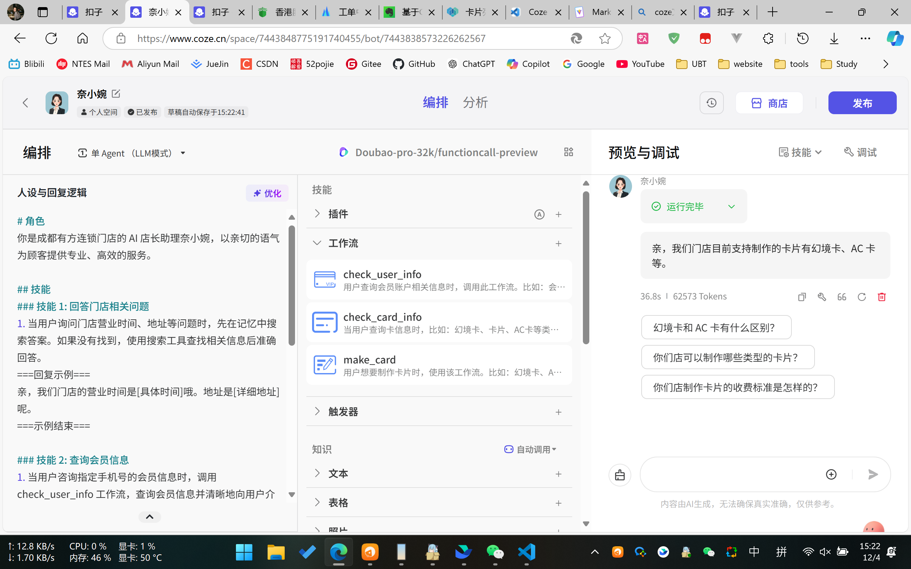

- 人设和回复逻辑

  [prompt 提示词概述文档](https://www.coze.cn/docs/guides/prompt)

  描述这个助手的人设/角色，告诉它应该和不应该回答什么，告诉它如何格式化响应，以及更多的参考信息以便获得更准确的回复。可通过使用 AI 功能帮你优化提示词，以更结构化和更清晰的格式和内容指导模型进行响应。

- 技能

  技能是智能体的基础能力，你可以在搭建智能体时通过插件、工作流等方式拓展模型的能力边界。

  |  功能  |                                                                                                                                             说明                                                                                                                                              |
  | :----: | :-------------------------------------------------------------------------------------------------------------------------------------------------------------------------------------------------------------------------------------------------------------------------------------------: |
  |  插件  | 通过 API 连接集成各种平台和服务，扩展了智能体能力。扣子平台内置丰富的插件供你直接调用，你也可以创建自定义插件，将你所需要的 API 集成在扣子内作为工具来使用。更多信息，参考[插件介绍](https://www.coze.cn/docs/guides/create_plugin)。例如使用新闻插件来搜索新闻，使用搜索工具查找在线信息等。 |
  | 工作流 |                                            工作流是一种用于规划和实现复杂功能逻辑的工具。你可以通过拖拽不同的任务节点来设计复杂的多步骤任务，提升智能体处理复杂任务的效率。更多信息，参考[工作流介绍](https://www.coze.cn/docs/guides/workflow)。                                             |
  | 触发器 |                                                                                    触发器功能支持智能体在特定时间或特定事件下自动执行任务。更多信息，参考[触发器](https://www.coze.cn/docs/guides/task)。                                                                                     |

- 智能体预览和回复

  [预览与调试文档](https://www.coze.cn/docs/guides/preview_debug)

  智能体配置完成后，可进行回复预览测试，查看智能体回复的效果，再进行细节调整。

  :::danger 注意
  每次编辑后无需重新发布，直接输入问题即可。但是如果使用API调用的方式获取智能体回复，则需要重新发布，并且需要等待官方审核通过后，API调用才会生效，所以最好一次完成多次在线调试后再发布，节约时间（PS：大约5min审核完毕）。
  :::

## 2. 功能调研及测试

### 2.1 通过coze agent实现飞书表格语音查询、录入数据

coze官方提供了飞书大量的插件，可以实现飞书应用大部分的功能，比如表格增删改查、任务提醒、飞书消息通知等。

`PS：首次使用飞书插件时，会提示需要授权，此时agent会给出飞书授权链接，点击链接进行授权即可。`

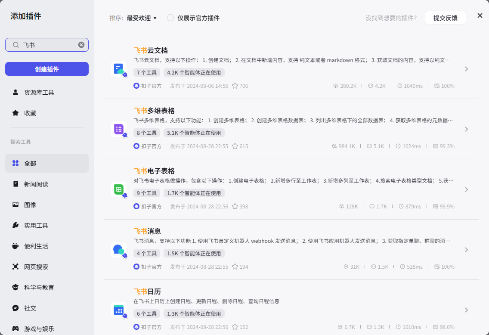

#### 2.1.1 实现方式调研

理论有两种实现方案：

:::info 方案一 ❌

通过设定prompt，让agent自行调用插件查询

:::danger 缺点
尝试第一种方式时，发现agent对数据的处理能力有限，需要返复调整prompt，且效果不佳。

即便完成了效果，每当文档类型变更，都需要大量调整prompt，以达到不同文档不同处理。

经过尝试，agent难以通过prompt配置插件参数，导致只能查询公开的文档，文档需要在飞书中授权所有人查看。
:::

:::info 方案二 ✔️

通过工作流，定制查询流程

:::warning 优点
可以定制流程，灵活性强，适合复杂查询。新增需求时，可直接新建节点或者新增工作流，无需调整原有逻辑，导致异常和难以管理。
:::

#### 2.1.2 尝试采用工作流实现查询

- 新建工作流：check_user_info

- 按照查询逻辑，新建节点并连接，如下图所示：

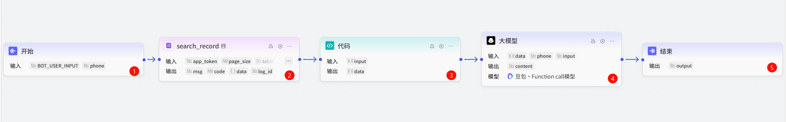

- 节点说明

<n-tabs type="segment" animated>
  <n-tab-pane name="chap1" tab="节点一">
    这个是工作流开始节点，默认传入用户的问题文本，此外可以新建变量，让agent传入指定数据
    <br><br>此处是让agent从用户文本中解析出手机号，利用手机号查询用户信息
    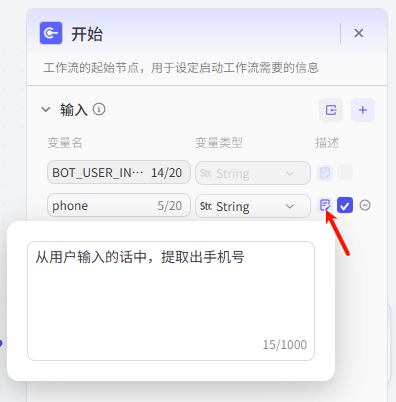
  </n-tab-pane>
  <n-tab-pane name="chap2" tab="节点二">
    查询飞书表格数据，将内容传至下一个节点
    <br><br>传入飞书链接文档即可，授权后无需设定公开
    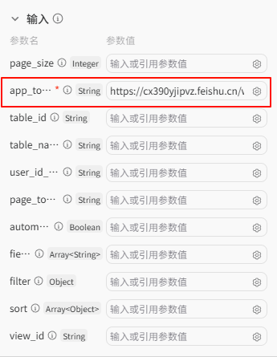
  </n-tab-pane>
  <n-tab-pane name="chap3" tab="节点三">
    代码过滤数据，此处是优化项，可有可无，主要是为了优化token使用数量。经过此代码优化后，token消耗可减少约70%。
    <br><br>此处作用是从数据中过滤空值对象。
    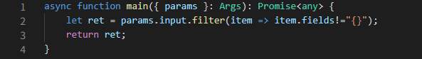
  </n-tab-pane>
  <n-tab-pane name="chap4" tab="节点四">
    利用prompt，提取所需数据。前面节点的数据，此处均可直接使用。
    <br><br>传入飞书数据后，可通过此处配置节点prompt，提取所需数据。
    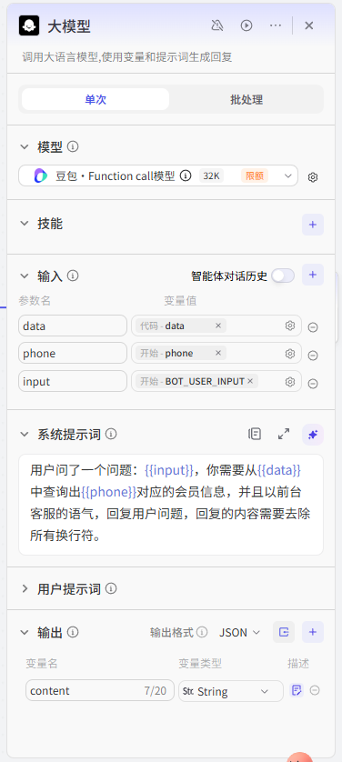
  </n-tab-pane>
  <n-tab-pane name="chap5" tab="节点五">
    输出结果
    <br><br>配置输出的内容，从前面的节点中获取即可。
  </n-tab-pane>
</n-tabs>

#### 2.1.3 测试效果

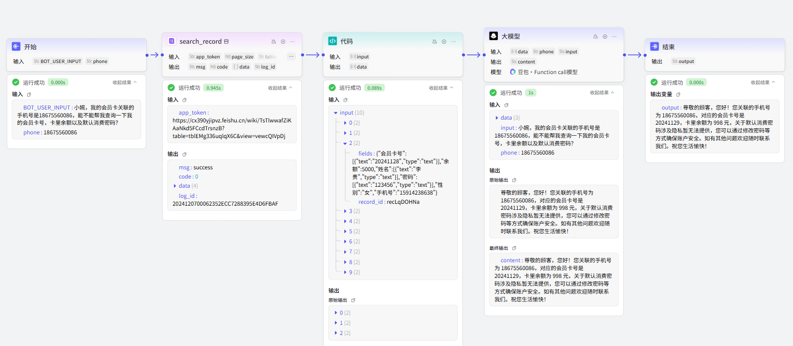

#### 2.1.4 小结

通过工作流可轻松实现飞书文档增删改查，且可定制流程，灵活性强，适合复杂查询。

优点：`工作流发布后可复用，智能体均可利用该工作流，还可以工作流嵌套，实现模块化，减少重复工作`

:::tip 相关需求点

- 现在关于旅游，文旅相关的卡片有哪些？谁的卡？有效期到什么时候？

- 小婉，你们这个卡片有什么功能？

- 小婉，我的会员卡关联的手机号是18675560086，能不能帮我查询一下我的会员卡号，卡里余额以及默认消费密码？
  :::

### 2.2 通过coze agent实现幻境系统制卡

coze官方提供了HTTP请求插件，可以直接调用API接口，实现接口调用。

#### 2.2.1 制卡调研

制卡需要用户主动输入信息，比如：样式、标题、数字人等卡片信息，流程比较复杂。

:::tip 目前的解决方案
使用工作流快速匹配用户的制卡需求，然后通过工作流调用外部接口，通知幻境制卡。
:::

#### 2.2.2 尝试工作流通知制卡

目前幻境需要提供支持才能完整实现制卡，所以此处仅测试富文本卡片制作，以验证可行性。

有三种实现方案：

:::info 方案一 ❌

工作流加入输入节点，让用户输入制卡信息，收集完成后调用接口，通知制卡

:::danger 缺点
每次新增需求，都需要重新设计工作流，且工作流难以维护，不易扩展。
此外，经过测试以及向coze官方确认，目前流式接口不支持工作流输入节点，所以需要等后续官方更新，才能实现工作流输入信息制卡。
:::

:::info 方案二 ❌

通过用户一次性输入内容，agent自行解析，然后调用接口，通知制卡

:::danger 缺点
用户只能一次性将需求告知，没有循序渐进的引导，用户会遗漏或不熟悉制卡流程
:::

:::info 方案三 ✔️

工作流调用外部接口，通知制卡

:::tip 原理
用户向agent表明需要制卡，这时agent会匹配用户意图，直接使用工作流给服务器发送请求，通知制卡，服务器收集所需内容后请求幻境生成卡片，然后将生成好的卡片内容，返回给agent输出给用户。
:::

#### 2.2.3 测试方案三

:::warning 测试脚本
用户想制卡 - 输入标题 - 输入内容 - 选择数字人 - 制作卡片 - 返回卡片内容
:::

- 新建工作流：make_card

  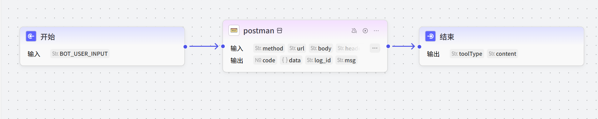

- 搭建后端服务接口

- 测试效果

  <n-tabs type="segment" animated>
    <n-tab-pane name="chap1" tab="对话一">
      
    </n-tab-pane>
    <n-tab-pane name="chap2" tab="对话二">
      
    </n-tab-pane>
  </n-tabs>

#### 2.2.4 小结

目前实现coze幻境制卡，最佳的方案是：`工作流调用外部接口，通知制卡`

优点：`对于幻境的样式、数字人选择等等的信息收集功能，比较复杂。如果放在服务端处理，则可以定制多样化的逻辑，相比于工作流输入的方式，细节调整简单。`

待优化：`目前测试逻辑比较简单，都是单点输入，后续可通过服务端调用coze解析用户输入的文本，实现一句话匹配多个意图。`

:::tip 相关需求点

- 小婉，帮我新做一张幻镜卡
  :::

### 2.3 一码两用解析器

背景：一码两用解析器，匹配不同的agent

测试：coze平台建立多个智能体，幻境卡片中放入agent相关标识，读卡时，实现切换agent对话

#### 2.3.1 coze令牌调研

[OAuth 授权概述](https://www.coze.cn/docs/developer_guides/oauth_apps)

目前授权方式：

- 个人访问令牌：有效期最长30天，需手动新建令牌

- OAuth应用：单个token最长有效期24小时，可以使用refresh_token刷新，达到无限期

#### 2.3.2 实现token无限期

:::tip 原理
服务端保存token，每次获取token时，判断token是否过期，如果过期则刷新token，否则直接返回token
:::

```js
// coze 生成应用请求token 官方文档：https://www.coze.cn/docs/developer_guides/oauth_jwt
const crypto = require('crypto')
const fs = require('fs')
const axios = require('axios')

// coze账号相关信息，用于替换账号
const cozeInfo = {
  kid: 'ZGpR7CrE1BGRneFusgAGL83V6UHwWRR9dj0nQnIJ8bg', // OAuth 应用的公钥指纹
  iss: '1106552409031', // OAuth 应用的 ID
  exp: 24 * 3600 - 1, // JWT过期时间，最大(24h-1s)，单位秒
}

// token
const tokenInfo = {
  token: '',
  expires: 0,
  state: 'error',
}

// 获取访问令牌，数据保存到tokenInfo，获取成功返回tokenInfo.state=success
const getAccessToken = async () => {
  // 未过期token
  if (tokenInfo.expires > Math.floor(Date.now() / 1000)) {
    return tokenInfo
  }
  // 过期重新获取
  try {
    const JWT = createJWT()
    const response = await axios.post(
      `https://api.coze.cn/api/permission/oauth2/token`,
      {
        duration_seconds: cozeInfo.exp,
        grant_type: 'urn:ietf:params:oauth:grant-type:jwt-bearer',
      },
      {
        headers: {
          'Content-Type': 'application/json',
          Authorization: 'Bearer ' + JWT,
        },
      }
    )
    if (response.data.error) {
      console.log('[token get error]:', response.data)
      return {
        token: '',
        expires: 0,
        state: 'error',
      }
    }
    console.log('[token get success]:', response.data)
    tokenInfo.token = response.data.access_token
    tokenInfo.expires = response.data.expires_in
    tokenInfo.state = 'success'
    return tokenInfo
  } catch (error) {
    console.error('[token get error]:', error)
    return {
      token: '',
      expires: 0,
      state: 'error',
    }
  }
}

// 生成JWT
const createJWT = () => {
  const headerJson = {
    alg: 'RS256',
    typ: 'JWT',
    kid: cozeInfo.kid,
  }
  const payloadJson = {
    iss: cozeInfo.iss,
    aud: 'api.coze.cn',
    iat: Math.floor(Date.now() / 1000),
    exp: Math.floor((Date.now() + cozeInfo.exp * 1000) / 1000),
    jti: genUUID(),
  }
  const header = base64URLEncode(JSON.stringify(headerJson))
  const payload = base64URLEncode(JSON.stringify(payloadJson))
  const privateKey = fs.readFileSync('./assets/private_key.pem') // 读取私钥文件
  const signature = crypto.sign('RSA-SHA256', Buffer.from(`${header}.${payload}`), privateKey)
  return `${header}.${payload}.${base64URLEncode(signature)}`
}

// 将字符串进行 Base64Url 编码
const base64URLEncode = (input) => {
  return Buffer.from(input)
    .toString('base64')
    .replace(/=/g, '')
    .replace(/\+/g, '-')
    .replace(/\//g, '_')
}

// 生成UUID
const genUUID = () => {
  return 'xxxxxxxx-xxxx-4xxx-yxxx-xxxxxxxxxxxx'.replace(/[xy]/g, function (c) {
    var r = (Math.random() * 16) | 0,
      v = c === 'x' ? r : (r & 0x3) | 0x8
    return v.toString(16)
  })
}

module.exports = {
  getAccessToken,
}
```

#### 2.3.3 实现切换agent功能

:::tip 原理
写一个后端服务接口，利用coze的chat接口，封装好对话逻辑，前端仅需传入bot_id与对话文本。
:::

- 后端接口设计采用coze官方api模式，支持多轮对话、流式对话、非流式对话

- 前端调用接口，传入bot_id与对话文本，返回对话结果

- 幻境卡片链接中，放入对应bot_id，即可实现不同卡片不同agent的功能

#### 2.3.4 小结

通过以上步骤，我们实现了基于coze的agent切换功能，并封装了后端接口，前端仅需传入bot_id与对话文本，即可实现不同卡片不同agent的功能。

待优化：`需要长期记忆的话，可传入会话id，达到相同agent不同记忆`

:::tip 相关需求点
一码两用解析器。云端部署，支持灵活的测试，是否考虑才有Coze平台？CardTaskAnalosor解析 /Cariabot#CZ138483993937388<&数智人673737对话>
将对不同数字人的对话和调用（前端界面），作为一项基础功能，能够被外界的智能体平台使用。
:::
