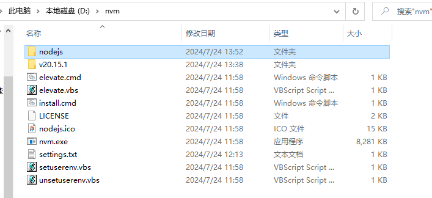

# 解决nvm use无效问题

首先安装先确定没错。[nvm安装教程](https://blog.csdn.net/HuangsTing/article/details/113857145)

问题：nvm use 后 node和npm均无法使用，nvm list也没有\*号

原因：nvm目录下没有nodejs文件夹

解决办法：先nvm install 一个版本，复制，改名nodejs，比如我这里是复制v20.15.1，再改名。

