# 不同分辨率图片测试

现有图片模型在不同分辨率图片上的能力对比

## 1. Sony ZV-E10M2

参数：

- 分辨率：4128 × 6192
- 人物距离：1m ～ 5m
- 环境：昏暗室内
- 焦距：30 ～ 50mm
- 光圈：f/5.6
- 曝光时间：1/160

### 1.1 证件照

- 输入照片

从左到右分别：5m => 4m => 3m => 2m => 1m

<table>
  <tbody>
    <tr>
      <td></td>
      <td></td>
      <td></td>
      <td></td>
      <td></td>
    </tr>
  </tbody>
</table>

- 模型输出结果

<table>
  <tbody>
    <tr>
      <td>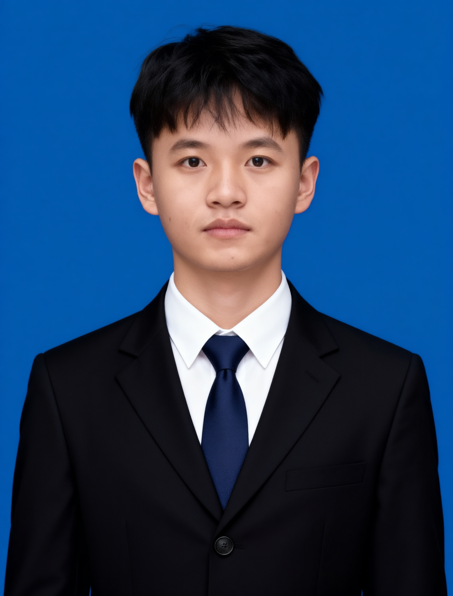</td>
      <td>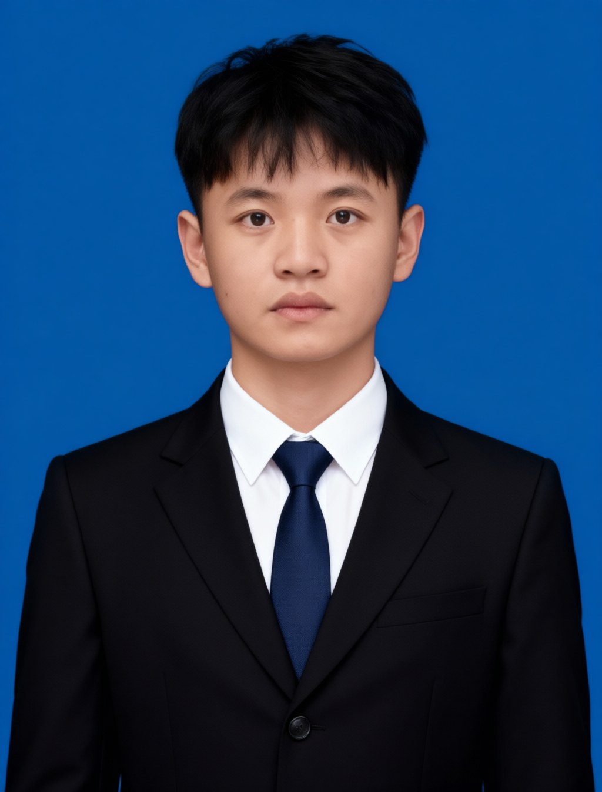</td>
      <td>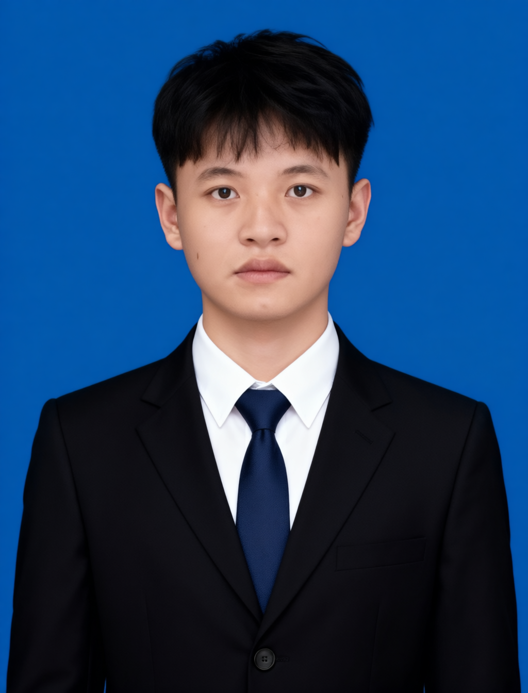</td>
      <td></td>
      <td>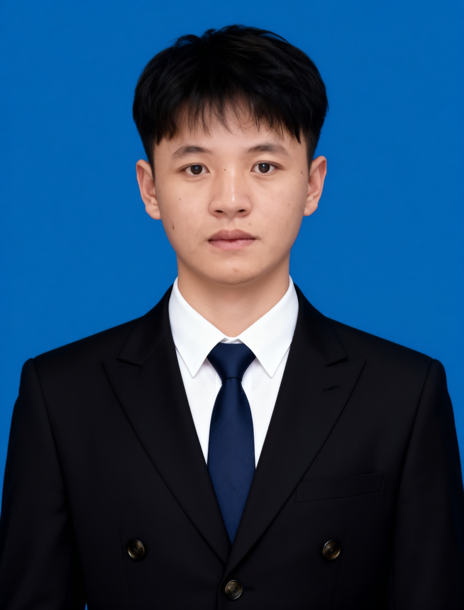</td>
    </tr>
  </tbody>
</table>

## 2. UVC 1080P

参数：

- 分辨率：1920 × 1080、640 × 480
- 人物距离：1m ～ 5m
- 环境：昏暗室内
- 焦距：30 ～ 50mm
- 光圈：f/5.6
- 曝光时间：1/160

### 2.1 证件照

- 输入照片

从左到右分别：5m => 4m => 3m => 2m

<table>
  <tbody>
    <tr>
      <td>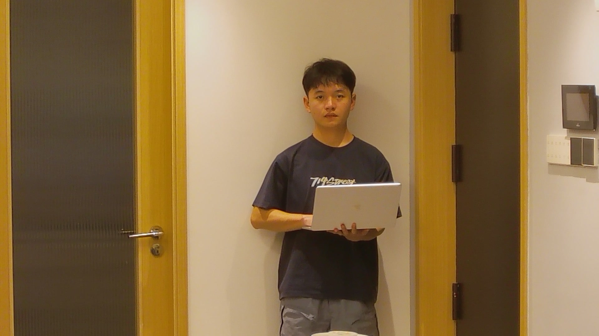</td>
      <td>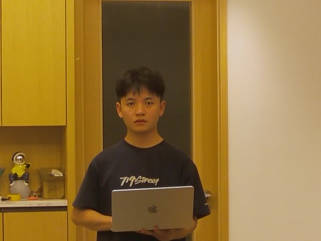</td>
      <td>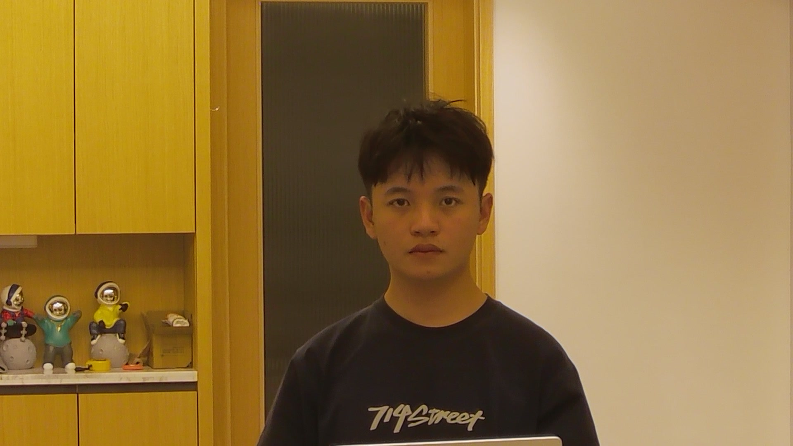</td>
      <td>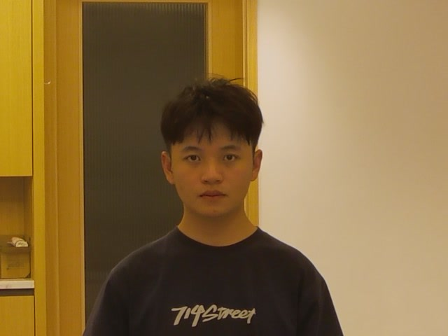</td>
    </tr>
  </tbody>
</table>

- 模型输出结果

<table>
  <tbody>
    <tr>
      <td>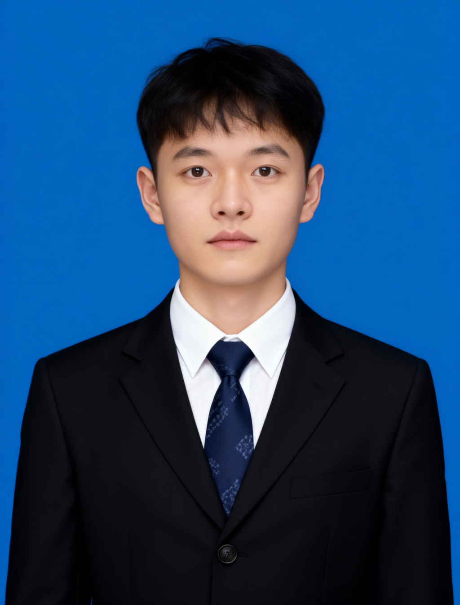</td>
      <td>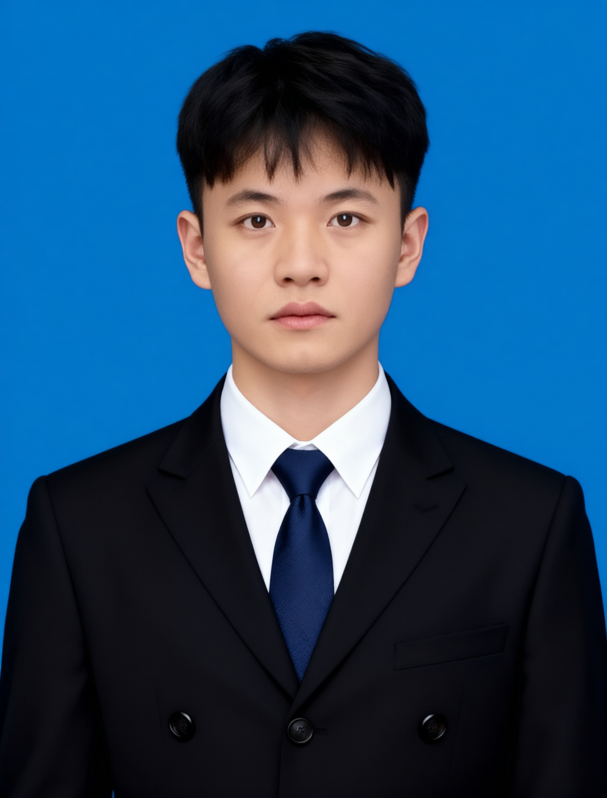</td>
      <td>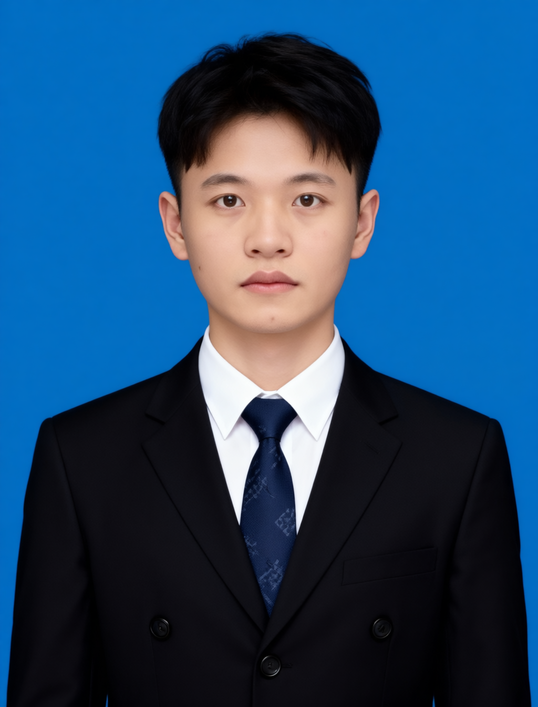</td>
      <td>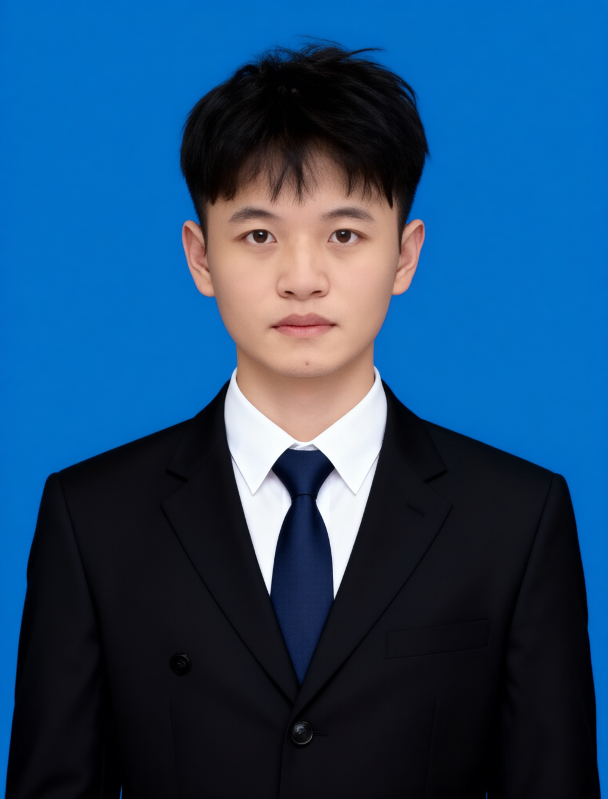</td>
    </tr>
  </tbody>
</table>
