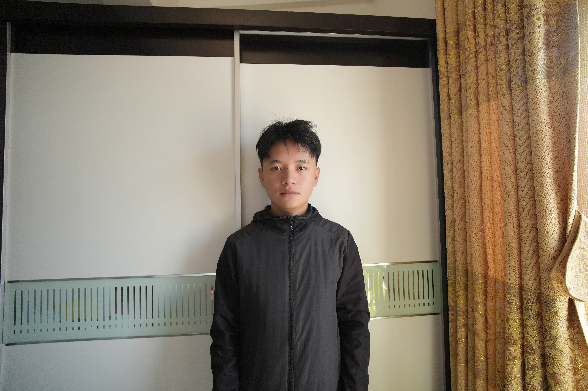

<script setup>
import { NTabs, NTabPane, NTag,NAlert } from 'naive-ui'
</script>

# AI图片编辑模型对比

## 前言

:::tip 对比方法
固定输入模特图，以及模型prompt，对比输出文件的效果
:::

:::tip 图像编辑模型排行榜

:::

:::info 数据来源
[LMArena AI - 全球模型评估平台官网](https://lmarenaai.cn/)

[image-edit排行榜](https://arena.ai/zh/leaderboard/image-edit)
:::

## 1. 测试模型能力

当前输入照片未经过处理，不怎么符合证件照要求，用于测试模型对人物的处理能力

### 1.1 蓝底证件照

- prompt

:::code-group

```markdown [正向提示词]
将输入的人物照片编辑为标准蓝底证件照；
严禁修改原始人脸特征、五官比例、表情、肤色、发型、发际线以及原始佩戴的眼镜或饰品（如有）；
不能将人物头部进行任何修改、重绘、美化、风格化或生成，必须100%保留原始面部细节和结构；
仅在原始人物基础上：添加深黑色单排两粒扣合身西装、纯白色无褶皱正装衬衫、藏青色无图案纯色领带（标准半温莎结）；
采用专业影棚布光，确保整体光照均匀、无阴影；
构图严格遵循证件照规范：图像仅包含从头顶到锁骨上方的区域，肩部不得完整露出，画面底部截止于颈部与肩部交界处，头顶距图像顶部约3%–5%，下巴位于图像高度70%–75%位置；
人物整体为正面、居中、双眼平视、双肩水平的合规证件照。
```

```markdown [反向提示词]
背景颜色错误，人物露出完整肩膀，脸部、发型、特征、配饰、眼镜被修改或移除，脸部存在阴影，
衣物不符合要求（非深黑色西装、纯白色衬衫、藏青色领带），头部有任何形式的修改或美化。
```

:::

- 输入照片



### 1.2 模型输出结果

<n-tabs type="segment" animated style="margin-top:10px">
  <!-- Qwen -->
  <n-tab-pane name="1" tab="qwen">
    <n-alert title="qwen-image-edit-max" type="info">
      模型能力：⭐⭐⭐⭐☆
      <br />人物脸部细节有明显改动，肩膀不符合要求，效果一般
    </n-alert>
    <div style="display:flex;align-items:center;justify-content:space-between;margin-top:15px">
      
      =>
      
    </div>
  </n-tab-pane>

  <!-- Doubao -->
  <n-tab-pane name="2" tab="doubao">
    <n-alert title="doubao-seedream-4-5-251128" type="info">
      模型能力：⭐⭐⭐⭐⭐
      <br />人物脸部细节有轻微变化，效果比较好。
      <br />ps：在coze平台上使用时发现，该模型图像处理是分步执行的，先扣出人像再合成照片。
    </n-alert>
    <div style="display:flex;align-items:center;justify-content:space-between;margin-top:15px">
      
      =>
      
    </div>
  </n-tab-pane>

  <!-- GPT -->
  <n-tab-pane name="3" tab="gpt">
    <n-alert title="gpt-image-1.5" type="info">
      模型能力：⭐⭐⭐☆☆
      <br />人物脸部有变化，并且有阴影，肩膀不符合要求
      <br />ps：5min才输出一张图片
    </n-alert>
    <div style="display:flex;align-items:center;justify-content:space-between;margin-top:15px">
      
      =>
      
    </div>
  </n-tab-pane>

  <!-- Gemini -->
  <n-tab-pane name="4" tab="gemini">
    <n-alert title="gemini-3-pro-image-preview" type="info">
      模型能力：⭐⭐☆☆☆
      <br />人物脸部变化很大，发型也被调整，肩膀不符合要求
    </n-alert>
    <div style="display:flex;align-items:center;justify-content:space-between;margin-top:15px">
      
      =>
      
    </div>
  </n-tab-pane>

  <!-- Banana -->
  <n-tab-pane name="5" tab="banana">
    <n-alert title="nano-banana-2" type="info">
      模型能力：⭐⭐☆☆☆
      <br />人物脸部变化很大，发型也被调整，肩膀不符合要求
    </n-alert>
    <div style="display:flex;align-items:center;justify-content:space-between;margin-top:15px">
      
      =>
      
    </div>
  </n-tab-pane>

  <!-- Flux -->
  <n-tab-pane name="6" tab="flux">
    <n-alert title="flux-2-pro" type="info">
      模型能力：⭐☆☆☆☆
      <br />人物脸部变化太大，发型也被调整
    </n-alert>
    <div style="display:flex;align-items:center;justify-content:space-between;margin-top:15px">
      
      =>
      
    </div>
  </n-tab-pane>

  <!-- Wan -->
  <n-tab-pane name="7" tab="wan">
    <n-alert title="wan2.6-image" type="info">
      模型能力：☆☆☆☆☆
      <br />人物完全不一致
    </n-alert>
    <div style="display:flex;align-items:center;justify-content:space-between;margin-top:15px">
      
      =>
      
    </div>
  </n-tab-pane>
</n-tabs>

### 1.3 总结

模型结果均使用API调用返回，配置参数基本一致（个别模型不支持反向提示词以及指定像素）

第一轮结果：`doubao-seedream-4-5-251128`、`qwen-image-edit-max`

这两款模型的效果比较好，其余模型在该场景下基本不可用。

## 2. 相同人物不同照片

将第一轮测试ok的模型，复测人物一致性

### 2.1 更换人物照片
