<script setup>
import { NTabs, NTabPane } from 'naive-ui'
</script>

# AI图片编辑模型对比

## 前言

:::tip 对比方法
固定输入模特图，以及模型prompt，对比输出文件的效果
:::

:::tip 图像编辑模型排行榜
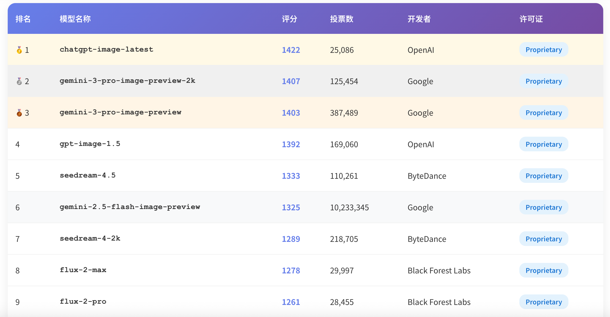
:::

:::info 数据来源
[LMArena AI - 全球模型评估平台官网](https://lmarenaai.cn/)

[image-edit排行榜](https://arena.ai/zh/leaderboard/image-edit)
:::

## 1. 测试模型单图输入

输入的照片未经过任何处理，且比较随意，不符合证件照要求，用于测试模型对人物的处理能力

### 1.1 蓝底证件照

- prompt

:::code-group

```markdown [正向提示词]
将输入的人物照片编辑为标准蓝底证件照；
严禁修改原始人脸特征、五官比例、表情、肤色、发型、发际线以及原始佩戴的眼镜或饰品（如有）；
不能将人物头部进行任何修改、重绘、美化、风格化或生成，必须100%保留原始面部细节和结构；
仅在原始人物基础上：添加深黑色单排两粒扣合身西装、纯白色无褶皱正装衬衫、藏青色无图案纯色领带（标准半温莎结）；
采用专业影棚布光，确保整体光照均匀、无阴影；
构图严格遵循证件照规范：图像仅包含从头顶到锁骨上方的区域，肩部不得完整露出，画面底部截止于颈部与肩部交界处，头顶距图像顶部约3%–5%，下巴位于图像高度70%–75%位置；
人物整体为正面、居中、双眼平视、双肩水平的合规证件照。
```

```markdown [反向提示词]
背景颜色错误，人物露出完整肩膀，脸部、发型、特征、配饰、眼镜被修改或移除，脸部存在阴影，
衣物不符合要求（非深黑色西装、纯白色衬衫、藏青色领带），头部有任何形式的修改或美化。
```

:::

- 输入照片


### 1.2 模型输出结果

<n-tabs type="segment" animated style="margin-top:10px">
  <!-- Qwen -->
  <n-tab-pane name="1" tab="qwen">
    <n-alert title="qwen-image-edit-max" type="info">
      模型能力：⭐⭐⭐⭐☆
      <br />人物脸部细节有明显改动，肩膀不符合要求，效果一般
    </n-alert>
    <div style="display:flex;align-items:center;justify-content:space-between;margin-top:15px">
      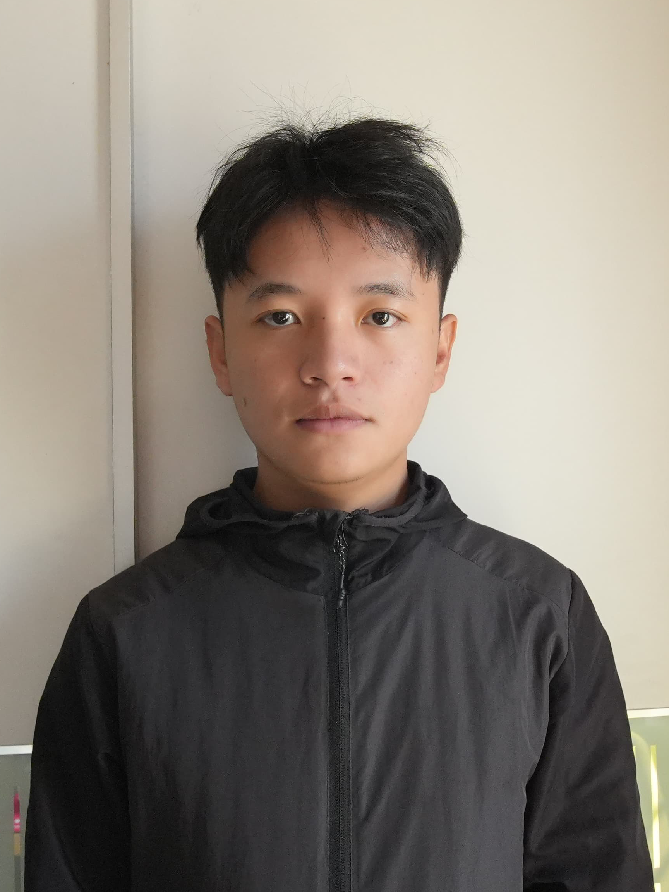
      =>
      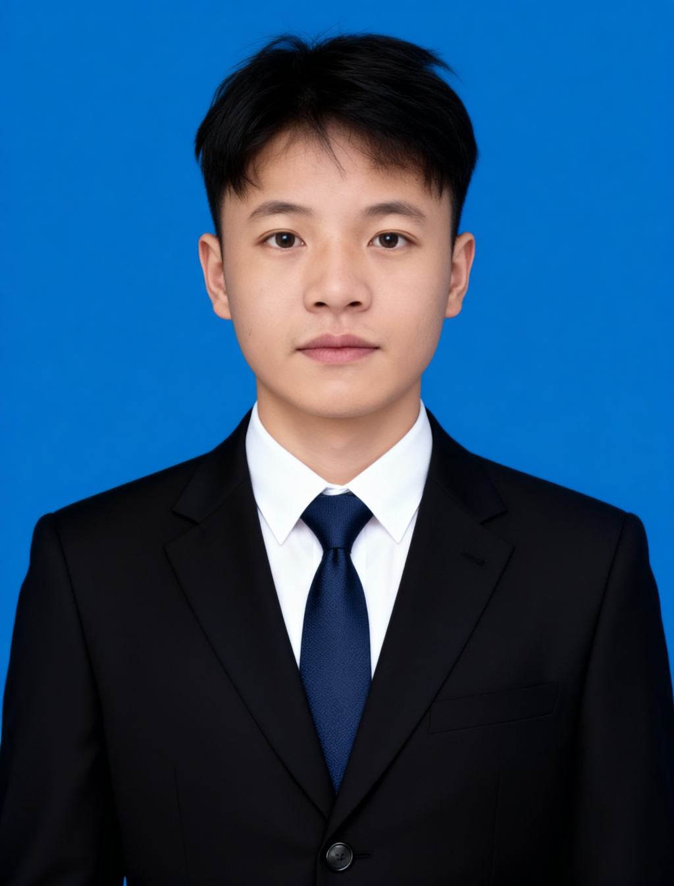
    </div>
  </n-tab-pane>

  <!-- Doubao -->
  <n-tab-pane name="2" tab="doubao">
    <n-alert title="doubao-seedream-4-5-251128" type="info">
      模型能力：⭐⭐⭐⭐⭐
      <br />人物脸部细节有轻微变化，效果比较好。
      <br />ps：在coze平台上使用时发现，该模型图像处理是分步执行的，先扣出人像再合成照片。
    </n-alert>
    <div style="display:flex;align-items:center;justify-content:space-between;margin-top:15px">
      
      =>
      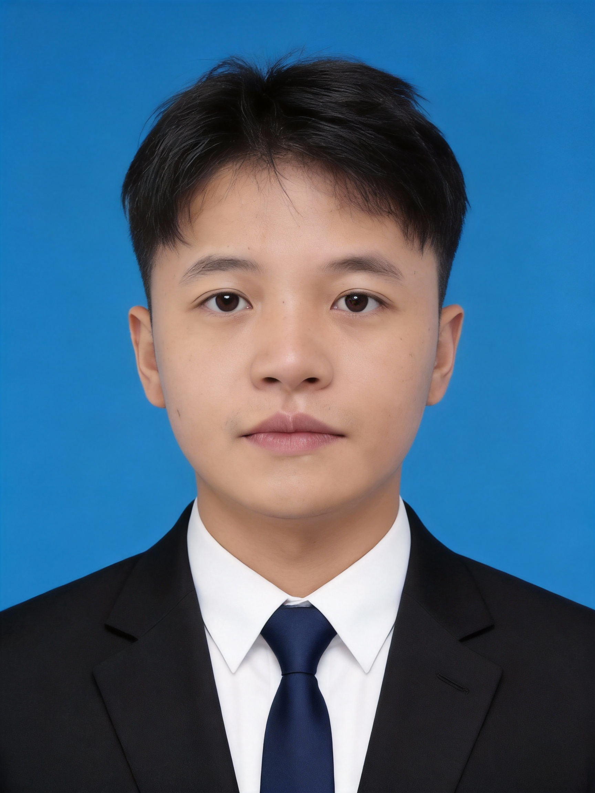
    </div>
  </n-tab-pane>

  <!-- GPT -->
  <n-tab-pane name="3" tab="gpt">
    <n-alert title="gpt-image-1.5" type="info">
      模型能力：⭐⭐⭐☆☆
      <br />人物脸部有变化，并且有阴影，肩膀不符合要求
      <br />ps：5min才输出一张图片
    </n-alert>
    <div style="display:flex;align-items:center;justify-content:space-between;margin-top:15px">
      
      =>
      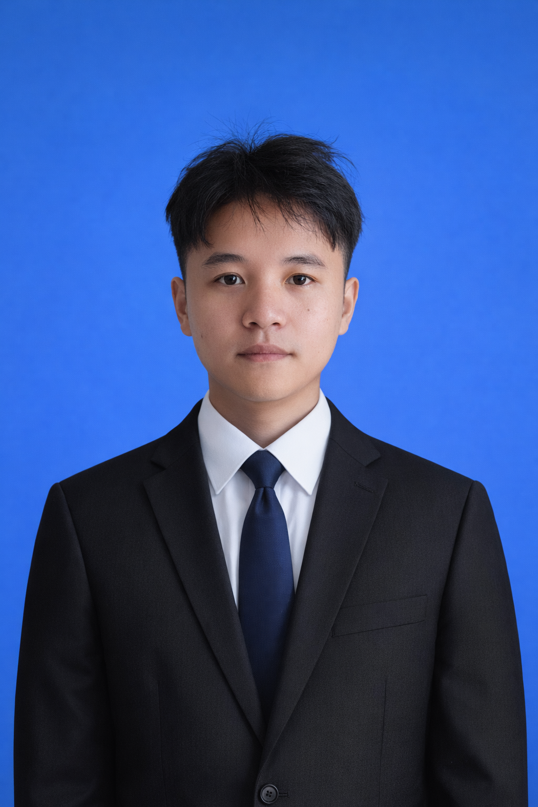
    </div>
  </n-tab-pane>

  <!-- Gemini -->
  <n-tab-pane name="4" tab="gemini">
    <n-alert title="gemini-3-pro-image-preview" type="info">
      模型能力：⭐⭐☆☆☆
      <br />人物脸部变化很大，发型也被调整，肩膀不符合要求
    </n-alert>
    <div style="display:flex;align-items:center;justify-content:space-between;margin-top:15px">
      
      =>
      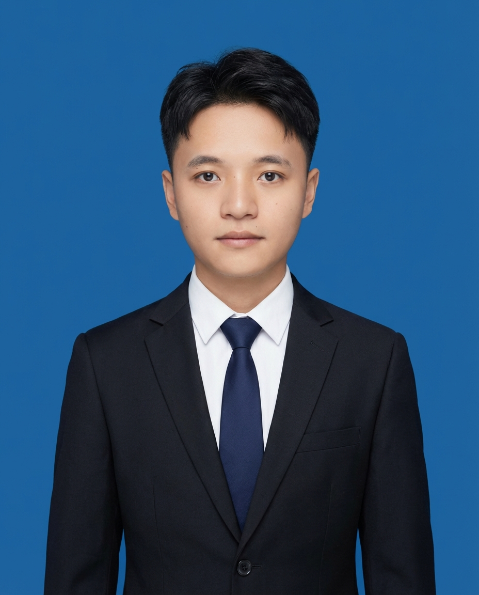
    </div>
  </n-tab-pane>

  <!-- Banana -->
  <n-tab-pane name="5" tab="banana">
    <n-alert title="nano-banana-2" type="info">
      模型能力：⭐⭐☆☆☆
      <br />人物脸部变化很大，发型也被调整，肩膀不符合要求
    </n-alert>
    <div style="display:flex;align-items:center;justify-content:space-between;margin-top:15px">
      
      =>
      
    </div>
  </n-tab-pane>

  <!-- Flux -->
  <n-tab-pane name="6" tab="flux">
    <n-alert title="flux-2-pro" type="info">
      模型能力：⭐☆☆☆☆
      <br />人物脸部变化太大，发型也被调整
    </n-alert>
    <div style="display:flex;align-items:center;justify-content:space-between;margin-top:15px">
      
      =>
      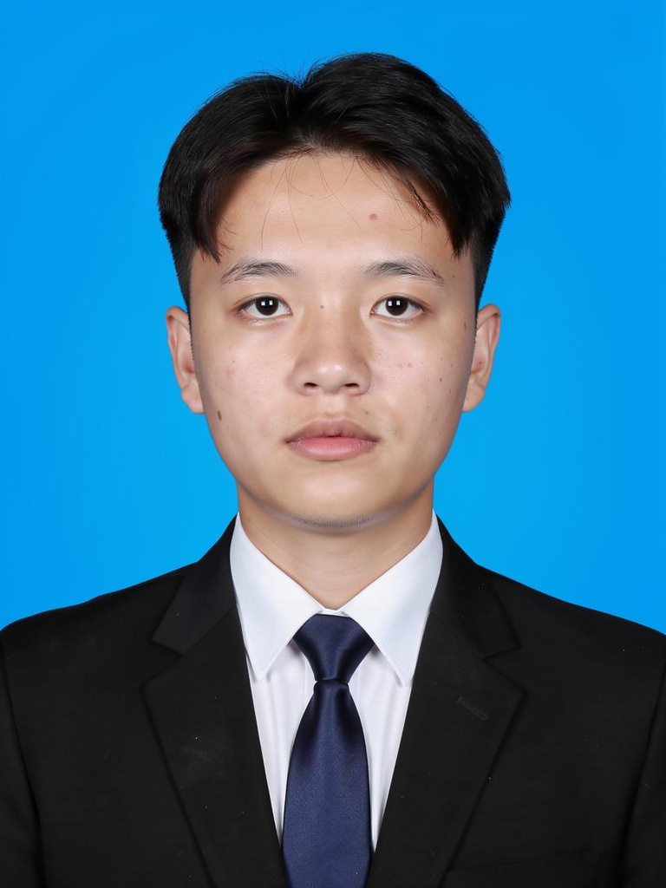
    </div>
  </n-tab-pane>

  <!-- hunyuan -->
  <n-tab-pane name="7" tab="hunyuan">
    <n-alert title="HunyuanImage 3.0-Instruct" type="info">
      模型能力：⭐☆☆☆☆
      <br />人物脸部变化太大，发型也被调整，尺寸也不正确
    </n-alert>
    <div style="display:flex;align-items:center;justify-content:space-between;margin-top:15px">
      
      =>
      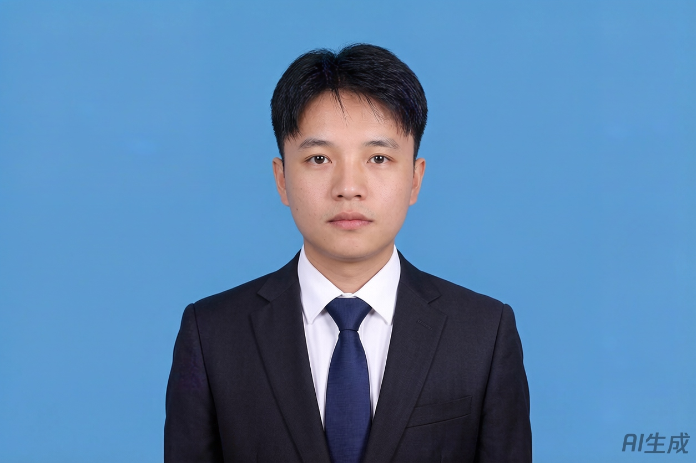
    </div>
  </n-tab-pane>

  <!-- Wan -->
  <n-tab-pane name="8" tab="wan">
    <n-alert title="wan2.6-image" type="info">
      模型能力：☆☆☆☆☆
      <br />人物完全不一致
    </n-alert>
    <div style="display:flex;align-items:center;justify-content:space-between;margin-top:15px">
      
      =>
      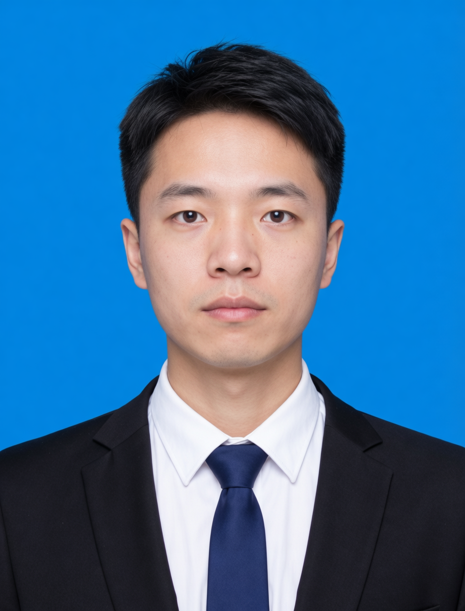
    </div>
  </n-tab-pane>
</n-tabs>

### 1.3 总结

模型结果均使用API调用返回，配置参数基本一致（个别模型不支持反向提示词以及指定像素）

第一轮结果：`doubao-seedream-4-5-251128`、`qwen-image-edit-max`

这两款模型的效果比较好，其余模型在该场景下基本不可用。

## 2. 单图相同人物不同照片

将第一轮测试ok的模型，复测人物一致性

### 2.1 更换人物照片

- 输入照片

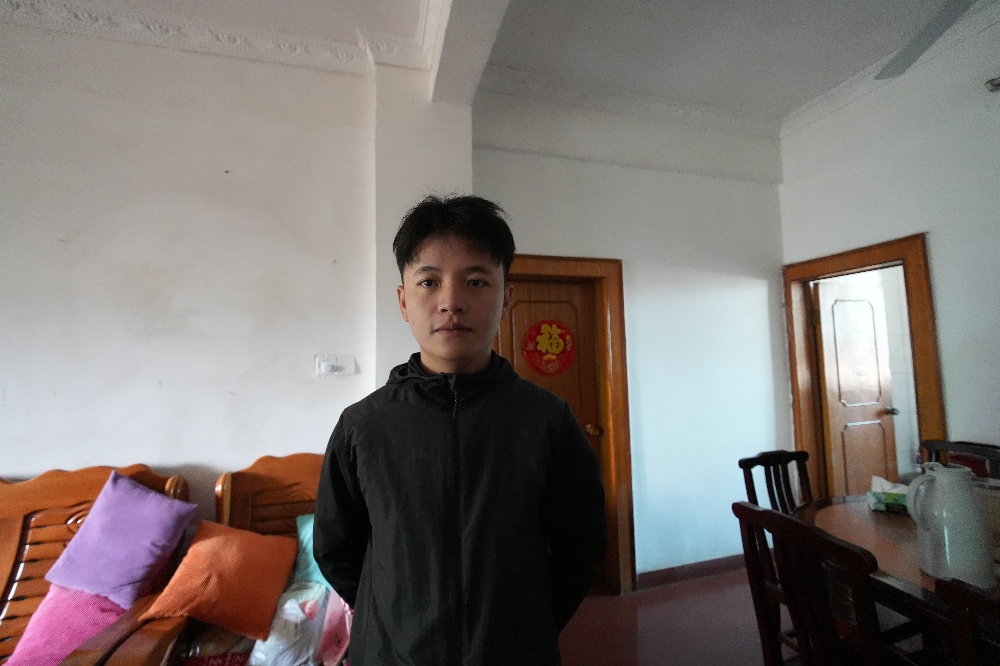

### 2.2 模型输出结果

ps：左输入图片，中间第二轮输出，右边上一轮输出

<n-tabs type="segment" animated style="margin-top:10px">
  <!-- Qwen -->
  <n-tab-pane name="1" tab="qwen">
    <n-alert title="qwen-image-edit-max" type="info">
      模型能力：⭐⭐⭐⭐☆
      <br />人物脸部细节有轻微改动。与上一轮输出图片保持一致。
    </n-alert>
    <div style="display:flex;align-items:center;justify-content:space-between;margin-top:15px">
      
      =>
      
      ≈
      
    </div>
  </n-tab-pane>

  <!-- Doubao -->
  <n-tab-pane name="2" tab="doubao">
    <n-alert title="doubao-seedream-4-5-251128" type="info">
      模型能力：⭐⭐⭐⭐⭐
      <br />人物脸部细节有轻微变化，效果比较好。与上一轮输出图片保持一致。
    </n-alert>
    <div style="display:flex;align-items:center;justify-content:space-between;margin-top:15px">
      
      =>
      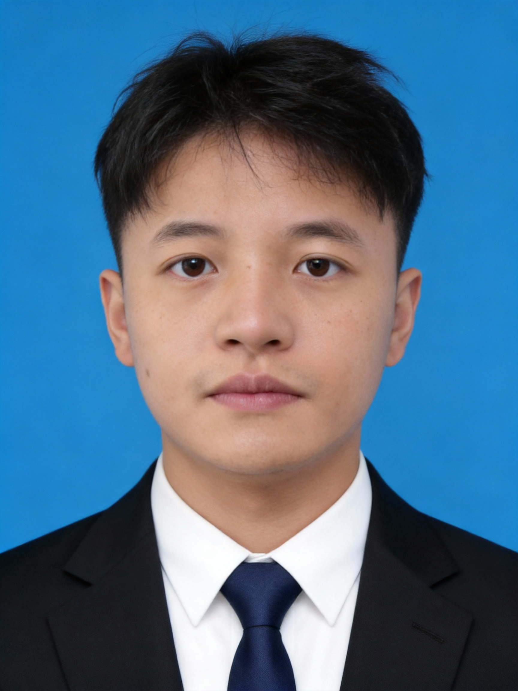
       ≈
      
    </div>
  </n-tab-pane>
</n-tabs>

### 2.3 总结

两个模型在输出一致性上，能力都不错。

## 3. 不同角度多图输入

输入多张不同角度的人物测试模型对人物合成的处理能力

### 3.1 图片组

- 输入照片组

<table>
  <tbody>
    <tr>
      <td></td>
      <td>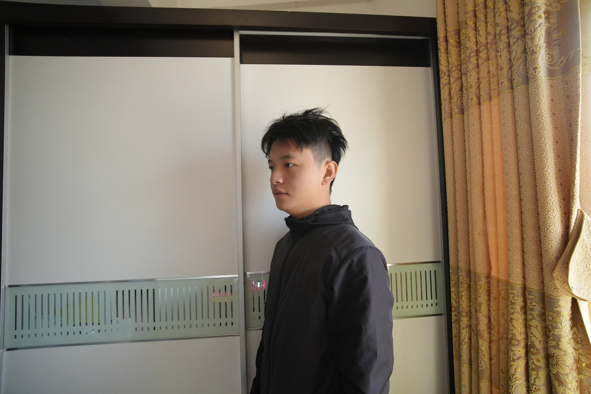</td>
      <td>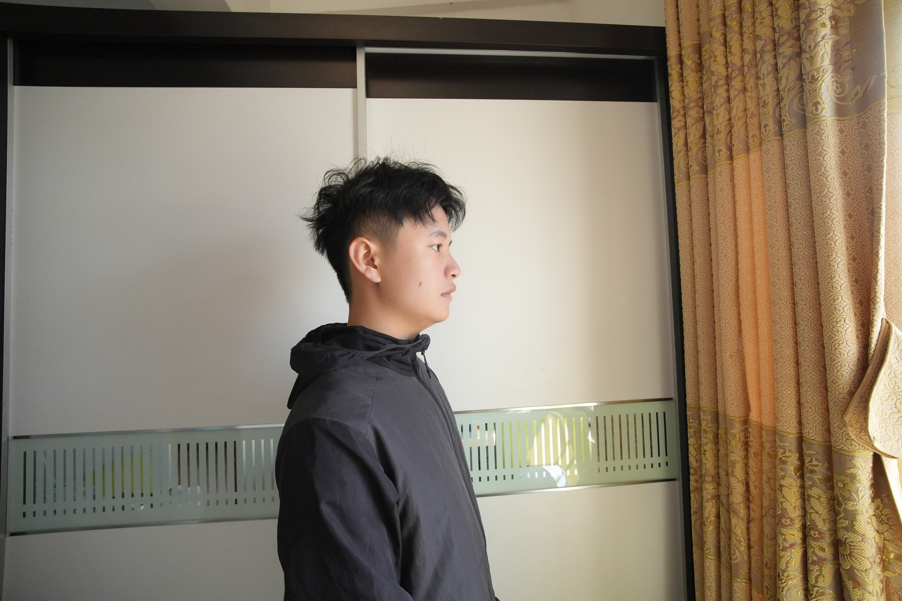</td>
    </tr>
  </tbody>
</table>

### 3.2 模型输出结果

ps：左第一轮，中间第二轮，右边第三轮

<n-tabs type="segment" animated style="margin-top:10px">
  <!-- Qwen -->
  <n-tab-pane name="1" tab="qwen">
    <n-alert title="qwen-image-edit-max" type="info">
      模型能力：⭐⭐⭐⭐☆
      <br />人物脸部细节有轻微改动。
    </n-alert>
    <div style="display:flex;align-items:center;justify-content:space-between;margin-top:15px">
      
      ≈
      
      ≈
      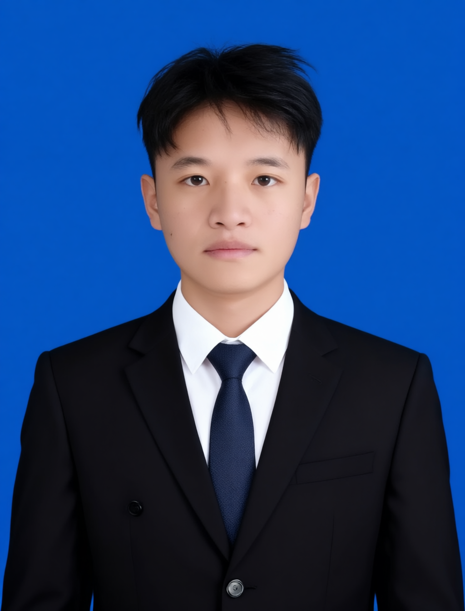
    </div>
  </n-tab-pane>

  <!-- Doubao -->
  <n-tab-pane name="2" tab="doubao">
    <n-alert title="doubao-seedream-4-5-251128" type="info">
      模型能力：⭐⭐⭐⭐⭐
      <br />人物脸部细节有轻微变化，效果比较好。
    </n-alert>
    <div style="display:flex;align-items:center;justify-content:space-between;margin-top:15px">
      
      ≈
      
      ≈
      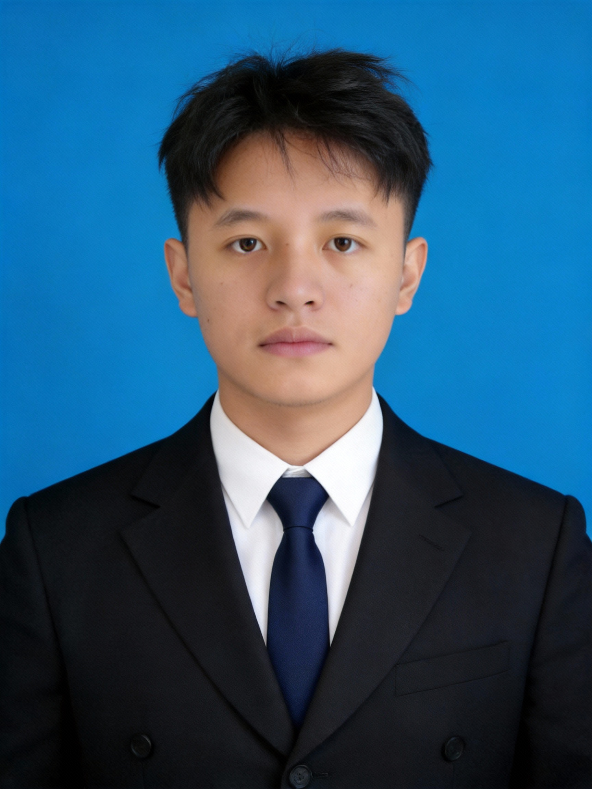
    </div>
  </n-tab-pane>
</n-tabs>

### 3.3 总结

多角度人像输入时，模型容易将不同视角的特征“平均化”，导致细节丢失、融合混乱。加上算法在对齐和处理高维视角信息上的局限，反而不如单张输入效果好。

## 4. 相同角度多图输入

输入多张不同角度的人物测试模型对人物合成的处理能力

### 4.1 图片组

- 输入照片组

<table>
  <tbody>
    <tr>
      <td></td>
      <td></td>
      <td>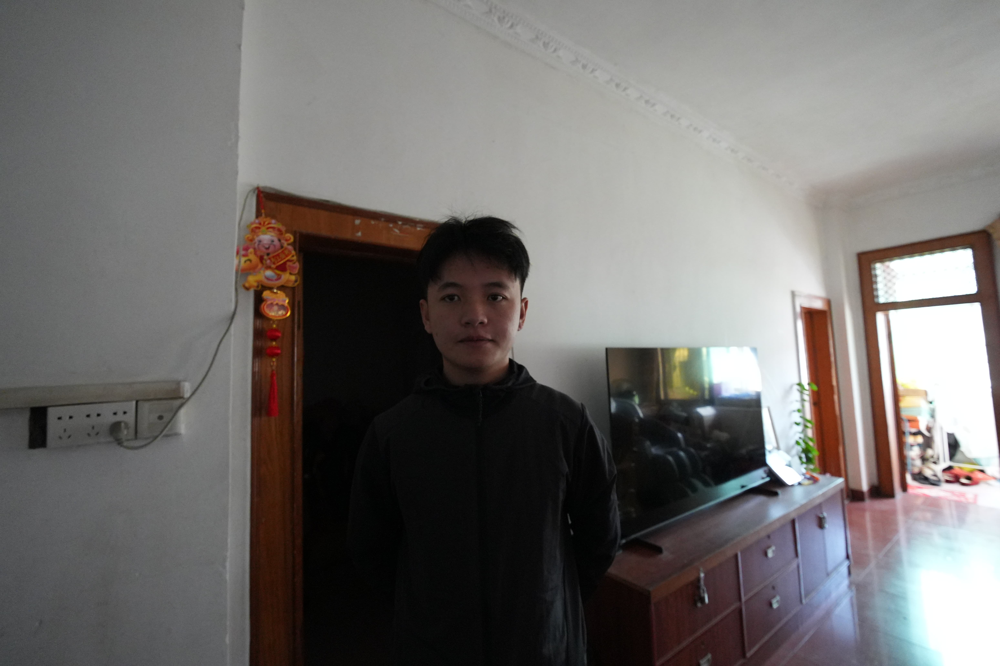</td>
    </tr>
  </tbody>
</table>

### 4.2 模型输出结果

ps：从左到右分别是1、2、3、4轮结果

<n-tabs type="segment" animated style="margin-top:10px">
  <!-- Qwen -->
  <n-tab-pane name="1" tab="qwen">
    <n-alert title="qwen-image-edit-max" type="info">
      模型能力：⭐⭐⭐⭐☆
      <br />相同角度多图融合效果比较好，相比前面的结果，更接近真人
    </n-alert>
    <div style="display:flex;align-items:center;justify-content:space-between;margin-top:15px">
      
      ≈
      
      ≈
      
      ≈
      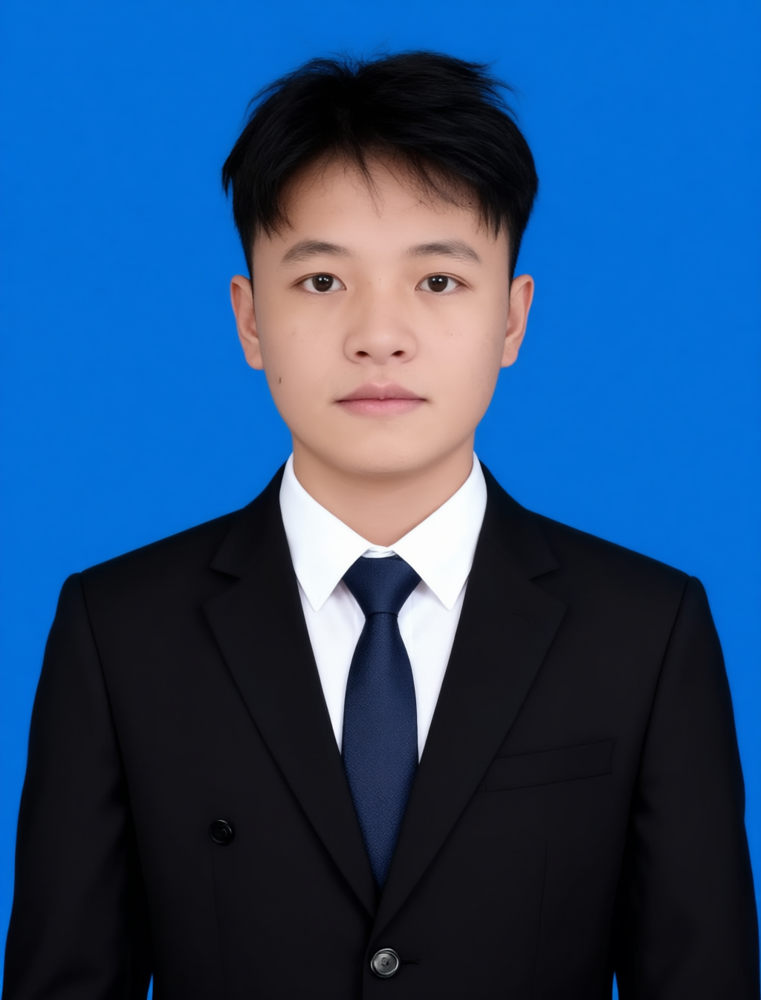
    </div>
  </n-tab-pane>

  <!-- Doubao -->
  <n-tab-pane name="2" tab="doubao">
    <n-alert title="doubao-seedream-4-5-251128" type="info">
      模型能力：⭐⭐⭐⭐⭐
      <br />相同角度多图融合效果比较好，相比第三轮脸部更真实
    </n-alert>
    <div style="display:flex;align-items:center;justify-content:space-between;margin-top:15px">
      
      ≈
      
      ≈
      
      ≈
      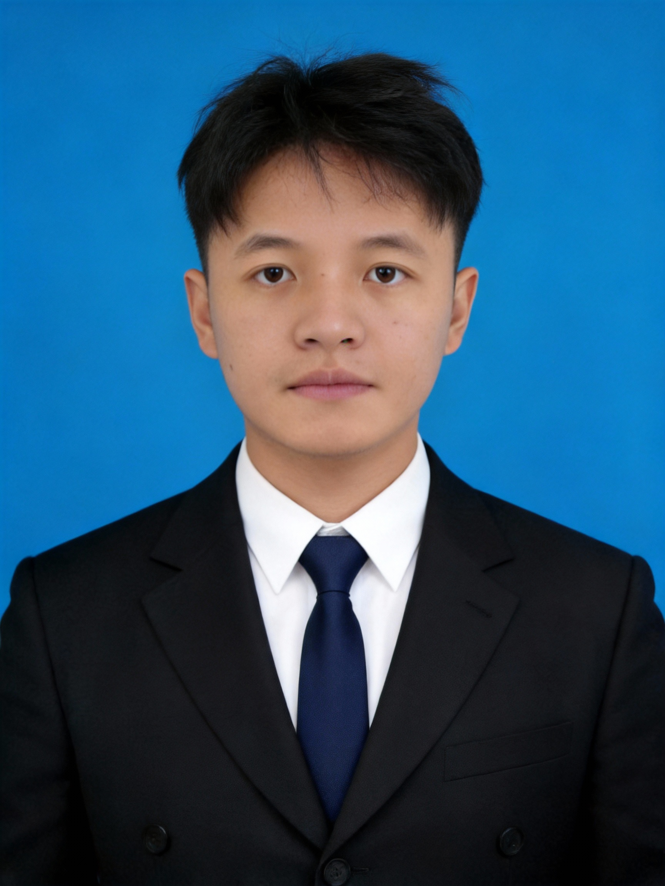
    </div>
  </n-tab-pane>
</n-tabs>

### 4.4 总结

在图生图任务中，同角度、风格和姿态一致的多张人像输入通常能提供更稳定、互补的细节信息，从而生成比单张更好的效果；而多角度输入或同角度但人物外观差异过大的图像，容易导致特征冲突或模型混淆，反而降低生成质量。因此，保持输入图像视角一致、人物状态稳定是提升生成效果的关键。

:::tip 模型结论
相同角度下的多图输入最还原人物真实形态，但是每张图的人物形象不能差距太大，否则会融合错误反而影响真实性。
:::

## 5. 模型一致性测试

### 5.2 模型输入

测试相同精细化prompt，不同人物下的输出效果

- prompt

:::code-group

```markdown [正向提示词]
"将输入的人物照片编辑为专业商务半身肖像照；严禁修改原始人脸特征、五官比例、表情、肤色、发型、发际线以及原始佩戴的眼镜或饰品（如有）；
不能对人物头部进行任何修改、重绘、美化、风格化或生成，必须100%保留原始面部细节和结构；
仅在原始人物基础上：添加午夜藏青色单排扣合身西装（深邃哑光质感）、黑色内衬衬衫（无领带）；
人物身体主干呈现**极轻微向右侧身（3度）**，但**双肩基本正对镜头**，形成‘身体微侧、面部正对’的经典商务构图；
**头部保持挺直，颈部自然伸展，下巴微微内收但不过度上扬，杜绝头前倾**，双眼平视镜头，展现自信从容的状态；
双手交叠置于腹部前方（轻触）；背景替换为均匀柔和的纯灰色摄影棚背景（灰度值约#D3D3D3），无纹理、无渐变、无反光；采用专业影棚布光，确保面部及上半身光照均匀、无阴影、无高光；
构图范围为标准半身照：从头顶至腰部上方（约肚脐位置），肩部与手臂自然入画，画面底部截止于上腹部；头顶距图像顶部约5%，整体呈现专业、稳重、可信且富有亲和力的商务形象。
```

```markdown [反向提示词]
背景非纯灰色，出现蓝底或其他颜色，人物脸部被修改、模糊或美化，眼镜/饰品被移除，添加领带、图案衬衫或错误西装颜色，身体侧身角度过大（超过3度），肩膀明显歪斜或背对镜头，头部前倾、低头或过度仰头，双手下垂僵硬或姿势夸张，存在明显阴影、高光、侧光，服装材质反光或不真实，头身比例失真，构图截断过早（如只到胸部）或过低（露出腿部）。
```

:::

### 5.2 模型输出结果

`qwen-image-edit-max`

:::tip 测试不同输入不同姿势的服装
输出结果：服装保持一致
:::

<table>
  <tbody>
    <tr>
      <td>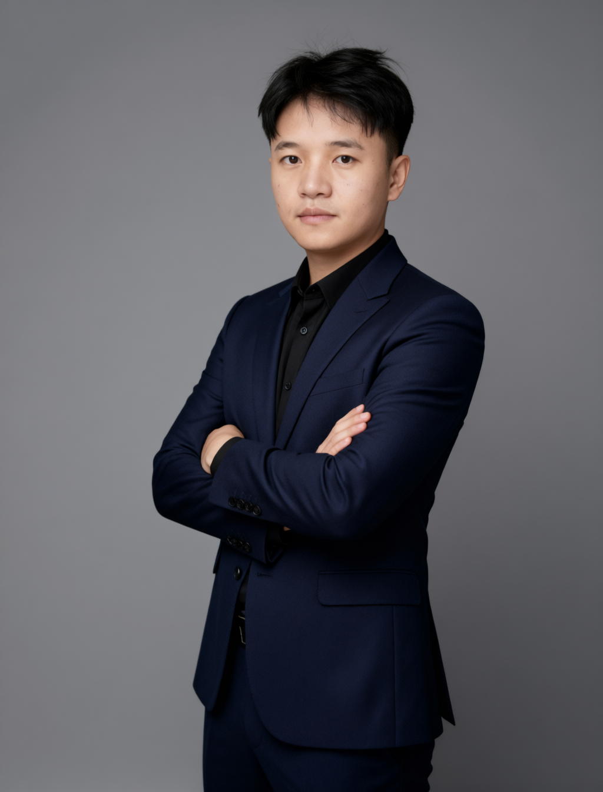</td>
      <td>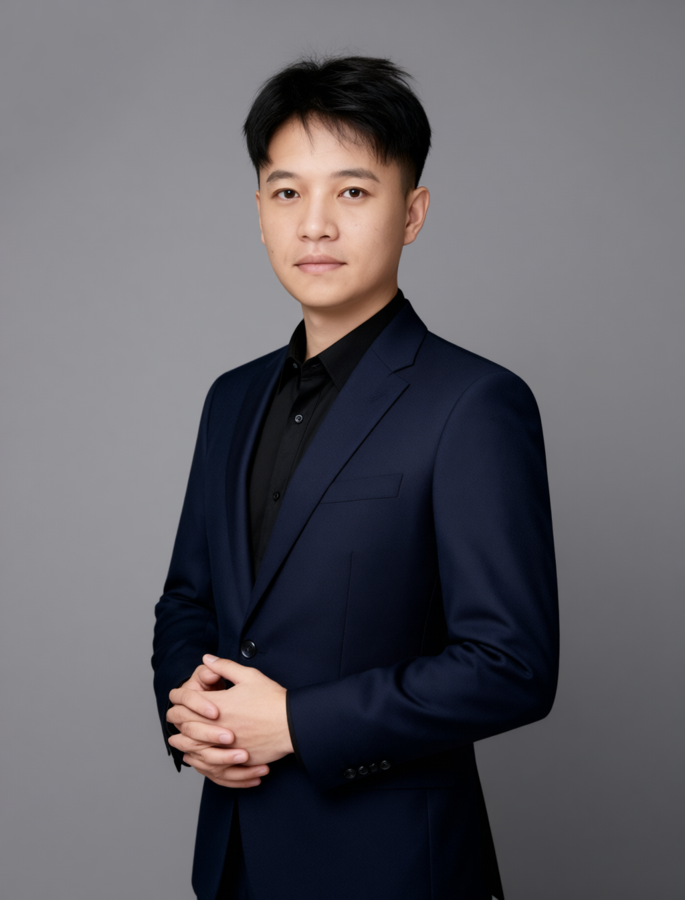</td>
      <td>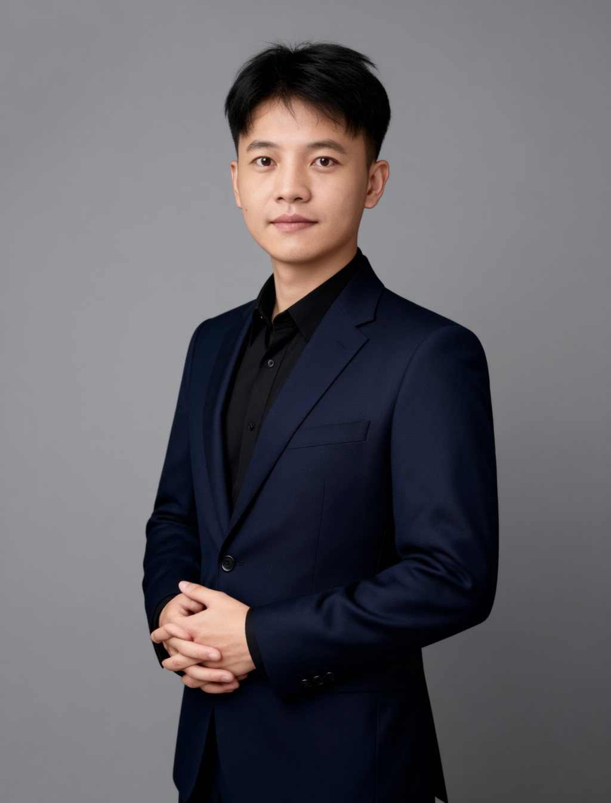</td>
    </tr>
  </tbody>
</table>

:::tip 测试相同输入不同姿势服装
输出结果：服装保持一致
:::

<table>
  <tbody>
    <tr>
      <td>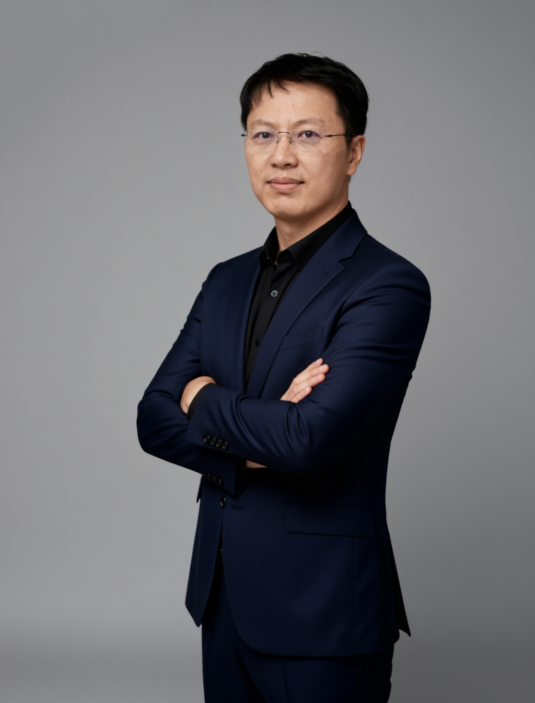</td>
      <td>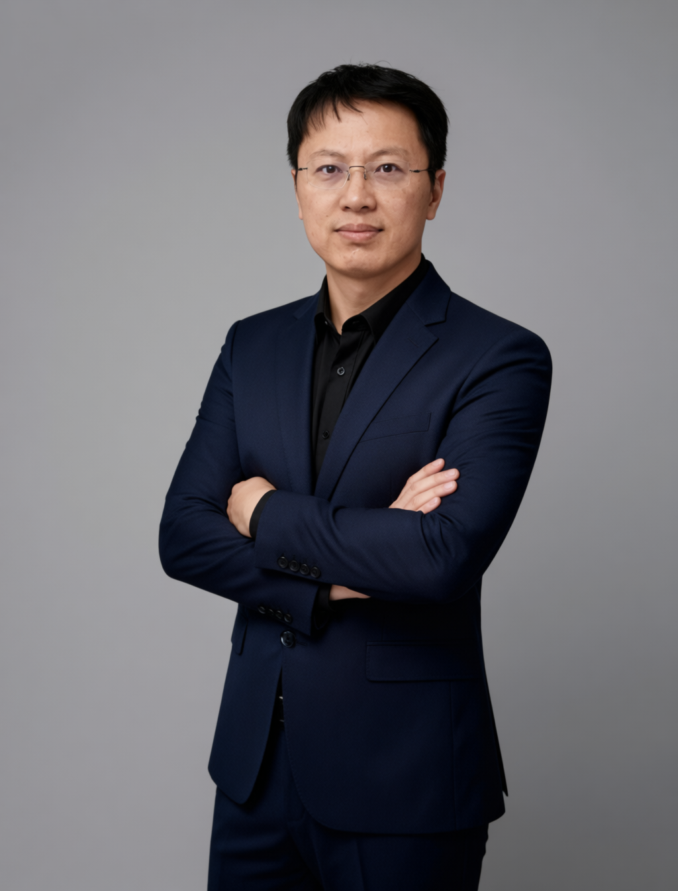</td>
      <td></td>
      <td>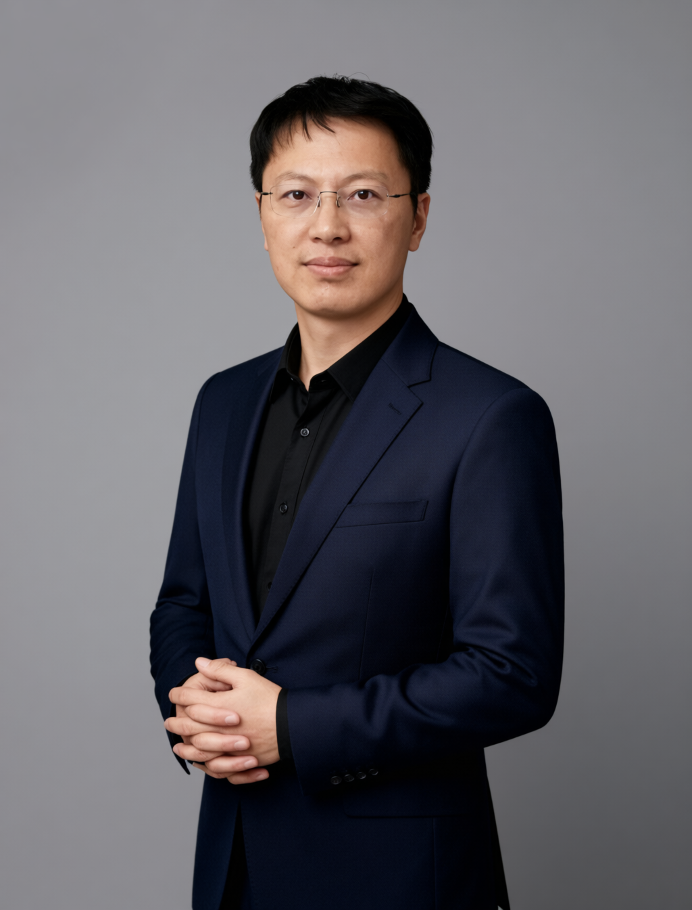</td>
    </tr>
  </tbody>
</table>

### 5.3 总结

在精细化prompt下，模型输出结果非常稳定。相比于输入模板图而言，减少了图片融合的风险，增加了不少的稳定性。

## 6. 测试眼镜替换能力

测试模型对于单物品替换的能力

### 6.1 模型输入

- prompt-非模板

:::code-group

```markdown [正向提示词]
在绝对不改变输入图像中人物原始面部结构、五官比例、表情、肤色、发型、发际线、身体姿态、光照及背景的前提下，仅替换其眼镜。
添加一副完全标准化的纯黑色哑光眼镜，具体规格如下：

- 镜框为矩形全框，整体宽高比约为 1.6:1；
- 镜框总宽度（含鼻梁）约占人脸宽度（两颧骨最宽处）的 42%；
- 镜框高度为宽度的 60%；
- 四角采用精确圆角处理，**圆角半径严格等于镜框高度的 1/8**，形成轻微倒角，既非直角也非大弧度；
- 边框厚度为 6.5mm（视觉中等偏粗），材质为无光泽黑色醋酸纤维，无任何纹理、金属件、Logo 或彩色装饰；
- 镜腿与镜框同色，从铰链处向后均匀收窄至末端 4mm 宽，无条纹、无标识；\n- 镜片完全透明、无反光、无色、无畸变，清晰展现双眼瞳孔与虹膜细节；
- 佩戴位置精准：镜框上缘位于眉毛下沿下方约 1–2mm，镜片几何中心对准瞳孔，镜框下缘高于颧骨最高点；
- 眼镜必须自然贴合面部曲面，无漂浮、穿透或透视错误。
  输出图像尺寸、比例、背景、服装、光照均须与原图完全一致。
```

```markdown [反向提示词]
人物脸部被修改、模糊、磨皮、美化、形变或重绘；原始眼镜未完全移除或残留痕迹；新眼镜为圆形、椭圆形、猫眼形、直角方形或圆角过大（>高度1/6）；边框过细（<5mm）或过粗（>8mm）；镜片有色、反光、模糊、遮挡瞳孔；眼镜带有Logo、双G、红绿条纹、金属装饰、亮面材质；镜腿有颜色变化或图案；眼镜位置歪斜、过高、过低、尺寸随人脸缩放失真；输出图像裁剪、拉伸或尺寸改变；背景或服装被修改。
```

:::

- prompt-输入参考图

:::code-group

```markdown [正向提示词]
在保持输入图像中人物完全不变的前提下，人物的眼镜更换为图2中的眼镜。眼镜与面部轮廓自然贴合，不反光且不遮挡瞳孔；
确保眼镜与鼻梁及耳朵的接触点位置合理自然；
不得对人物的脸部特征、表情、肤色、发型、服装等进行任何修改；
输出结果需与原始图像尺寸一致，背景和其他元素均不做改动。
```

```markdown [反向提示词]
人物脸部或五官发生任何变化，包括但不限于模糊、美化、磨皮、形变；眼镜有额外颜色或装饰元素，如红绿条纹、Logo、金属件等；眼镜形状过于圆润或方正，不符合描述；镜片有色、反光或遮挡眼睛；眼镜佩戴位置不合理，过高、过低或歪斜；输出图像尺寸与原图不符，背景或服装被修改。
```

:::

- 输入照片

<table>
  <tbody>
    <tr>
      <td></td>
      <td></td>
    </tr>
  </tbody>
</table>

### 6.2 模型输出结果

:::tip 无参考图，精细化prompt
输出结果：眼镜基本保持一致，与人物有关
:::

<n-tabs type="segment" animated style="margin-top:10px">
  <!-- Qwen -->
  <n-tab-pane name="1" tab="qwen-无参考图">
    <div style="display:flex;align-items:center;justify-content:space-between;margin-top:15px">
      
      =
      
    </div>
  </n-tab-pane>

  <!-- Doubao -->
  <n-tab-pane name="2" tab="doubao-无参考图">
    <div style="display:flex;align-items:center;justify-content:space-between;margin-top:15px">
      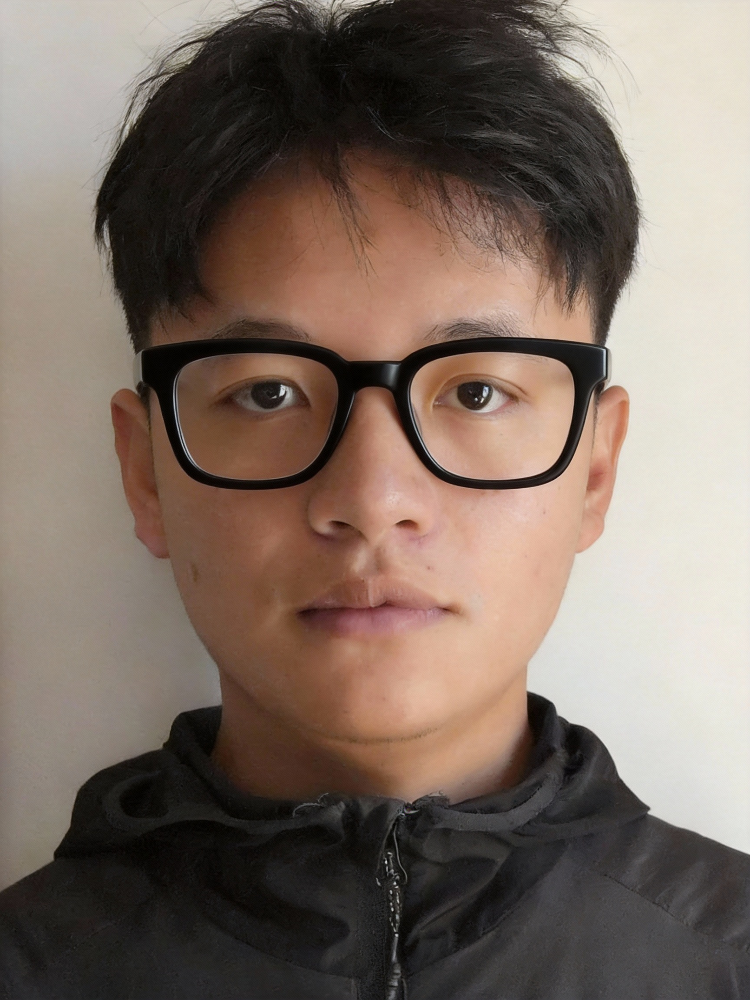
      =
      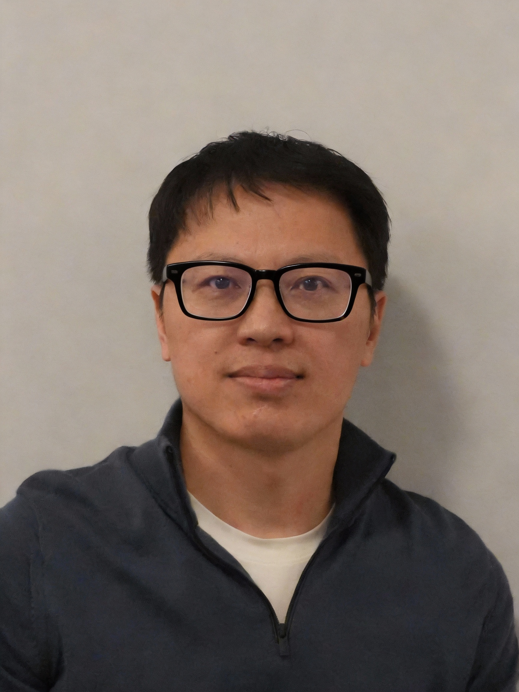
    </div>
  </n-tab-pane>
</n-tabs>

:::warning 有参考图
输出结果：眼镜基本保持一致
:::

<n-tabs type="segment" animated style="margin:10px 0;">
  <!-- Qwen -->
  <n-tab-pane name="1" tab="qwen-有参考图">
    <div style="display:flex;align-items:center;justify-content:space-between;margin-top:15px">
      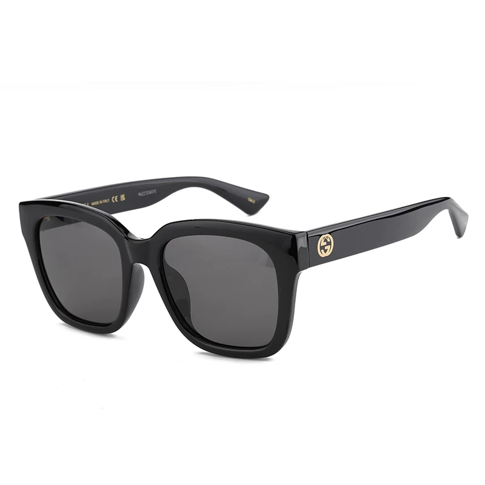
      =>
      
      =
      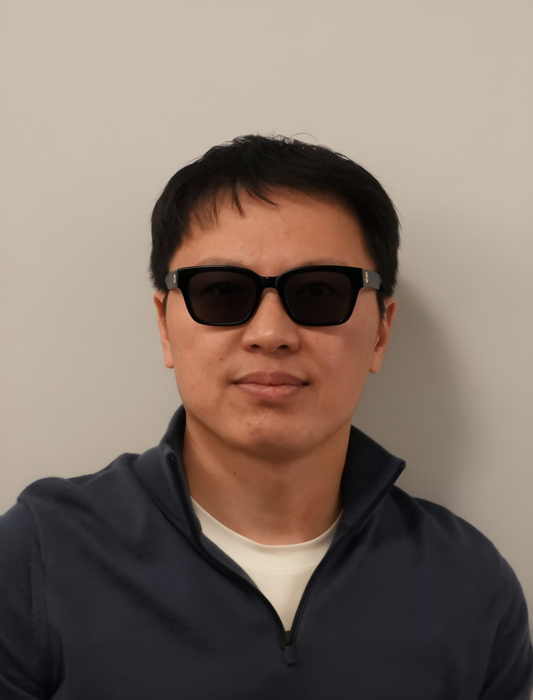
    </div>
  </n-tab-pane>

  <!-- Doubao -->
  <n-tab-pane name="2" tab="doubao-有参考图">
    <div style="display:flex;align-items:center;justify-content:space-between;margin-top:15px">
      
      =>
      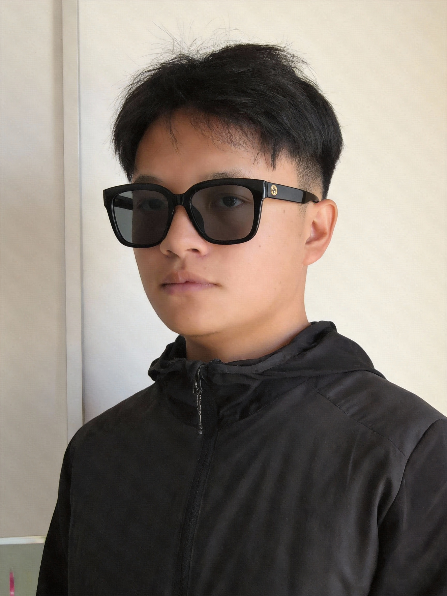
      =
      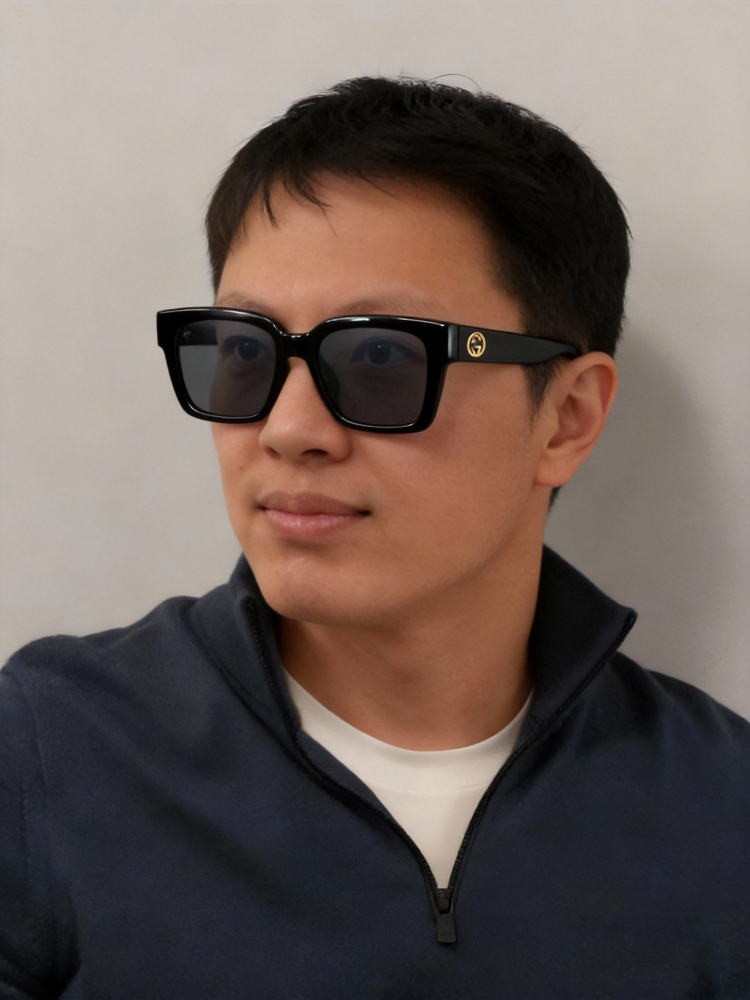
    </div>
  </n-tab-pane>
</n-tabs>

### 6.3 总结

缺乏视觉参考时，输出一致性依赖于 prompt 中对形状、比例、材质等细节的精确参数化描述；而当提供参考图时，模型虽能大致复现样式，仍需通过 prompt 显式引导其严格遵循参考图的结构与风格，以抑制不必要的生成偏差。

:::tip 提醒
提供参考图时，请尽量只包含目标元素本身（例如：眼镜应为白底单镜图，而非佩戴在模特脸上的照片）。若参考图中包含人脸或其他干扰元素，模型可能误将参考图中的人物特征与输入图像融合，导致输出不稳定或出现身份混淆。
:::
